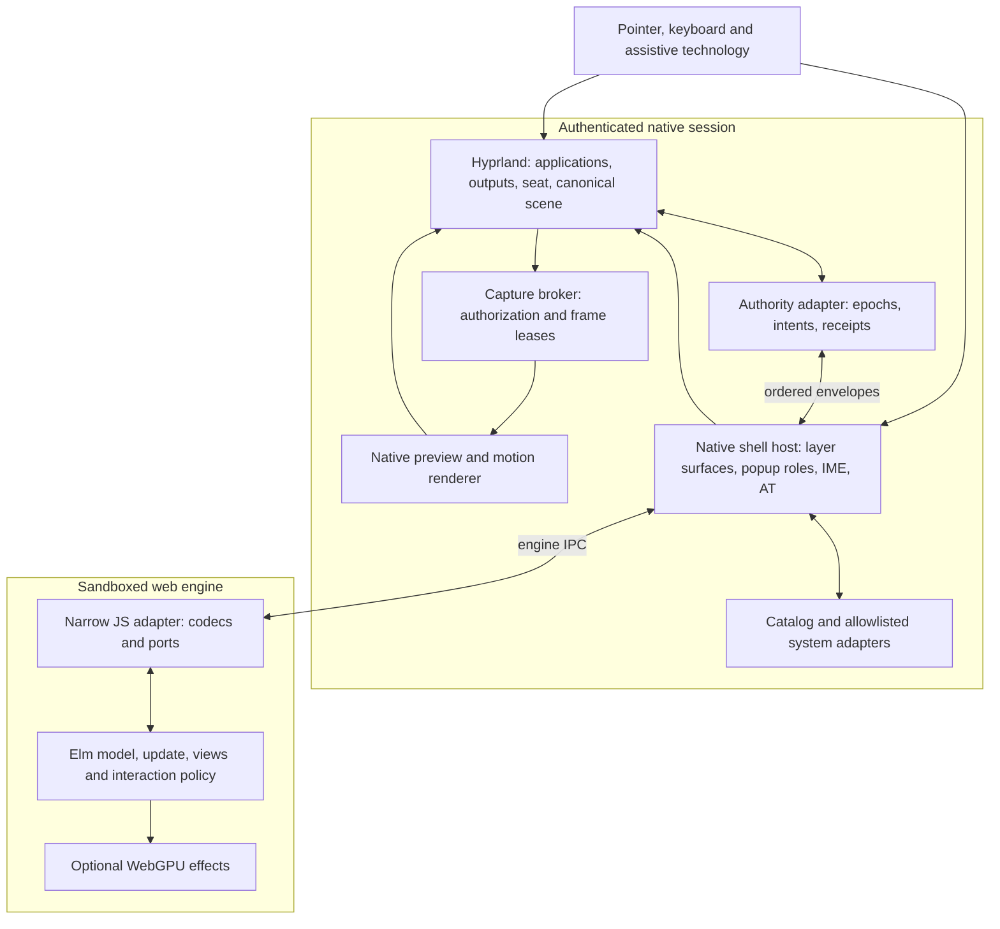
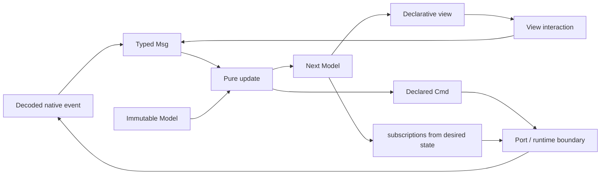
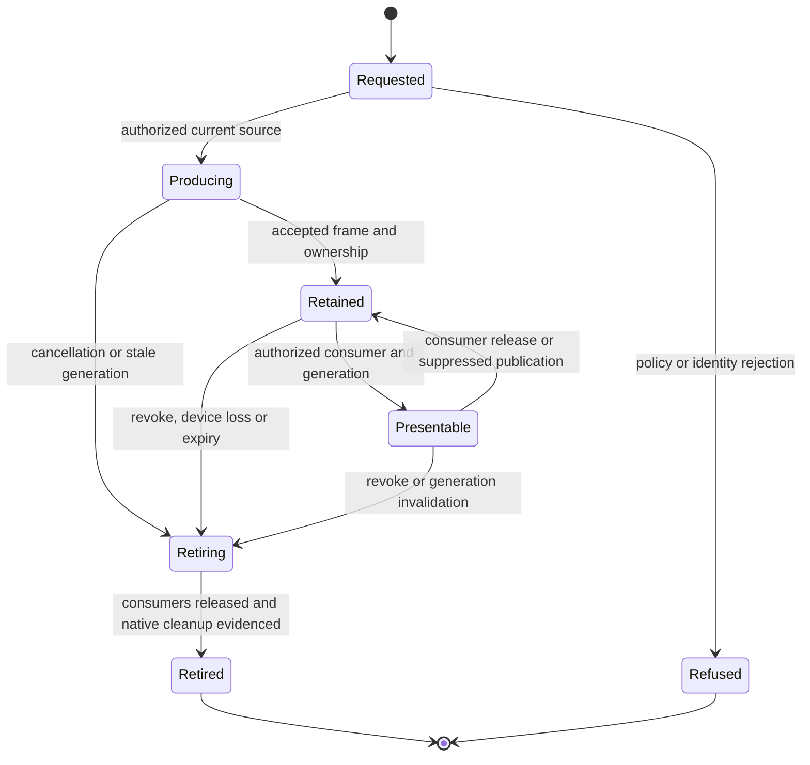

# Elm desktop architecture

Design proposal for `feature/elm`. Implementation, hardware-rendered host selection and native acceptance remain pending. The [requirement registry](REQUIREMENTS.md) is normative; this document allocates its behavior to components and makes the interfaces and validation boundaries concrete. [ROADMAP.md](ROADMAP.md) defines delivery gates, [INTERACTION.md](INTERACTION.md) defines product interaction policy, and [LAYERING.md](LAYERING.md) and [GPU.md](GPU.md) provide the native scene and graphics contracts.

## Architectural outcome

Elm implements all migrated shell views and their typed interaction model. A sandboxed web engine draws those views inside a small native host. The host owns shell Wayland surfaces, accessibility and input-method integration. A native authority owns application-window transactions and supplies coherent observations from the compositor. A native capture broker and renderer own frame storage, synchronization and motion. The first release retains Hyprland; its relevant scene/input paths must satisfy the canonical scene contract before the Elm shell can qualify. The language migration never grants a webview control over compositor drawing order.

The optional compositor replacement preserves these interfaces while replacing their native implementation. Elm remains a policy and presentation layer; it does not become a Wayland server, seat implementation or GPU driver through ports.



This diagram shows authority boundaries rather than a requirement for one process per box. The compositor-side adapter executes commit validation in the compositor's serialization domain. Moving the same checks into a separate service without a compositor commit acknowledgement would introduce an unacceptable check/commit race.

## Elm Architecture and reactive design

The shell is designed around The Elm Architecture (TEA): an immutable typed `Model`, pure `update` transitions over explicit `Msg` values, a declarative `view`, and declared commands/subscriptions. This is the architectural center of the GUI, rather than a thin Elm wrapper around imperative JavaScript controllers. The local [official architecture guide](../research/elm-pivot/corpus/official/guide/architecture.md) describes the model/update/view pattern; the [effects guide](../research/elm-pivot/corpus/official/guide/effects.md) adds `Cmd` and `Sub` for external interactions.



Use `Browser.element` for full hosted views. Keep `init`, `update`, `view` and `subscriptions` explicit and small enough to review. The pure domain reducer can return an effect description for a thin runtime adapter to turn into `Cmd Msg`; this permits deterministic tests to inspect proposed intents without running native effects. A `Platform.worker` experiment can exercise the same policy reducer headlessly, but it does not qualify a GUI host.

Partition the model by owned facts, not by mutable widget controllers:

| Model area | Contents | Source of truth |
| --- | --- | --- |
| Native projection | Last coherent scene/capability snapshot, sequence watermark and authoritative receipts | Native authority; Elm treats it as immutable observations |
| Interaction state | Search query, open scope, selected identity, frozen chord candidates, preferences | Pure Elm transitions over explicit user/native messages |
| Pending workflows | Correlated request/generation, original deadline, prerequisite and outcome | Elm tracks the workflow; native receipts decide effect completion |
| View-local state | Focused control identity, text/preedit projection, overflow position and accessible status | Elm plus identity-bound host input/AT observations |
| Opaque resources | Lease capability and publication status, never pixel storage | Native broker owns resource validity; Elm owns presentation choice |

Derive group membership, active/attention indicators, launcher matching/ranking and enabled actions from the authoritative projection plus interaction state. Avoid maintaining independent mutable lists for taskbar, switcher and Task View that can diverge after a window retires. Store a frozen chord order when the interaction contract requires a stable snapshot; this is intentional historical interaction state, not a second source of native truth. Cache expensive derived results only behind explicit source/query revisions, and invalidate them deterministically.

Use custom types to make invalid combinations difficult to construct. The [official custom-types guide](../research/elm-pivot/corpus/official/guide/types/custom_types.md) supports modeling each state with its associated data. Proposed application types include:

```elm
-- Design sketch; concrete modules/decoders are implemented and compiled in P2.
type SessionState
    = Starting
    | Synchronizing Reconciliation
    | Ready CoherentProjection
    | Locked LockProjection
    | Recovering RecoveryContext

type Outcome
    = Pending PendingRequest
    | Committed CommitReceipt
    | Refused RefusalReceipt
    | Cancelled CancellationReceipt
    | Unknown UncertainRequest

type SwitcherState
    = Closed
    | Selecting ChordSelection
    | Resolving PendingActivation

type PreviewState
    = NoPreview PreviewFallback
    | AwaitingPreview PreviewRequest
    | HistoricalPreview AuthorizedLease
    | LivePreview AuthorizedLease
    | RevokingPreview RetirementContext
```

Constructors for authority-bearing identities and an `AuthorizedLease` stay private to their decoder/domain module. A random string cannot be treated as a valid lease merely because it fits a record field. Native validation remains mandatory: Elm types prevent local misuse but cannot guarantee that an external process, source or GPU device still exists. Keep intentional desired state separate from acknowledged native state; a pending maximize intent is not an active/MAX observation.

Declare effects rather than execute them inside pure policy code. Native intents cross one outgoing port, decoded observations arrive through one incoming port, and all messages pass through the same state transition path. The [official ports guide](../research/elm-pivot/corpus/official/guide/interop/ports.md) recommends a small message-oriented boundary with explicit state ownership. JavaScript handles codec/binding/resource integration; it does not maintain another taskbar reducer, change DOM controls behind Elm's view or silently synthesize native policy.

Dependencies advance through receipts. For example, navigation/restore/live activation is a typed workflow whose next intent is produced after its matching accepted prerequisite, with current dependencies and the original deadline. `Cmd.batch` is reserved for independent effects; it does not establish capture-before-hide, navigation-before-activation or producer-before-consumer retirement. A cancellation message updates desired workflow state and emits a native cancellation/retirement request, while the physical resource remains pending until its receipt.

`subscriptions : Model -> Sub Msg` reflects desired observation needs. Keep the authority control stream active for the connected session; subscribe to optional local timers or browser animation events only while a relevant view interaction needs them. Native observation/capture interest is expressed through an explicit generation-bound subscription intent so the broker can bound production. Turning off an Elm subscription is not proof of native closure: retired helpers, callbacks and leases still need native receipts. High-rate preview observations can be bounded/coalesced, while control events stay ordered. The [official time guide](../research/elm-pivot/corpus/official/guide/effects/time.md) illustrates model-driven subscriptions; its wall/POSIX time display facilities do not replace native monotonic deadlines or presentation timing.

This uses modern Elm's commands/subscriptions rather than historical `Signal` APIs. The collected [FRP study](../research/elm-pivot/FRP.md) separates old signal-graph Elm from current TEA and preserves primary sources. Reactive principles still guide this design: push discrete state/receipt changes, derive coherent values from immutable snapshots, and sample a continuous motion function only while it is active on the native presentation clock. A declarative trajectory describes geometry over time; native presentation receipts establish what was actually shown. No distributed atomicity is inferred from a pure reducer.

The expected benefits are concrete but remain to be measured: exhaustive cases expose missing outcome handling at compile time; immutable snapshots enable deterministic replay; custom types prevent accidental identity/state mixing; derived state reduces inconsistent projections; and bounded effect interfaces simplify fault injection. Replay logs use redacted structured observations and identity-bound fixtures rather than private text or credential data. Elm runtime DOM diffing can reduce unnecessary view work, but whole-process CPU/memory/wakeups and input-to-present performance remain host gates. Optimize from measurements with revision-bound derived caches and keyed stable DOM identities, without making per-frame native hit testing dependent on webview work.

## Components and ownership

| Component | Owns | Public interface | Lifetime and failure boundary |
| --- | --- | --- | --- |
| Elm application | Typed shell model, desired state, focused control identity, query/context, pending outcomes, HTML/CSS view | One incoming event port, one outgoing intent port | Frontend epoch; never owns native pointers, Wayland objects or pixel buffers |
| JavaScript adapter | Pinned serialization, engine binding, local GPU effect objects | Strict envelope codec; bounded port forwarding | Renderer process; no generic command dispatcher or arbitrary native methods |
| Native host | Per-output shell surfaces, popup roles, input regions, engine instances, native accessibility/IME, session endpoint | Authenticated authority client and allowlisted view operations | Supervised host lifetime; engine crash does not confer fresh native authority |
| Compositor-side authority | Committed scene, request admission, serialization, incarnations, operation generations, dependency revisions, cancellation and receipts | Versioned observation/intent protocol | Exact owning compositor/plugin ABI tuple; compositor lifetime is a distinct identity |
| Capture broker | Capture policy, source identity, producer/consumer ledger, native buffers, lease capabilities | Acquire, observe, revoke and retire opaque leases | Native session plus rendering/output generations; source death and consumer death are separate |
| Native preview/motion renderer | Buffer imports, fences, last-presented geometry, visual proxies, sampled motion and presentation receipts | Frame lease and accepted native motion transaction | Rendering device and generation; cannot mutate application windows independently |
| Integration adapters | Desktop catalog, notifications, settings, volume/network/power/session actions and installed Files launch/reuse | Typed capability-specific requests and correlated observations | User-session service; unavailable capability is an explicit UI state |
| Supervisor/recovery tools | Service ordering, feature selection, compatible settings copies, restart/resync and offline rollback | Reviewed manifests and local recovery command | User session; does not restart the main compositor to recover a shell view |

The initial compositor adapter is a narrow C++ integration with the owning Hyprland APIs, preserving existing native source and ABI evidence. Native host spikes compare a compatible GTK/WebKitGTK/layer-shell build with a dedicated Qt WebEngine build. The host and integration-service language is a P1 build decision, not a reason to rewrite accepted compositor code. A memory-safe service implementation is a useful candidate where it can consume a stable protocol; its benefits do not remove browser-engine or compositor lifetime obligations.

An existing observer/helper can be reused only after its source ownership, normal closure, protocol projection and acceptance mapping are reviewed. Existing CPU or bounded native evidence does not become acceptance of the new host by copying the helper.

## Process and trust boundaries

The web engine is an untrusted consumer of native state. It receives packaged assets from one allowlisted local origin and a narrow binding. It cannot navigate to remote content, invoke arbitrary methods, access a shell command runner, choose capture sources by memory address or read another application's pixels by guessing a handle. Release builds disable remote debugging. Host selection preserves the renderer sandbox rather than adding switches to obtain a GPU feature.

The native host authenticates to a session-local authority endpoint. Endpoint setup verifies the owning UID, socket type, nonsymlink path and private runtime-directory ownership; the protocol handshake additionally binds compositor lifetime, native session, frontend epoch and negotiated capabilities. A matching UID alone does not establish the right desktop session. A stale connection, wrong session or failed handshake has read/effect access refused according to the capability policy. Details become versioned decoder and endpoint fixtures in P0/P2, before an effect-capable bridge is enabled.

Each engine instance receives scoped view capabilities. The host mediates all outgoing envelopes; a forged frontend epoch or output identity cannot escape the instance's scope. One authority serializes cross-output transactions. Additional output views receive read-only projections of the same model and cannot race independent ownership of a pin, transfer or switcher operation.

Native integration adapters accept structured arguments under an allowlist. Desktop-file launch semantics are resolved by the catalog adapter, preserving argument and visibility rules; requests are never converted to an unrestricted shell expression. Files calls use the installed explorer contract. File operations, their Quint semantics and graphical authorization remain owned by the installed Files adapter. A later approved Files replacement has a separate acceptance gate.

The session-lock authority remains native. Ordinary shell input priority, fullscreen flags, pin state and engine focus cannot bypass lock. Lock-screen and policy-classified credential-entry surfaces are excluded from preview capture. Classification comes from a reviewed native policy/protocol mapping; a window title is not a sufficient security classification. Credential approval integrations use their existing native broker flow, and secret values are never serialized into shell state, event journals or logs.

## Native surface and input design

Each configured output has a native shell host surface for its taskbar and separately scoped transient surfaces when appropriate. The host chooses the protocol role before exposing an Elm view. Taskbar exclusive zones, anchor edges and scale/transform handling are native configuration. A full-output view used for Task View or a switcher is a deliberate temporary surface with a bounded lifetime and declared keyboard-interactivity/input-region policy.

Native popup roles and protocol grabs own menus. The host maps view geometry into current output-local/native coordinates; negative output origins, fractional scaling and rotated outputs are explicit transforms. A DOM rectangle cannot serve as the final global input oracle. Ordinary shell input regions cover only current interactive geometry. Transparent margins pass pointer events to eligible underlying native applications, including drag initiation. Painting an overlay does not automatically justify an output-sized hit region.

The host maintains identity-bound focus scopes for menus, switcher, launcher and nested popups. Dismissal restores the surviving parent scope or current eligible opener; otherwise it uses the declared native fallback. A destroyed opener's reused address never receives restoration. Lock supersedes all ordinary restoration. Native IME callbacks carry field identity and composition generation; consumed keys cannot accidentally launch an item, and late commits after field retirement or restart are refused. Caret/candidate placement uses the accepted native geometry transform.

Accessibility is a selected-host capability, not an inference from HTML attributes. Every interactive migrated control needs native names, roles, states, values, relationships and actions. Decorative capture pixels stay inert; a restore button is a separate control with its own identity. Speech/braille status follows correlated outcomes without stealing focus or announcing duplicate receipts. P1 qualifies minimal AT/IME boundaries, P3 tests actual taskbar/switcher controls, and P5 qualifies all surfaces on the selected host.

## Canonical scene transaction

The compositor supplies one committed scene record:

```text
SceneRevision {
  compositorLifetime, sessionId, sequenceWatermark, sceneRevision,
  outputSet: { outputId, outputGeneration, scale, transform, workArea, effectiveWorkspaceSet },
  windows: { incarnation, ownerIncarnation, role, workspaceId, outputId,
             minimized, mapped, hiddenReasons, stickyMembership, pinState,
             fullscreenState, presentationGeometry, nativeInputRegions,
             dependencyRevision, familyRevision },
  orderedEligibleSurfaces, declaredInputExceptions,
  focusedRecipient, securityState
}
```

Transport field names and enum values are frozen by the versioned protocol schema before bridge implementation. This record lists necessary semantics; it is not an implemented wire schema.

For each transaction the compositor authority:

1. Resolves current incarnations, session/security state and operation-specific dependencies. Refuses stale requests, expired identities, unsupported capabilities and invalid cancellation generations before mutation.
2. Computes live eligibility from current mapped/minimized/workspace/output/security/family state. Explicit sticky membership participates in the effective workspace set. Pinning changes precedence, not membership. Dependent transient descendants become ineligible with an excluded owner unless current native policy accepts independent/reparented status.
3. Classifies eligible surface roles, applying the frozen ordinary/MAX, pin, true-fullscreen, shell, modal/popup and lock precedence matrix. It never reintroduces an excluded surface using a stale fullscreen permission.
4. Solves family and layer constraints with stable relative order. Invalid cycles/inconsistency refuse the affected transaction without publishing a partial solution. Unrelated windows sharing an application ID are not automatically modal descendants.
5. Resolves the intended focus recipient. Activating a blocked parent redirects to its eligible modal without synthesizing a modal click. Minimizing the focused family chooses the frozen eligible committed-MRU successor or desktop/no-application-focus state; minimizing an unfocused family preserves focus.
6. Commits eligibility, constrained order, native geometry and focus atomically under one scene revision. Painting and hit testing consume that revision. Hit testing traverses eligible input surfaces in reverse using declared native regions and presented transforms; an input-region hole can correctly target a lower window while upper pixels remain visible.
7. Emits the correlated effect receipt and ordered observation. A separate presentation receipt later records actual frame presentation; commit alone never proves displayed pixels.

Native hit dispatch, frame composition and per-frame motion do not wait for Elm or engine IPC. The canonical scene belongs to the compositor; an authority-side copy is an observation, not an independent competing stack. Effect passes, fullscreen redraw paths and native animation actors must consume the same exclusions/order as ordinary painting.

Shell enumeration is separate from live eligibility. A minimized target remains in taskbar, switcher and Task View while its live source remains absent from painting, pointer targeting and direct focus. Its retained preview is a separate visual resource. Represent a minimized family by its identity-bound entry, then resolve the current eligible modal target after accepted restoration; the live-eligibility requirement cannot erase minimized entries. Activating an enumerated target outside the effective workspace set navigates to its preserved workspace on its owning output before visible activation; implicit membership transfer is prohibited. A refusal produces correlated feedback and preserves an eligible visible focus result. If navigation commits before restore refuses, choose the declared eligible destination fallback or a separately validated compensation to the prior workspace; the original focused window may no longer be visible. A Task View transfer is a different explicit native transaction.

The Heroic fixture exercises ordinary, fullscreen and effect passes with permissive cached flags on an inactive special workspace. It must independently observe live pixel exclusion, input target and focus on the same candidate tuple. The historical screenshot and sampled metadata remain labeled non-atomic. The rebuild minimizes with first-class state and normal workspace preservation; the historical special-workspace route remains a regression input rather than the desired implementation.

## Bridge identities, ordering and admission

Use distinct opaque types in Elm for `WindowIncarnation`, `RequestId`, `FrontendEpoch`, `CompositorLifetime`, `SessionId`, `OperationGeneration`, `SceneRevision`, `DependencyRevision`, `OutputGeneration`, `FrameLease` and native deadline values. Their representation is a schema-defined canonical string; JSON numbers are rejected for authority-bearing 64-bit fields. An application label, process PID, DOM row index or reusable native address cannot substitute for an incarnation.

Conceptual envelopes are:

```text
Hello(protocolVersion, sessionBinding, frontendEpoch, requestedCapabilities)
Snapshot(compositorLifetime, sessionId, watermark, scene, capabilitySet)
Event(sequence, lifetime, epoch, eventKind, payload)
Intent(requestId, lifetime, epoch, operationGeneration, targetIncarnation,
       outputGeneration, expectedDependencies, originalDeadline, intentKind, payload)
Outcome(requestId, generation, status, reason, committedSceneRevision?)
Presented(transactionId, sceneRevision, renderingGeneration, nativeTimestamp)
Reconcile(lastContiguousWatermark, affectedRequests)
```

Capabilities, enum variants, byte/item limits, refusal codes and every discriminated payload have strict decoders. Unknown versions or malformed incoming/outgoing messages receive explicit bounded rejection with no effect. Numeric-identity rejection, wrong session, unsupported action, arbitrary resource URL and invalid queue-boundary fixtures are first-class tests.

The Elm model represents `Pending`, `Committed`, `Refused`, `Cancelled` and `Unknown` separately. A sent command is Pending. Dependent mutations advance only after the matching Committed prerequisite with the same incarnation/generation; all other states withhold them. Presentation is tracked separately. UI feedback preserves the user's query, selection and action context, suppresses duplicate dispatch and offers recovery after reconciliation without automatically replaying uncertain mutation.

Authority requests have a bounded deduplication ledger. A duplicate current identity returns its previous disposition without applying an effect again. An identity outside the retained result window is refused as expired, rather than becoming new work. New reconciled work receives a distinct request identity while preserving the original deadline. A fresh request also revalidates target/family/output dependencies; reconciliation cannot turn a refused stale request into a commit.

The native serialization point validates incarnation, dependency revisions and cancellation inside the same critical section as mutation. Cancellation ordered before commit prevents it and retires that generation's resources. If commit wins, the outcome remains Committed; a later cancellation cannot retroactively erase the mutation. A user reversal is a distinct current operation, validated against the committed state and remaining contract, rather than historical receipt rewriting.

Global scene revisions and effect dependency revisions are distinct. Continuous unrelated movement can change the global scene without invalidating a stable target/family/output dependency. Stale observations trigger reconciliation and a fresh bounded request. Actual dependency changes still refuse the stale request. Liveness is established against the original deadline without weakening incarnation/eligibility checks.

### Event and queue discipline

Snapshots establish a contiguous watermark. Later deltas apply in native order; a gap holds subsequent deltas and new effect admission until a coherent fresh snapshot is installed. Coalescing can replace an observation only before it is committed to the sequenced publication stream, or by a specifically versioned projection/supersession representation. Dropping an already-numbered event and pretending the remaining sequence is contiguous is prohibited. Recovery snapshots may account for replaced observations, but cannot substitute for lost chord/cancellation/retirement outcomes.

Observation, preview work and reserved control queues have separate configured byte/item bounds. The control class retains native chord press/repeat/release, Escape, cancellation, effect outcomes and retirement outcomes. If control capacity is exhausted, stop new mutations, invalidate uncertain pending generations and supervise reconciliation. Logs distinguish bounded admission refusal from data corruption. No silently discarded Alt release can leave a permanently open switcher.

The native chord journal retains declared control events with chord generation and ordinal before the frontend is ready. It omits unrelated text and credential keys. Alt release before readiness resolves once; Escape before native commit preserves prior focus. The switcher uses the frozen committed-MRU interaction policy, family representation, workspace/output scope, initial selection and wraparound. Destroyed candidates trigger the declared surviving-member/empty fallback without selecting a reused incarnation.

All deadlines are measured in the frozen native monotonic domain with their original start event. Frontend reload, queueing and retries do not reset them. Suspend/restart handling invalidates affected old work rather than reinterpret an old deadline in a different clock/lifetime. The inherited campaign's clock source/time origin is recorded and preserved; a different production clock cannot silently revise old acceptance assertions.

## Capture, motion and graphics ownership

The capture broker authorizes a source incarnation in the current native session under a reviewed preview policy. It assembles the accepted decorated/modal-family extent, records its output transform/generation and acquires a frame through the native producer. Frame bytes, native external-memory handles and synchronization objects stay outside Elm ports. The frontend gets an opaque capability scoped to its authenticated epoch, source incarnation and output generation.

The ledger separates source, producer, broker, renderer consumer and publication rights. A source can stop rendering or exit while the broker retains accepted pixels for a historical preview. Source-stop retention is a native lifetime proof, not an assumption that an engine-owned GPU object survives its renderer. A guessed/unissued, revoked, wrong-session or wrong-generation capability cannot access foreign storage.



The state diagram is conceptual. A concrete broker may track producer/consumer/publication rights as orthogonal flags rather than a single enum. It must still prove that storage ownership alone never grants presentation authority.

Every import waits for accepted acquire synchronization before sampling. Revocation/render-generation invalidation prevents new sampling, while already submitted device work and buffer release are tracked until safe physical retirement. Logical lease revocation and actual GPU allocation destruction are distinct observations; an allocation is not freed merely because its UI row disappeared. Record release synchronization and normal consumer/producer closure.

Native minimize/restore motion uses the last presented geometry and accepted native clock. An inert retained proxy bridges restoration until the matching live source is ready. The accepted restore handoff retires the obsolete proxy before publishing the current live surface as interactive in one scene publication. Late generation callbacks cannot revive it. Reversal begins from last presented geometry, not a stale desired Elm rectangle. Reduced-motion changes settle decoration without changing acknowledged targets, original deadlines, native focus or ownership.

Lock invalidates pending publication generations and suppresses all application previews before subsequent scene publication. New capture admission fails while locked. Same-session private buffers may be retained under policy but remain unpublishable. Revoked/prior-session leases retire. Unlock reconciles current authorization and source identity under a fresh publication generation; old queued completions never obtain new publication rights automatically.

### Acceleration and device failure

Three qualifications remain separate: native composition, the webview's own hardware compositor, and optional WebGPU effects. The selected host must prove its own nonsoftware rendering path; an accelerated native thumbnail beside software DOM does not qualify it. WebGPU deterministic render/compute tests establish optional API execution, not native DMA-BUF interoperability. The initial preview path remains native Vulkan/OpenGL unless an alternative import path passes the ownership, fence and copy budgets.

The chosen adapter/driver/engine/output tuple is recorded in the release manifest. A different integrated/discrete choice invalidates a tuple-specific verdict until a matching qualified record exists. Measure copy bytes, fence wait, upload work and cross-GPU transfers against frozen budgets. Expensive imports are rejected in favor of a qualified route or an explicit unavailable-preview state; zero-copy is never inferred from API availability.

Device loss invalidates dependent objects and rendering generations before new presentation. Current lease/source/output/scene state is revalidated before rebuilding. If the only retained storage is lost, revoke/retire the lease and show its unavailable fallback. An independently valid copy can be considered under fresh authority. Rebuilding graphics resources never replays old application-window effects. If no qualified hardware route remains, expose essential disclosed recovery controls and block accelerated release admission.

## Services, integration and recovery

The user-session supervisor starts capability adapters and authority connectivity before admitting effect-capable views. The host negotiates capabilities, receives a fresh snapshot, installs contiguous state, and then enables controls. Unsupported adapters remain visible as unavailable controls under product policy. Per-output views can start later without obtaining independent transaction ownership.

Packaged assets are immutable within a release tuple. Settings have a versioned schema with a prior compatible copy, validated updates and explicit migration/rollback. Feature selection can route one component to the accepted existing shell during staged delivery. Avoid two hosts presenting competing interactive controls or duplicate AT announcements. Only one component owns a published surface/action route at a time.

| Failure | Native response | UI/recovery behavior |
| --- | --- | --- |
| Engine crashes | Invalidate frontend epoch, close/revoke scoped surfaces and leases, reconcile pending outcomes | Restart view with fresh snapshot; preserve validated settings/context where safe; never replay old mutations |
| Host dies | Native authority invalidates host capabilities and cancels/retire associated pending work | Supervisor recovers or switches to accepted shell; drafts stay connected to compositor |
| Authority connection breaks | Mark uncertain requests Unknown and stop admission | Reconnect under authenticated lifetime, obtain coherent snapshot and reconcile outcomes |
| Native authority restarts | Fresh authority/frontend binding and source/resource reconciliation | Old epoch cannot mutate; old requests are terminally refused or reconciled with explicit outcome |
| Output disappears or changes transform | Invalidate affected output/presentation generations, refuse stale transfers/snap geometry | Rebuild view/geometry against native truth and report refused operations without invisible activation |
| Suspend/resume | Reconcile fresh outputs/scene, invalidate changed render generations and pre-suspend intents | Rebuild current view; no replay of old mutating work |
| Lock/revocation | Withdraw ordinary input and preview publication | Native security UI owns input; ordinary shell restoration waits for authorized fresh state |
| Upgrade or activation fails | Retain source/ABI manifest and accepted prior settings/component routes | Offline recovery restores accepted shell without main-compositor restart |

Compositor failure is a different boundary from host failure. The shell cannot promise that application connections survive a compositor process crash. Production startup of a changed compositor/plugin pair requires the separately reviewed session activation/rollback plan; no research or shell recovery path restarts the main session incidentally.

## Build, dependency and deployment boundaries

Artifacts are independently versioned: compiled Elm assets and packages; pinned JS adapter; host engine/toolkit/layer-shell dependencies; native authority plugin plus exact owning compositor; capture/render helpers; integration adapters; settings schemas; capability/protocol schemas; and recovery manifests. Build output records source hashes, package/runtime versions, license notices and an SBOM. Matching source language alone is not an ABI compatibility claim.

The GTK spike must use a compatible GTK/WebKit/layer-shell combination; installed GTK3 and GTK4 layer libraries are not interchangeable. The Qt spike initializes its dedicated engine correctly and does not load it casually into an existing shell process. Compiler/package/toolchain pins are confirmed by actual build/replay experiments. Release artifacts contain local resources needed offline; remote assets are not a runtime prerequisite.

Deployment prepares user-owned configuration and reviewed service units while retaining the accepted shell. Do not edit `/usr/share/omarchy`. Reversible feature selection and an offline rollback command exist before candidate activation. When a native plugin change requires a new owning compositor, build/freeze/test the exact pair in isolated QA before seeking main-session activation. Existing user windows and drafts remain outside sacrificial experiments.

## Architecture decisions and validation gates

| Decision | Rationale and alternative | Validation before commitment |
| --- | --- | --- |
| Retain Hyprland initially | Reuse protocol/application behavior and isolate the GUI migration. Alternative native compositor has much wider input/output/security scope. | Independent P0 layering qualification; exact candidate tuple; no claim that old compatibility proves new routes |
| Canonical native scene authority | Paint/hit/focus consistency requires compositor serialization. Independent Elm/DOM stacks introduce races. | Model/property invariants plus native overlap pixel/hit/focus receipts and specialized-pass fixtures |
| Elm views with narrow asynchronous ports | Typed reducer/replay model is useful; native input and GPU lifetimes remain external. Synchronous per-frame IPC would block native latency. | Port decoder faults, contiguous replay, cancellation races, stalled frontend and liveness tests |
| Comparative native webview hosts | Surface/IME/AT/GPU/process cost determines feasibility. Existing QML is the fallback if neither passes. | Same assets/workloads/tuple, hardware composition, surface roles, complete AT/IME fixtures and frozen budgets |
| Opaque native frame leases | Avoid pixel JSON and privilege/lifetime confusion. Browser-native import is an optional measured route. | Source-stop retention, guessing/revocation tests, synchronization/copy volume and retirement evidence |
| Scoped dependencies and distinct fresh requests | Avoid starvation from unrelated movement without accepting stale effects. Blanket global revision checks are safe but can prevent progress. | Moving-unrelated-window activation, changed-family refusal and original-deadline preservation |
| Native chord journal and bounded control lane | Release/cancellation must survive startup and preview overload. Raw keyboard recording would expose private text. | Release-before-ready, queue saturation, cancellation/control exhaustion and journal privacy fixtures |
| Separate optional WebGPU path | WebGPU can add effects/compute, but its absence does not negate native/engine GPU acceleration. | Secure local origin, deterministic execution, nonsoftware adapter, displayed frame and device-loss proofs |
| Generation-based recovery with offline fallback | Process disappearance is not a reconciled result. Blind replay can act on reused identities. | Engine/host/service restart, Unknown outcome, suspend/output changes and rollback drills |
| Separate optional compositor project | A native replacement can reuse policy/protocol concepts; its backend/protocol obligations are much larger than a shell. | P7 go/no-go and P8 compatibility matrix, nested then sacrificial hardware sessions |

The evidence ladder is explicit: schema validation and static design review; executable reducer/protocol experiments; named Quint scenarios and invariant/random traces; isolated host/capture PoCs; protected native fixtures; hardware/presentation/AT campaigns; and one coherent release tuple. Each level answers different questions. A mathematical stack model cannot prove a renderer obeyed it, and an API probe cannot prove a displayed frame was hardware accelerated.

P0 freezes interaction policy, original case mappings, deadlines and numeric budgets before qualification. P1 host experiments resolve the host-dependent surface, accessibility, IME and GPU boundaries. P2 stabilizes typed transport and native effect admission. P3 validates actual taskbar/switcher behavior, P4 capture/motion, P5 complete UX/native parity and P6 coherent release/recovery. [OpenSpec](../../openspec/changes/elm-desktop-pivot/design.md) retains the requirement-to-task mapping; exploratory code stays outside deployed configuration until its gate is accepted.

## Outstanding decisions

The selected toolkit/engine, production wire schema field names and numeric bounds, exact native preview import backend, measured budget values and optional compositor substrate remain gated design decisions. They have explicit experiments and refusal/fallback paths; none is silently treated as implemented. Fullscreen/pin precedence is frozen against inherited predicates, while the [interaction contract](INTERACTION.md) freezes user-visible MRU/workspace/focus behavior. Any change to those policies requires updated requirements, model fixtures and native scenarios before implementation acceptance.
