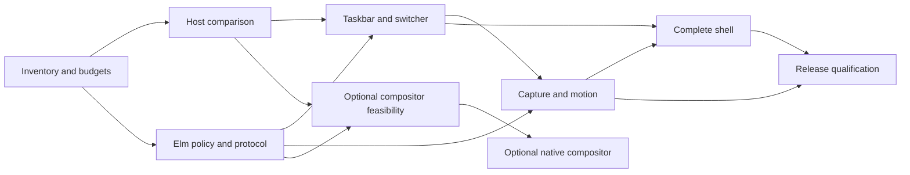

# Elm desktop and window-system roadmap

Reviewed delivery plan — 2026-10-03 — branch `feature/elm`.

The target is a complete Elm desktop shell for Omarchy with Windows-style window behavior. Elm owns presentation and ordinary policy; a native host and command authority own Wayland surfaces, application-window effects, global input, captures and presentation feedback. Hyprland remains the compositor for the first production milestone. Replacing it is a separately gated native compositor project with Elm policy, included below rather than assumed to be an all-Elm implementation.

This is a planning change. No implementation milestone, native acceptance campaign or deployment is completed by creating this roadmap. The observed taskbar improvements and staged stacking correction are existing inputs, not proof of Elm compatibility. The original acceptance cases and deadlines remain binding.

## Reading order and contracts

1. [Baseline and preserved work](BASELINE.md).
2. [EARS requirements](REQUIREMENTS.md), the complete planning behavior inventory.
3. [Traceability matrix](TRACEABILITY.md), mapping each requirement to an OpenSpec scenario, phase, task and verification.
4. [OpenSpec proposal](../../openspec/changes/elm-desktop-pivot/proposal.md), [design](../../openspec/changes/elm-desktop-pivot/design.md), [tasks](../../openspec/changes/elm-desktop-pivot/tasks.md) and capability deltas.
5. [Audit findings and dispositions](audits/README.md).
6. [Interaction defaults](INTERACTION.md) and [complete architecture](ARCHITECTURE.md).
7. [Elm practices](ELM-PRACTICES.md) and [architecture prototypes](prototypes/README.md).
8. [Research corpus](../research/elm-pivot/CORPUS_INDEX.md).

The EARS registry is the source of requirement text. Each row names an accountable role and an independent verifier; these are explicit responsibility mappings pending staffing, not claims that people are already assigned. OpenSpec expresses the same text with concrete GIVEN/WHEN/THEN scenarios; neither representation is a claim of deployed behavior. New capabilities live under `openspec/changes/elm-desktop-pivot/specs/` until implemented and accepted. Do not promote a draft into `openspec/specs/` or archive the change while tasks remain incomplete.

## Scope and success

The mandatory scope covers application discovery, left taskbar and groups, launcher/actions, previews of minimized windows, switcher and Task View, snapping/workspaces, maximize/minimize/restore, pin/modal/focus behavior, continuous reversible motion, menus/settings/themes, native integrations, multi-display scaling, keyboard/IME/accessibility, packaging, recovery and upgrade/rollback.

Windows parity means the explicit behavior inventory and inherited scenario identities, not compatibility with every Windows API or duplication of every Microsoft application. Existing Linux application windows, Files and Omarchy services remain usable. File operations retain their Quint-defined semantics and authorization route. The preview ownership problem and the Brave maximized-window defect remain native issues even when Elm displays the UI.

The optional compositor track includes native Wayland/Xwayland compatibility, seat/input, rendering/buffer ownership, outputs/backends, portals/IME/accessibility and crash recovery. It begins only after its feasibility gate and a separate resource/scope decision. Mandatory shell delivery does not depend on completing it.

## Sprint delivery

[Sprint plan](SPRINTS.md) decomposes the mandatory phases into 16 outcome-driven work packages, with separate optional compositor slots. The [machine backlog](delivery/sprint-backlog.json) maps all 242 requirements and 417 acceptance scenarios exactly once, retaining owners and independent verifier roles. Implement small runnable slices, check them, review results and advance when acceptance gates pass. Cycle numbers carry no duration or staffing forecast. This is a delivery-planning derivative of the frozen reviewed requirements; the original audit and final-plan manifests remain unchanged.

## Workstreams and ownership

| Workstream | Responsible role | Outputs |
| --- | --- | --- |
| Product/interaction | Desktop experience lead | Behavior inventory, keyboard and accessibility paths, compatibility fixtures |
| Elm policy/presentation | Elm lead | Typed model, reducer, decoders, views, replay and unit/fuzz tests |
| Native host/authority | Wayland/Qt/GTK lead | Shell surface roles, input ordering, validated effects, command receipts |
| Capture/rendering | Graphics lead | Opaque frame API, native retention, motion/presentation evidence |
| Verification | Independent QA/formal lead | Quint models, property tests, protected native campaigns, evidence closure |
| Release/integration | Omarchy integration lead | Dependency/ABI manifests, supervised services, feature selection, rollback |

These roles identify responsibilities for implementation and review. Independent coding, model and host experiments can progress in parallel against stable interfaces; native GUI campaigns remain serialized.

## Phases, gates and dependencies

| Phase | Objective and concrete deliverables | Dependencies | Exit evidence |
| --- | --- | --- | --- |
| P0 | Freeze baseline, inventory, protocol proposal, workloads and compatibility matrix; establish budgets; run an independent existing-compositor layering diagnosis/qualification track | Research and preserved archive | Reviewed manifests, original case map, measured baseline and frozen budget sheet |
| P1 | Isolated GTK/WebKit and comparative Qt host spikes; Elm HTML layer surface, bridge, focus/IME/popup routing and host crash recovery | P0 | Native host surface-role proof; measured startup/idle/input latency; selected host decision |
| P2 | Elm policy model, versioned event/intent/receipt contract, recorded-observation replay, stale/cancel/restart faults | P0 contract; P1 transport before native effects | Named/fuzz/Quint evidence; replay equivalence; native effect-boundary rejection |
| P3 | Full Elm taskbar and switcher vertical slice; desktop metadata, groups, actions, global Alt chord routing, feature-selectable integration | P1 + P2 | Taskbar/switcher native routes including release-before-open and unchanged/cancelled/stale paths |
| P4 | Minimized previews, retained frames, family capture, minimize/restore motion, reversal and capture retirement | P2; P3 UI consumer | Original restore baseline38/fault34 plus source-stop/family/output proofs at original deadlines |
| P5 | Complete shell experience: Task View, snap/workspaces, launcher/menus, settings/themes, accessibility/IME/multi-output and native window-policy parity | P3; previews/motion depend on P4 | Explicit UX matrix, original pin/input/popup/drag cases, AT and hardware evidence |
| P6 | Coherent regression tuple, performance qualification, packaging/license review, reversible activation and rollback drills | P4 + P5 and all mandatory requirements accepted | One frozen source/runtime/ABI pair with full gate ledger; release and rollback receipts |
| P7 | Optional compositor feasibility: candidate substrate, protocol/application inventory, scope/funding decision and isolated baseline | P1–P2 evidence; separate scope decision, independent of shell release | Native proof of representative Wayland/Xwayland applications; explicit go/no-go |
| P8 | Optional native compositor implementation with Elm policy; full compatibility, capture, outputs, seat and release qualification | P7 go decision; separately staffed plan | Equivalent mandatory parity and full new compositor compatibility gates |

Delivery uses AI-assisted build cycles. Previous human staffing and engineer-week estimates are superseded; historical audit packets remain unchanged. Progress is measured by runnable behavior, resolved counterexamples and accepted native evidence. Revisit implementation choices when host or capture experiments fail. Original runtime acceptance deadlines remain binding.

## Architecture and data flow

Use Elm `Browser.element` or a justified equivalent for native-hosted views. Keep the JavaScript adapter narrow: initialization, serialized ports and the selected host IPC binding. The stable reference compiler is 0.19.2; pin compiler, Elm packages, test runner and host dependencies together. Current Elm commands/subscriptions replace historical FRP Signals. A headless `Platform.worker` is useful for reducer/replay experiments but does not qualify the full-GUI host.

Publish coherent native snapshots and ordered event deltas. Requests and receipts carry protocol version, request ID, compositor lifetime, frontend epoch, captured window incarnation, operation generation, expected native revision and output generation. Specify numeric encoding for 64-bit identities/clocks, queue limits, snapshot resynchronization, timeouts and rejection codes before implementing the transport. Window addresses and DOM rows are not stable authority.

The native service decides whether a requested effect is still valid immediately before committing it. Elm tracks desired state, pending operation and acknowledged outcome. A send, accepted receipt and presented frame are different events. Dependent capture/hide/retire actions advance through receipts rather than unordered `Cmd.batch`. After uncertainty or renderer restart, reconcile native truth instead of automatically replaying mutating operations.

Global keyboard chord events originate in native order before view readiness; unrelated text and credential keys are never journaled. Native scene/input fixes can be developed and qualified against P0 policy without waiting for the Elm host comparison. Wayland layer surfaces, popup roles, hit masks, exclusive zones and keyboard interactivity are host responsibilities. Native frame producers expose opaque leased handles; consumers do not exchange large pixel arrays through JSON. Live-preview embedding, accessibility bridges, IME composition and source-stop retention need explicit native proof for the selected host.

## GPU and layering prerequisites

[GPU acceleration and WebGPU qualification](GPU.md) makes actual hardware-rendered shell output a host/release gate. The read-only machine inventory finds both Intel and NVIDIA Vulkan devices; webview and WebGPU execution remain unproven. WebGPU is evaluated as an optional effect/compute path, with native buffer interoperability and device-loss proof.

[Layering design](LAYERING.md) studies Mutter and KWin and requires a single native eligibility/stack revision shared by painting, hit testing and focus. Minimized and inactive-workspace surfaces cannot become eligible merely through an old raise/fullscreen flag. The observed Heroic/terminal incident is a new regression fixture; the staged MAX correction is not assumed to cover it.

## Performance qualification

P0 freezes workload and hardware metadata for cold startup, idle taskbar, desktop-entry refresh, switcher opening/navigation, minimized preview, capture-to-first-frame, reversible motion, output transfer and a long-running resource soak. Record CPU/wakeups, resident/private memory, input-to-present latency distributions, dropped/deadline-missed frames, texture/upload work and bounded resource counts. Measure whole-process groups, including browser renderer children and native helpers.

For host selection, compare each candidate with the same current-shell workload and report p50/p95/p99, sample counts, refresh rates, warm/cold state and instrumentation overhead. Freeze the acceptable regression thresholds and absolute product targets in `budgets.json` during P0 before evaluating candidates. An unset budget blocks host selection/release; a favorable compiler benchmark cannot fill it. The existing two-second capture/restore acceptance deadline and original helper/receipt/cursor timeouts are preserved.

Keep compositor hit testing, actual drawing order and per-frame native motion off the asynchronous webview loop. Evaluate multi-output/high-refresh behavior on hardware, rather than inferring 240 Hz support from reducer throughput. Use coalescing for observations with explicit non-coalescible causal events; dropping Alt release, cancellation or frame-retirement receipts is not a performance optimization.

## Verification and evidence

Retain the original archived tests, hashes, failures and scenario identities unchanged. New adapters map legacy observations into Elm-specific scenarios and retain the mapping. CPU, replay, fuzz, formal/model and native results have separate gate columns; one cannot stand in for another. Every proposed requirement has at least one OpenSpec scenario and a task with a concrete verifier.

Use protected QA orchestration for every proof/freezer/native campaign. The QA owner serializes live campaigns, verifies the parent Wayland socket and private runtime ownership, supervises all process groups, preserves core-limit and crash-watch controls, and closes owned clients/helpers before compositor teardown. Main-desktop restart, drafts and installed native pairing are preserved during research/testing. Actual activation is a separately authorized final action after a concrete accepted tuple and rollback artifact exist.

Retain all failures and reruns with hashes. Gate records contain input source tuple, command, environment, native pair, original deadline, observations, normal-exit/retirement evidence and verdict. Evidence from the current native stack correction is a bounded seven-case result; it does not establish full Brave/application, multi-output or Elm-host acceptance.

## Decisions and stop conditions

| Decision | Owner / phase | Evidence needed | Stop or fallback |
| --- | --- | --- | --- |
| WebKitGTK vs Qt WebEngine | Native + Elm leads / P1 | Compatible GTK major versions or valid Qt initialization; native role/focus/IME/AT; whole-tree performance | Retain existing QML if neither host passes; headless Elm policy remains an independently useful option |
| Native preview embedding | Graphics lead / P4 | Source-stop lifetime, decorations/popups, buffers/retirement and output transforms | Keep native renderer for previews or defer full shell; do not replace a failed proof with screenshots |
| Canonical multi-display model | Elm + native leads / P2 | Ordered events, generation invalidation and no competing effects | Keep cross-display authority native until explicit synchronization is proven |
| Optional compositor substrate | Compositor lead / P7 | Protocol matrix, app fixtures, upstream support/license and prototype | Do not commit to replacement if native scope/cost is unacceptable |
| Production activation | Release owner / P6 | Full mandatory ledger, dependency/ABI hashes and rollback drill | Preserve working shell and staged candidates until qualification completes |

## Risks and mitigations

| Risk | Impact | Mitigation and detection |
| --- | --- | --- |
| Native surface/keyboard semantics do not map to chosen host | Shell cannot safely receive global chords or popups | P1 actual surface and chord fixtures before full UI investment |
| Browser process/runtime overhead exceeds budgets | Idle regressions or visible input latency | Whole-tree baseline, bounded publication and renderer lifecycle; stop host selection on failed budgets |
| Captured family pixels or leases are incomplete | Minimized previews/restore show wrong or dead content | Original baseline/fault gates, family extents, source-stop and normal retirement proof |
| Pure reducer accepted but native commit is stale | Wrong application receives a focus/minimize operation | Native incarnation/revision checks, epochs and cancellation at effect boundary |
| Existing defect relabeled as language migration | Painted and hit-tested stacking remain inconsistent | Explicit native stack acceptance and representative Brave runs independent of Elm UI |
| Accessibility or IME fails across host boundary | Users cannot navigate/input text or use assistive technology | Early P1 bridge proof plus P5 audible/braille/IME hardware qualification |
| Optional compositor expands mandatory scope | Shell delivery stalls | Separate P7/P8 decision, estimates, requirements and release gates |
| Archived proof rewritten to fit migration | False confidence and lost regression history | Fresh derivatives, hash-bound old evidence, named scenario selection and audit ledger |

## Release and operation

Package reproducible Elm assets, the native host/authority and manifests separately. Configuration exposes a reversible per-component feature selection and retains the existing working shell until accepted replacement routes are available. Install only reviewed user-owned configuration; do not edit `/usr/share/omarchy`. Native plugin and compositor upgrades require an exact compatible pair and an explicit session activation plan.

Before release, qualify cold start, renderer/native-service restart, reconnect/resync, output hotplug, suspend/resume, rollback with settings preservation and an interrupted upgrade. Generate an offline recovery path that does not require a functioning Elm view. Validate licenses for compiler, packages, WebKit/Qt, native substrate and bundled resources; retain notices and an SBOM. These are future delivery tasks, not installations performed by this planning change.

## Audit and acceptance status

Five requested GPT-6.1 Sol authors develop the component plan and requirement registry. Four independent requested auditors—two Grok 4.7 and two GPT-6.1 Sol—review a frozen first-draft packet. Findings are retained with severity, affected requirement, correction and final disposition. Validation checks traceability, EARS form, OpenSpec strict parsing and draft artifact links. Audit and format acceptance do not mean the Elm implementation is complete.

## Completed planning validation

The final registry contains 242 EARS requirements and 417 OpenSpec scenarios across 15 capabilities. Strict OpenSpec validation and local phase/task/scenario/owner/link checks pass. Four initial architecture/delivery audits produced 57 reconciled findings; five UI/UX specialist reviewers subsequently confirmed corrections to their 23 findings against the same final registry. Reports and exact hash bindings are retained in audits/. These model reviews do not replace empirical user studies.

The [full architecture](ARCHITECTURE.md) and [Elm practices](ELM-PRACTICES.md) define component contracts, native authority, TEA reducers/effects, resource lifetimes and deployment boundaries. The [architecture experiments](prototypes/README.md) pass 29 named Quint tests and 3,000 bounded sampled traces; 12 deliberately buggy derivatives expose retained counterexamples. A compiled headless Elm reducer passes eight checks. Composition/liveness and actual host/native/GPU acceptance remain pending.

## Implementation started

[First Elm/native host slice](../../implementation/elm-shell-v1/README.md) compiles, passes 14 pure Elm checks and native host decoder/asset test groups, and renders fixture views in private xdg and layer-shell cases. No full requirement or production milestone is marked complete. The [execution ledger](delivery/implementation-status.json) records active work and open gates. The final implementation pass updates only DEL-002 to match outcome-driven execution; previous hash-bound reviews remain scoped to their recorded registry.
