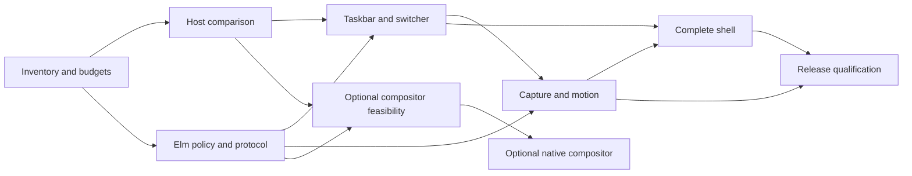

You are an independent Grok 4.7 auditor of an Elm desktop/window-system ROADMAP, not an implementer. The user explicitly requested two independent Grok 4.7 audit sessions. You are one session. Do not use tools, make changes, send messages, or claim native testing. All audit material is embedded below. Review it adversarially with concrete counterexamples. A future gated implementation and openly unresolved owner/experiment decision is not intrinsically a planning defect. Do not claim to have reviewed all source code: primary-source interpretations are included, full corpus is available locally but not all embedded here.
Return a comprehensive Markdown report with input SHA256, verdict, scope/limitations, findings grouped by severity, then coverage strengths. Every finding needs stable ID, severity critical/high/medium/low, requirement IDs, artifact/heading, concrete defect/counterexample, exact correction and whether it blocks implementation admission. Prefix finding IDs GRK-D. Suggest explicit EARS wording for missing requirements. Do not invent severity to meet a quota. Distinguish user requirements from recommendations. All implementation/native/GPU acceptance is pending.

Input SHA256: 9b7f47af2664ab40322cf40241d04f69348a0a6064b20b1cec34a37713436b6b
Focus: Complete requirements and execution readiness. Evaluate EARS atomicity/testability, OpenSpec scenarios and traceability, phase dependencies/effort/staffing, source closure and inherited native acceptance, security/assistive technology/IME, hardware/performance budget freezing, package/ABI/recovery/upgrade/rollback and comprehensive architecture study. Identify uncovered user requirements and insufficient gates.

# Frozen Elm desktop planning review packet

The canonical requirement registry includes exact OpenSpec normative text/scenarios, implementation tasks, phase and evidence mapping. OpenSpec strict verification is included. All implementation/native/GPU acceptance is pending. Report defects with stable IDs, concrete counterexamples and precise corrections. Do not infer that source acquisition or model tests prove native behavior.

---
FILE: docs/elm-roadmap/ROADMAP.md

# Elm desktop and window-system roadmap

Draft delivery plan — 2026-10-03 — branch `feature/elm`.

The target is a complete Elm desktop shell for Omarchy with Windows-style window behavior. Elm owns presentation and ordinary policy; a native host and command authority own Wayland surfaces, application-window effects, global input, captures and presentation feedback. Hyprland remains the compositor for the first production milestone. Replacing it is a separately gated native compositor project with Elm policy, included below rather than assumed to be an all-Elm implementation.

This is a planning change. No implementation milestone, native acceptance campaign or deployment is completed by creating this roadmap. The observed taskbar improvements and staged stacking correction are existing inputs, not proof of Elm compatibility. The original acceptance cases and deadlines remain binding.

## Reading order and contracts

1. [Baseline and preserved work](BASELINE.md).
2. [EARS requirements](REQUIREMENTS.md), the complete planning behavior inventory.
3. [Traceability matrix](TRACEABILITY.md), mapping each requirement to an OpenSpec scenario, phase, task and verification.
4. [OpenSpec proposal](../../openspec/changes/elm-desktop-pivot/proposal.md), [design](../../openspec/changes/elm-desktop-pivot/design.md), [tasks](../../openspec/changes/elm-desktop-pivot/tasks.md) and capability deltas.
5. [Audit findings and dispositions](audits/README.md).
6. [Research corpus](../research/elm-pivot/CORPUS_INDEX.md).

The EARS registry is the source of requirement text. OpenSpec expresses the same text with concrete GIVEN/WHEN/THEN scenarios; neither representation is a claim of deployed behavior. New capabilities live under `openspec/changes/elm-desktop-pivot/specs/` until implemented and accepted. Do not promote a draft into `openspec/specs/` or archive the change while tasks remain incomplete.

## Scope and success

The mandatory scope covers application discovery, left taskbar and groups, launcher/actions, previews of minimized windows, switcher and Task View, snapping/workspaces, maximize/minimize/restore, pin/modal/focus behavior, continuous reversible motion, menus/settings/themes, native integrations, multi-display scaling, keyboard/IME/accessibility, packaging, recovery and upgrade/rollback.

Windows parity means the explicit behavior inventory and inherited scenario identities, not compatibility with every Windows API or duplication of every Microsoft application. Existing Linux application windows, Files and Omarchy services remain usable. File operations retain their Quint-defined semantics and authorization route. The preview ownership problem and the Brave maximized-window defect remain native issues even when Elm displays the UI.

The optional compositor track includes native Wayland/Xwayland compatibility, seat/input, rendering/buffer ownership, outputs/backends, portals/IME/accessibility and crash recovery. It begins only after its feasibility gate and a separate resource/scope decision. Mandatory shell delivery does not depend on completing it.

## Workstreams and ownership

| Workstream | Responsible role | Outputs |
| --- | --- | --- |
| Product/interaction | Desktop experience lead | Behavior inventory, keyboard and accessibility paths, compatibility fixtures |
| Elm policy/presentation | Elm lead | Typed model, reducer, decoders, views, replay and unit/fuzz tests |
| Native host/authority | Wayland/Qt/GTK lead | Shell surface roles, input ordering, validated effects, command receipts |
| Capture/rendering | Graphics lead | Opaque frame API, native retention, motion/presentation evidence |
| Verification | Independent QA/formal lead | Quint models, property tests, protected native campaigns, evidence closure |
| Release/integration | Omarchy integration lead | Dependency/ABI manifests, supervised services, feature selection, rollback |

These are staffing roles, not claims that six people are assigned. With one developer, work follows the dependency order. With three experienced engineers, policy/view work can run alongside host integration after the protocol contract stabilizes; native GUI campaigns remain serialized by the protected QA owner.

## Phases, gates and dependencies

| Phase | Objective and concrete deliverables | Dependencies | Exit evidence | Rough effort |
| --- | --- | --- | --- | --- |
| P0 | Freeze baseline, inventory, protocol proposal, workloads and compatibility matrix; reproduce current failures; establish performance budgets | Research and preserved archive | Reviewed manifests, original case map, measured baseline and frozen budget sheet | 1–2 engineer-weeks |
| P1 | Isolated GTK/WebKit and comparative Qt host spikes; Elm HTML layer surface, bridge, focus/IME/popup routing and host crash recovery | P0 | Native host surface-role proof; measured startup/idle/input latency; selected host decision | 2–4 engineer-weeks |
| P2 | Elm policy model, versioned event/intent/receipt contract, recorded-observation replay, stale/cancel/restart faults | P0 contract; P1 transport before native effects | Named/fuzz/Quint evidence; replay equivalence; native effect-boundary rejection | 2–4 engineer-weeks |
| P3 | Full Elm taskbar and switcher vertical slice; desktop metadata, groups, actions, global Alt chord routing, feature-selectable integration | P1 + P2 | Taskbar/switcher native routes including release-before-open and unchanged/cancelled/stale paths | 3–5 engineer-weeks |
| P4 | Minimized previews, retained frames, family capture, minimize/restore motion, reversal and capture retirement | P2; P3 UI consumer | Original restore baseline38/fault34 plus source-stop/family/output proofs at original deadlines | 4–8 engineer-weeks |
| P5 | Complete shell experience: Task View, snap/workspaces, launcher/menus, settings/themes, accessibility/IME/multi-output and native window-policy parity | P3; previews/motion depend on P4 | Explicit UX matrix, original pin/input/popup/drag cases, AT and hardware evidence | 5–9 engineer-weeks |
| P6 | Coherent regression tuple, performance qualification, packaging/license review, reversible activation and rollback drills | P4 + P5 and all mandatory requirements accepted | One frozen source/runtime/ABI pair with full gate ledger; release and rollback receipts | 2–4 engineer-weeks |
| P7 | Optional compositor feasibility: candidate substrate, protocol/application inventory, scope/funding decision and isolated baseline | P1–P2 evidence; separate scope decision, independent of shell release | Native proof of representative Wayland/Xwayland applications; explicit go/no-go | 3–6 engineer-weeks |
| P8 | Optional native compositor implementation with Elm policy; full compatibility, capture, outputs, seat and release qualification | P7 go decision; separately staffed plan | Equivalent mandatory parity and full new compositor compatibility gates | 20–50+ engineer-weeks |

Effort estimates are planning ranges, not measurements or dates. The mandatory phases sum to roughly 19–36 engineer-weeks before contingency; integration and hardware/accessibility findings can extend that range. These estimates assume experienced Elm and native Wayland engineers, access to target hardware and reuse of validated native authority/capture code. Three engineers do not divide the calendar duration by three because host, protocol, capture and serial acceptance form the critical path. Reserve 25–40% contingency after P0 resolves dependency inventory. Re-estimate at P1 host choice and P4 capture proof; stop rather than conceal a failed feasibility gate.

## Architecture and data flow

Use Elm `Browser.element` or a justified equivalent for native-hosted views. Keep the JavaScript adapter narrow: initialization, serialized ports and the selected host IPC binding. The stable reference compiler is 0.19.2; pin compiler, Elm packages, test runner and host dependencies together. Current Elm commands/subscriptions replace historical FRP Signals. A headless `Platform.worker` is useful for reducer/replay experiments but does not qualify the full-GUI host.

Publish coherent native snapshots and ordered event deltas. Requests and receipts carry protocol version, request ID, compositor lifetime, frontend epoch, captured window incarnation, operation generation, expected native revision and output generation. Specify numeric encoding for 64-bit identities/clocks, queue limits, snapshot resynchronization, timeouts and rejection codes before implementing the transport. Window addresses and DOM rows are not stable authority.

The native service decides whether a requested effect is still valid immediately before committing it. Elm tracks desired state, pending operation and acknowledged outcome. A send, accepted receipt and presented frame are different events. Dependent capture/hide/retire actions advance through receipts rather than unordered `Cmd.batch`. After uncertainty or renderer restart, reconcile native truth instead of automatically replaying mutating operations.

Global keyboard events originate in native order before view readiness. Wayland layer surfaces, popup roles, hit masks, exclusive zones and keyboard interactivity are host responsibilities. Native frame producers expose opaque leased handles; consumers do not exchange large pixel arrays through JSON. Live-preview embedding, accessibility bridges, IME composition and source-stop retention need explicit native proof for the selected host.

## GPU and layering prerequisites

[GPU acceleration and WebGPU qualification](GPU.md) makes actual hardware-rendered shell output a host/release gate. The read-only machine inventory finds both Intel and NVIDIA Vulkan devices; webview and WebGPU execution remain unproven. WebGPU is evaluated as an optional effect/compute path, with native buffer interoperability and device-loss proof.

[Layering design](LAYERING.md) studies Mutter and KWin and requires a single native eligibility/stack revision shared by painting, hit testing and focus. Minimized and inactive-workspace surfaces cannot become eligible merely through an old raise/fullscreen flag. The observed Heroic/terminal incident is a new regression fixture; the staged MAX correction is not assumed to cover it.

## Performance qualification

P0 freezes workload and hardware metadata for cold startup, idle taskbar, desktop-entry refresh, switcher opening/navigation, minimized preview, capture-to-first-frame, reversible motion, output transfer and a long-running resource soak. Record CPU/wakeups, resident/private memory, input-to-present latency distributions, dropped/deadline-missed frames, texture/upload work and bounded resource counts. Measure whole-process groups, including browser renderer children and native helpers.

For host selection, compare each candidate with the same current-shell workload and report p50/p95/p99, sample counts, refresh rates, warm/cold state and instrumentation overhead. Freeze the acceptable regression thresholds and absolute product targets in `budgets.json` during P0 before evaluating candidates. An unset budget blocks host selection/release; a favorable compiler benchmark cannot fill it. The existing two-second capture/restore acceptance deadline and original helper/receipt/cursor timeouts are preserved.

Keep compositor hit testing, actual drawing order and per-frame native motion off the asynchronous webview loop. Evaluate multi-output/high-refresh behavior on hardware, rather than inferring 240 Hz support from reducer throughput. Use coalescing for observations with explicit non-coalescible causal events; dropping Alt release, cancellation or frame-retirement receipts is not a performance optimization.

## Verification and evidence

Retain the original archived tests, hashes, failures and scenario identities unchanged. New adapters map legacy observations into Elm-specific scenarios and retain the mapping. CPU, replay, fuzz, formal/model and native results have separate gate columns; one cannot stand in for another. Every proposed requirement has at least one OpenSpec scenario and a task with a concrete verifier.

Use protected QA orchestration for every proof/freezer/native campaign. The QA owner serializes live campaigns, verifies the parent Wayland socket and private runtime ownership, supervises all process groups, preserves core-limit and crash-watch controls, and closes owned clients/helpers before compositor teardown. Main-desktop restart, drafts and installed native pairing are preserved during research/testing. Actual activation is a separately authorized final action after a concrete accepted tuple and rollback artifact exist.

Retain all failures and reruns with hashes. Gate records contain input source tuple, command, environment, native pair, original deadline, observations, normal-exit/retirement evidence and verdict. Evidence from the current native stack correction is a bounded seven-case result; it does not establish full Brave/application, multi-output or Elm-host acceptance.

## Decisions and stop conditions

| Decision | Owner / phase | Evidence needed | Stop or fallback |
| --- | --- | --- | --- |
| WebKitGTK vs Qt WebEngine | Native + Elm leads / P1 | Compatible GTK major versions or valid Qt initialization; native role/focus/IME/AT; whole-tree performance | Retain existing QML if neither host passes; headless Elm policy remains an independently useful option |
| Native preview embedding | Graphics lead / P4 | Source-stop lifetime, decorations/popups, buffers/retirement and output transforms | Keep native renderer for previews or defer full shell; do not replace a failed proof with screenshots |
| Canonical multi-display model | Elm + native leads / P2 | Ordered events, generation invalidation and no competing effects | Keep cross-display authority native until explicit synchronization is proven |
| Optional compositor substrate | Compositor lead / P7 | Protocol matrix, app fixtures, upstream support/license and prototype | Do not commit to replacement if native scope/cost is unacceptable |
| Production activation | Release owner / P6 | Full mandatory ledger, dependency/ABI hashes and rollback drill | Preserve working shell and staged candidates until qualification completes |

## Risks and mitigations

| Risk | Impact | Mitigation and detection |
| --- | --- | --- |
| Native surface/keyboard semantics do not map to chosen host | Shell cannot safely receive global chords or popups | P1 actual surface and chord fixtures before full UI investment |
| Browser process/runtime overhead exceeds budgets | Idle regressions or visible input latency | Whole-tree baseline, bounded publication and renderer lifecycle; stop host selection on failed budgets |
| Captured family pixels or leases are incomplete | Minimized previews/restore show wrong or dead content | Original baseline/fault gates, family extents, source-stop and normal retirement proof |
| Pure reducer accepted but native commit is stale | Wrong application receives a focus/minimize operation | Native incarnation/revision checks, epochs and cancellation at effect boundary |
| Existing defect relabeled as language migration | Painted and hit-tested stacking remain inconsistent | Explicit native stack acceptance and representative Brave runs independent of Elm UI |
| Accessibility or IME fails across host boundary | Users cannot navigate/input text or use assistive technology | Early P1 bridge proof plus P5 audible/braille/IME hardware qualification |
| Optional compositor expands mandatory scope | Shell delivery stalls | Separate P7/P8 decision, estimates, requirements and release gates |
| Archived proof rewritten to fit migration | False confidence and lost regression history | Fresh derivatives, hash-bound old evidence, named scenario selection and audit ledger |

## Release and operation

Package reproducible Elm assets, the native host/authority and manifests separately. Configuration exposes a reversible per-component feature selection and retains the existing working shell until accepted replacement routes are available. Install only reviewed user-owned configuration; do not edit `/usr/share/omarchy`. Native plugin and compositor upgrades require an exact compatible pair and an explicit session activation plan.

Before release, qualify cold start, renderer/native-service restart, reconnect/resync, output hotplug, suspend/resume, rollback with settings preservation and an interrupted upgrade. Generate an offline recovery path that does not require a functioning Elm view. Validate licenses for compiler, packages, WebKit/Qt, native substrate and bundled resources; retain notices and an SBOM. These are future delivery tasks, not installations performed by this planning change.

## Audit and acceptance status

Five requested GPT-6.1 Sol authors develop the component plan and requirement registry. Four independent requested auditors—two Grok 4.7 and two GPT-6.1 Sol—review a frozen first-draft packet. Findings are retained with severity, affected requirement, correction and final disposition. Validation checks traceability, EARS form, OpenSpec strict parsing and draft artifact links. Audit and format acceptance do not mean the Elm implementation is complete.

---
FILE: docs/elm-roadmap/BASELINE.md

# Baseline and migration obligations

Snapshot: 2026-10-03. The immutable [original handoff](../HANDOFF.md) defines full Windows parity as unfinished. The [research assessment](../research/elm-pivot/README.md) describes the proposed Elm boundary and offline evidence.

| Area | Current observation | Obligation carried into Elm |
| --- | --- | --- |
| Taskbar | v3 cache/event coalescing enabled; CPU/Qt/Quint and bounded native observer evidence | Preserve desktop-file masking/actions, private atomic cache, one shared observer, preview publication, cleanup and no feedback loops |
| Hidden capture | Original B14 missed rendering before two-second deadline; V29 CPU pass; profiling derivative staged | Original baseline38/fault34 with unchanged deadline, composed family pixels and owned helper closure |
| Retained frame | QML prototype/lint only, no source-stop native acceptance | Independent source-stop lifetime, family extents, scale/output and actual presentation proofs |
| MAX stacking | Exact native renderer/plugin pair built; seven private pixel/click/pin cases pass; activation pending | Native painted/hit/focus agreement plus broader application/modal/fullscreen/output matrix |
| Switcher | Alt-release-before-ready correction staged; pure/offscreen checks only | Native-origin chord ordering, generation cancellation and startup/reload route acceptance |
| Pin/input | B01–B10 bounded pass; B11 wrong premise; broader campaign open | Genuine no-focus blocker, remaining original cases and normal teardown; no altered assertions |
| Popup/process | CPU/formal subcomponents pass; runtime projection/reliability open | Real changed/same/cancelled/stale routes and original two-process/three-slot/helper reliability workload |
| Drag/resize | Original52 not complete | All original named cases including minimized preview movement and reload |
| Hardware/AT | Broad acceptance open | Multi-output, reduced motion, high refresh, assistive technology and application compatibility |

Current follow-up implementation status is in the working tree's `implementation/STATUS.md`. The roadmap commit deliberately excludes unrelated native build trees and installed files; that path is contextual local evidence, not a bundled Elm release. The immutable handoff remains the portable baseline. New requirement evidence paths identify the existing workspace sources or explicitly new proof obligations. Nothing in this document promotes staged candidates to deployed or fully accepted results.

Preserve `docs/crash-noise/HANDOFF-codex-window-qa.md` and its five operational changes. Run proof/freezer/native work through `/home/hoskinson/window-integration-qa/qa_run.py`, with the original process ownership, runtime-directory, cleanup and serial-campaign rules. No main-compositor restart or draft closure is part of the planning work.

---
FILE: docs/elm-roadmap/GPU.md

# GPU acceleration and WebGPU qualification

**Hardware GPU acceleration is a mandatory host/release gate. WebGPU is a candidate API whose availability must be proven in the actual pinned shell host.** Its absence does not require CPU rendering: native Vulkan/OpenGL and hardware-accelerated webview composition remain alternatives. Neither an Elm reducer nor finding `navigator.gpu` proves hardware-rendered shell output.

## What is available on this machine

The protected read-only [inventory](gpu-inventory.json) completed on 2026-10-03. Vulkan enumerates Intel Graphics ARL (integrated, Mesa 26.2.2) and NVIDIA GeForce RTX 5090 Laptop GPU (discrete, driver 615.71.09), each reporting Vulkan 1.4 capability. The Vulkan loader reports 1.4.357. Driver enumeration and `nvidia-smi` succeeded.

This establishes hardware and Vulkan API availability, not an executed shell render workload, GPU buffer import, webview acceleration or WebGPU adapter/device acceptance. Those are P1/P4 native proof obligations. The installed WebKitGTK package is 2.52.6; Qt WebEngine is a candidate dependency, not an installed qualified host. Hardware findings do not justify changing Brave flags or compositor settings.

## Three different acceleration layers

| Layer | Owner | Candidate | Qualification |
| --- | --- | --- | --- |
| Elm HTML/CSS shell rendering | Native webview and engine compositor | WebKitGTK or Qt WebEngine hardware path | Actual renderer/backend diagnostics, nonsoftware device, workload trace and displayed frame |
| Optional custom GPU effects/compute | Narrow JavaScript/custom-element renderer inside the host | WebGPU and WGSL | Secure local origin, adapter/device capabilities, known render/compute result, bounded resources, device-loss handling |
| Native application previews and window composition | Native capture/renderer/compositor | Existing native Vulkan/OpenGL, or separately evaluated native wgpu/Dawn backend | Buffer ownership/import/fences, last-presented timing, source-stop survival, output transforms and GPU retirement |

Elm sends declarative effect parameters and opaque identities. The JS adapter/native renderer owns GPU objects and execution; no unsupported Elm kernel extension or raw GPU pointer crosses ports. Elm's standard APIs do not directly bind WebGPU. A native wgpu/Dawn renderer is a separate native integration, even though it follows WebGPU concepts.

Qt's documented path uses Chromium GPU rendering imported into Qt's scene graph; the pinned Qt version and device/driver interoperability need testing, particularly with NVIDIA. Installed GTK components likewise do not prove the required runtime path. [Qt hardware acceleration](https://doc.qt.io/qt-6.11/qtwebengine-features.html).

## P1 WebGPU experiment

1. Create an isolated host with bundled local assets and a secure-origin scheme appropriate to that host. Preserve renderer sandboxing and keep privileged native commands behind authenticated host IPC. Remote debugging and remote navigation remain disabled for release.
2. Record engine/runtime versions and whether `navigator.gpu` is exposed. Request an adapter; record feature/limit availability and independently classify hardware versus software using pinned API/engine diagnostics. A null adapter, rejected device request or software-only adapter fails WebGPU qualification.
3. Request only required features/limits. Run deterministic WGSL render and compute probes; verify output/readback and validation errors, then independently observe a displayed native frame. Readback is test instrumentation, not the production rendering path.
4. Keep GPU objects and frame scheduling local to the renderer. Bound textures, buffers and outstanding frames. Dispose owned resources and test device loss, adapter failure, renderer restart, output changes and resynchronization.
5. Compare end-to-end input/presentation latency, memory, power/wakeups, upload/copy volume and frame deadlines with native GPU and normal accelerated DOM paths. Try integrated and discrete selection where the host supports it; compare battery and performance profiles without assuming that high-performance hints choose a specific device.

WebGPU is a secure-context API and adapters can be unavailable; device loss invalidates dependent GPU resources. Pin behavior against the actual runtime specification/API rather than assume every browser has identical flags or fallback-detection properties. [WebGPU specification](https://gpuweb.github.io/gpuweb/), [device/error handling design](https://github.com/gpuweb/gpuweb/blob/main/design/ErrorHandling.md).

## Preview import and copy budget

Standard browser WebGPU does not establish arbitrary native DMA-BUF import merely because a native frame lease exists. Prove the selected host's actual interoperability path. A VideoFrame/video-based import, native overlay, engine extension or native renderer has different ownership, copy, synchronization and security properties. Keep a native GPU preview path available while evaluating them.

Record external-memory/fence support on each native adapter, copy count/bytes and cross-GPU transfer. Define the acceptable copy budget from measurements in P0; do not promise zero-copy before proof. Source-stop survival, decorated/modal-family capture and producer/consumer retirement remain mandatory. WebGPU device loss must not replay a stale window focus/minimize intent.

## Release and failure policy

Select a host only after actual hardware-accelerated rendering passes the frozen P0 budgets and protected native acceptance. Publish the selected GPU/backend and qualification verdict in the release evidence. A software renderer can preserve essential controls during failure, but is explicitly degraded and cannot satisfy the GPU acceleration gate.

If WebGPU is unsupported or fails, disable its optional effects and retain an accepted native/engine GPU path. If every GPU path fails, preserve essential controls in a disclosed recovery mode and block promotion of that configuration as an accelerated release. Recovery must remain usable without a GPU-accelerated Elm view.

---
FILE: docs/elm-roadmap/LAYERING.md

# Window layering: native design and acceptance

Correct layering is a mandatory prerequisite for the Elm shell. The visible window, pointer target and native focus outcome must agree for overlapping eligible application surfaces. GUI-language purity and WebGPU acceleration do not fix contradictory native scene/input state.

## Current regression

The user reported that Heroic Games Launcher cannot be minimized or covered by selecting another window. A captured screen visibly shows Heroic while the compositor state sample identifies a terminal as active. Heroic is recorded on `special:win-minimized`, with `hidden=false`, `visible=true`, `acceptsInput=true` and prior over-fullscreen permission; the monitor reports no active special workspace. [Observation](heroic-layering-observation.json).

The metadata sample and screenshot are not an atomic capture. In the inspected core, generic `visible` is based on mapped/hidden/surface/alpha state, and generic `acceptsInput` does not itself encode workspace visibility. Those fields alone cannot prove the final native hit path. The observation establishes a real displayed symptom and an acceptance obligation; it does not isolate the exact offending draw pass, capture actor or runtime source tuple. The staged MAX ordering correction was built for a different bounded scenario and must not be declared a complete correction for this incident.

The current minimizer uses a special workspace. The rebuild instead needs first-class minimized eligibility that preserves normal workspace identity. Independently retained preview pixels are allowed while the live minimized surface is excluded from drawing/input. An application preview or animation actor cannot secretly remain a live clickable duplicate.

## Reference systems

Study source-level architectures, not only screenshots:

- [Mutter study](contributions/gnome-layering.md): visibility/showability, default layers, transient constraints, stack transactions, compositor actors and input ownership.
- [KWin study](contributions/kde-layering.md): constrained stacking, layer recomputation, transient handling, scene publication, input routing, outputs and native rendering.
- [Source/documentation inventories](reference/README.md): complete scoped source snapshots and reachable developer documentation downloaded using Scrapling, pinned revisions and hashes, crawl limitations and retained failures.

These references inform the design; they do not define our Windows product behavior automatically. For example, the inspected Mutter version suppresses its above-state layer for maximized windows. Our pin/MAX acceptance requires an explicit product policy instead of inheriting that behavior accidentally.

## Proposed native authority

Keep a single committed scene revision that includes stable native incarnations, window family relations, output/workspace membership, visibility reasons, presentation geometry, input regions, layer constraints, stack order and active focus. Elm receives a projection and proposes intents against a known revision; the native authority validates and commits them. It does not wait for webview IPC during native pointer dispatch or frame composition.

Apply eligibility before precedence. A stale allowed-over-fullscreen flag, pin permission or high z rank cannot make a minimized, unmapped, destroyed or inactive-workspace live surface eligible. Workspace-independent visibility is an explicit supported state, not an implication of pinning. Animation/preview surfaces have separate identities and lifetimes, remain inert when required, and retire on acknowledged generation changes.

Build layer and family constraints, then produce a deterministic bottom-to-top native order. Preserve stable relative order unless an accepted action changes it. Reject invalid owner cycles and stale requests. Eligible modal/popup children remain above their owner according to their protocol role, while focus redirects according to modal authority; unrelated windows sharing an application identity are not promoted into a modal family.

Native painting traverses the committed order; native hit testing traverses the relevant eligible order in reverse with actual input regions/transforms. Input-transparent surfaces may be painted while deliberately passing hits through. That is an explicit rule, not disagreement between independently computed stacks. Geometry used for animated hit testing follows native presented transforms, not a delayed Elm model or DOM rectangle.

A scene change publishes stack, eligibility and focus as one revision. Render/import completion and physical presentation remain separate evidence events. Generation invalidation prevents an old overlay or retained frame from becoming live input after minimize, restore, output transfer or restart. Any specialized fullscreen/effect pass must preserve the accepted order and eligibility rather than redraw an arbitrary floating window later.

## Layer policy to freeze in P0

| Domain | Product rule / gate |
| --- | --- |
| Ordinary and maximized applications | MAX remains in the ordinary application order; selecting a covered eligible peer raises it without stale peer redraw |
| Pinned applications | Explicit pin priority above ordinary/MAX windows; pin and workspace membership remain separate states |
| True fullscreen | Separate from MAX; output-local fullscreen, pin, transient and shell precedence must match the inherited native pin/fullscreen case matrix |
| Modal/popup families | Eligible children constrained above owner; focus redirects to the accepted modal recipient; protocol grabs/roles remain native |
| Panels/notifications/menus | Explicit shell surface roles and input regions; a fullscreen webview cannot grant itself compositor-wide priority |
| Preview/motion surfaces | Separate inert/interactive policy, frame lease, output generation and retirement; no accidental duplicate application input |
| Lock/security surfaces | Native exclusive security priority; ordinary apps and untrusted shell requests cannot bypass it |
| Minimized/inactive/destroyed | Excluded live surfaces regardless of z rank or old fullscreen permission; retained preview is a separate inert actor |

P0 records the exact inherited fullscreen/pin predicates and resolves any unsupported interactions before qualification. Every released layer relationship then has a concrete scenario and expected draw/hit/focus result. This gate prevents unreviewed precedence changes being smuggled in as language or host migration.

## Required adversarial fixtures

Include Heroic-versus-terminal and maximized Brave-versus-floating-peer, plus minimize/restore while a modal exists, inactive workspaces, pinned MAX/unpin/return, true fullscreen on one output with a pin on another, popup grabs and input-transparent menus. Exercise repeated raises, rapid Alt-tab, release-before-view-ready, pending capture/animation during minimize, source destruction/address reuse, output transfer/hotplug and renderer/service restart.

For each fixture preserve native identities, scene/output generations, committed order, selected window, pixel observation at overlap regions, independent input target, focus receipt and normal lifetime closure. Run the existing protected native campaigns with their original assertions/deadlines and fresh derivatives. Reducer tests, topology/property tests and Quint invariants supplement those campaigns; they do not substitute for actual drawn and clicked outcomes.

The optional replacement compositor must implement the same authority contract and acceptance matrix before taking over the main session. Shell release with Hyprland remains blocked if the active native layer behavior fails those mandatory cases.

---
FILE: docs/elm-roadmap/requirements.json

{
  "schema": 1,
  "status": "proposed; implementation acceptance pending",
  "requirements": [
    {
      "id": "ELM-ARC-001",
      "capability": "elm-host",
      "pattern": "ubiquitous",
      "ears": "The Elm desktop SHALL record the deployed compositor, plugin, shell, compiler and host versions and source hashes before a comparative native run.",
      "phase": "P0",
      "priority": "must",
      "verification": "Preserved scenario report with native or bridge trace showing: the report identifies every participating artifact; failure injection and artifact hashes included.",
      "legacyEvidence": "implementation/STATUS.md",
      "task": "Create a frozen architecture baseline manifest.",
      "scenarios": [
        {
          "name": "architecture-001",
          "given": "a taskbar-v3 desktop",
          "when": "a comparison is prepared",
          "then": "the report identifies every participating artifact"
        }
      ],
      "source": "docs/elm-roadmap/contributions/architecture.json",
      "status": "proposed",
      "taskId": "P0-ELM-ARC-001"
    },
    {
      "id": "ELM-ARC-002",
      "capability": "elm-host",
      "pattern": "ubiquitous",
      "ears": "The Elm desktop SHALL assign DOM presentation to Elm, Wayland surface lifetime to the native host, and application-window effects to native authority.",
      "phase": "P1",
      "priority": "must",
      "verification": "Preserved scenario report with native or bridge trace showing: only native authority mutates the application window; failure injection and artifact hashes included.",
      "legacyEvidence": "docs/research/elm-pivot/ARCHITECTURE.md",
      "task": "Publish an ownership table and executable boundary probe.",
      "scenarios": [
        {
          "name": "architecture-002",
          "given": "an Elm shell view",
          "when": "an application-window action is requested",
          "then": "only native authority mutates the application window"
        }
      ],
      "source": "docs/elm-roadmap/contributions/architecture.json",
      "status": "proposed",
      "taskId": "P1-ELM-ARC-002"
    },
    {
      "id": "ELM-ARC-003",
      "capability": "elm-native-bridge",
      "pattern": "ubiquitous",
      "ears": "The Elm desktop SHALL expose one incoming event stream and one outgoing intent stream with versioned, discriminated envelopes.",
      "phase": "P1",
      "priority": "must",
      "verification": "Preserved scenario report with native or bridge trace showing: both conform to the recorded schema; failure injection and artifact hashes included.",
      "legacyEvidence": "docs/research/elm-pivot/IMPLEMENTATION.md",
      "task": "Define the envelope schema and Elm decoders.",
      "scenarios": [
        {
          "name": "architecture-003",
          "given": "a connected host",
          "when": "an intent and its outcome cross the bridge",
          "then": "both conform to the recorded schema"
        }
      ],
      "source": "docs/elm-roadmap/contributions/architecture.json",
      "status": "proposed",
      "taskId": "P1-ELM-ARC-003"
    },
    {
      "id": "ELM-ARC-004",
      "capability": "elm-native-bridge",
      "pattern": "unwanted",
      "ears": "IF an envelope is malformed or has an unsupported protocol version, THEN the Elm desktop SHALL reject it without a native effect and record the rejection reason.",
      "phase": "P1",
      "priority": "must",
      "verification": "Preserved scenario report with native or bridge trace showing: no compositor action occurs and a reason is recorded; failure injection and artifact hashes included.",
      "legacyEvidence": "new coverage: bridge decoder and authority negative fixtures",
      "task": "Implement validation at both trust boundaries.",
      "scenarios": [
        {
          "name": "architecture-004",
          "given": "an invalid envelope",
          "when": "the host receives it",
          "then": "no compositor action occurs and a reason is recorded"
        }
      ],
      "source": "docs/elm-roadmap/contributions/architecture.json",
      "status": "proposed",
      "taskId": "P1-ELM-ARC-004"
    },
    {
      "id": "ELM-ARC-005",
      "capability": "elm-native-bridge",
      "pattern": "ubiquitous",
      "ears": "The Elm desktop SHALL attach request identity, compositor lifetime, frontend epoch, operation generation, window incarnation, output generation and expected native revision to window-effect intents.",
      "phase": "P1",
      "priority": "must",
      "verification": "Preserved scenario report with native or bridge trace showing: the serialized request contains the full authority tuple; failure injection and artifact hashes included.",
      "legacyEvidence": "docs/research/elm-pivot/ARCHITECTURE.md",
      "task": "Implement identity-bearing effect messages.",
      "scenarios": [
        {
          "name": "architecture-005",
          "given": "a known window and output",
          "when": "an effect is requested",
          "then": "the serialized request contains the full authority tuple"
        }
      ],
      "source": "docs/elm-roadmap/contributions/architecture.json",
      "status": "proposed",
      "taskId": "P1-ELM-ARC-005"
    },
    {
      "id": "ELM-ARC-006",
      "capability": "elm-native-bridge",
      "pattern": "unwanted",
      "ears": "IF an intent identity or expected revision differs from current native authority, THEN the Elm desktop SHALL refuse the intent before mutation.",
      "phase": "P2",
      "priority": "must",
      "verification": "Preserved scenario report with native or bridge trace showing: the new window remains unchanged; failure injection and artifact hashes included.",
      "legacyEvidence": "docs/HANDOFF.md",
      "task": "Add effect-boundary freshness guards.",
      "scenarios": [
        {
          "name": "architecture-006",
          "given": "a closed and recreated window",
          "when": "its old intent arrives",
          "then": "the new window remains unchanged"
        }
      ],
      "source": "docs/elm-roadmap/contributions/architecture.json",
      "status": "proposed",
      "taskId": "P2-ELM-ARC-006"
    },
    {
      "id": "ELM-ARC-007",
      "capability": "elm-native-bridge",
      "pattern": "ubiquitous",
      "ears": "The Elm desktop SHALL correlate each outcome with its request and represent Pending, Committed, Refused, Cancelled and Unknown as distinct states.",
      "phase": "P2",
      "priority": "must",
      "verification": "Preserved scenario report with native or bridge trace showing: its state is Unknown rather than Committed; failure injection and artifact hashes included.",
      "legacyEvidence": "docs/research/elm-pivot/ARCHITECTURE.md",
      "task": "Implement receipt state transitions.",
      "scenarios": [
        {
          "name": "architecture-007",
          "given": "a request whose connection drops",
          "when": "its final effect cannot be proven",
          "then": "its state is Unknown rather than Committed"
        }
      ],
      "source": "docs/elm-roadmap/contributions/architecture.json",
      "status": "proposed",
      "taskId": "P2-ELM-ARC-007"
    },
    {
      "id": "ELM-ARC-008",
      "capability": "elm-native-bridge",
      "pattern": "event-driven",
      "ears": "WHEN a dependent effect is requested, the Elm desktop SHALL dispatch it only after the prerequisite receipt satisfies its declared precondition.",
      "phase": "P2",
      "priority": "must",
      "verification": "Preserved scenario report with native or bridge trace showing: focus is withheld until the required receipt; failure injection and artifact hashes included.",
      "legacyEvidence": "docs/research/elm-pivot/README.md",
      "task": "Implement an acknowledged dependency scheduler.",
      "scenarios": [
        {
          "name": "architecture-008",
          "given": "restore followed by focus",
          "when": "restore is still pending",
          "then": "focus is withheld until the required receipt"
        }
      ],
      "source": "docs/elm-roadmap/contributions/architecture.json",
      "status": "proposed",
      "taskId": "P2-ELM-ARC-008"
    },
    {
      "id": "ELM-ARC-009",
      "capability": "elm-native-bridge",
      "pattern": "event-driven",
      "ears": "WHEN a duplicate request is received within a frontend epoch, the Elm desktop SHALL return the existing request disposition without executing the effect again.",
      "phase": "P2",
      "priority": "must",
      "verification": "Preserved scenario report with native or bridge trace showing: only one mutation is recorded; failure injection and artifact hashes included.",
      "legacyEvidence": "new coverage: authority idempotency ledger",
      "task": "Implement bounded request deduplication with explicit expired-ID refusal.",
      "scenarios": [
        {
          "name": "architecture-009",
          "given": "a committed request",
          "when": "the same request arrives twice",
          "then": "only one mutation is recorded"
        }
      ],
      "source": "docs/elm-roadmap/contributions/architecture.json",
      "status": "proposed",
      "taskId": "P2-ELM-ARC-009"
    },
    {
      "id": "ELM-ARC-010",
      "capability": "elm-native-bridge",
      "pattern": "event-driven",
      "ears": "WHEN a snapshot is installed, the Elm desktop SHALL apply only ordered events after its native sequence watermark and request reconciliation on a sequence gap.",
      "phase": "P2",
      "priority": "must",
      "verification": "Preserved scenario report with native or bridge trace showing: 9 is discarded and the gap before 12 triggers reconciliation; failure injection and artifact hashes included.",
      "legacyEvidence": "implementation/taskbar-v3/widget_v68/SnapshotStream.js",
      "task": "Implement snapshot and delta sequencing.",
      "scenarios": [
        {
          "name": "architecture-010",
          "given": "a snapshot at sequence 10",
          "when": "events 9 and 12 arrive",
          "then": "9 is discarded and the gap before 12 triggers reconciliation"
        }
      ],
      "source": "docs/elm-roadmap/contributions/architecture.json",
      "status": "proposed",
      "taskId": "P2-ELM-ARC-010"
    },
    {
      "id": "ELM-ARC-011",
      "capability": "elm-native-bridge",
      "pattern": "ubiquitous",
      "ears": "The Elm desktop SHALL capture modifier press, repeat, release and Escape in native order with chord generation and ordinal before frontend readiness.",
      "phase": "P2",
      "priority": "must",
      "verification": "Preserved scenario report with native or bridge trace showing: the ready view receives the release in its original chord order; failure injection and artifact hashes included.",
      "legacyEvidence": "implementation/STATUS.md",
      "task": "Retain native chord acquisition and replay it to Elm.",
      "scenarios": [
        {
          "name": "architecture-011",
          "given": "the webview is starting",
          "when": "Alt is released before readiness",
          "then": "the ready view receives the release in its original chord order"
        }
      ],
      "source": "docs/elm-roadmap/contributions/architecture.json",
      "status": "proposed",
      "taskId": "P2-ELM-ARC-011"
    },
    {
      "id": "ELM-ARC-012",
      "capability": "elm-native-bridge",
      "pattern": "event-driven",
      "ears": "WHEN cancellation reaches native authority before an effect commits, the Elm desktop SHALL prevent that effect and retire its request-owned resources.",
      "phase": "P2",
      "priority": "must",
      "verification": "Preserved scenario report with native or bridge trace showing: restore is absent and owned helpers retire; failure injection and artifact hashes included.",
      "legacyEvidence": "docs/HANDOFF.md",
      "task": "Implement cancellation checks at the final native effect boundary.",
      "scenarios": [
        {
          "name": "architecture-012",
          "given": "a prepared restore",
          "when": "Escape cancels before commit",
          "then": "restore is absent and owned helpers retire"
        }
      ],
      "source": "docs/elm-roadmap/contributions/architecture.json",
      "status": "proposed",
      "taskId": "P2-ELM-ARC-012"
    },
    {
      "id": "ELM-ARC-013",
      "capability": "elm-native-bridge",
      "pattern": "ubiquitous",
      "ears": "The Elm desktop SHALL retain each original acceptance deadline through retries, queueing, reconciliation and frontend restart.",
      "phase": "P2",
      "priority": "must",
      "verification": "Preserved scenario report with native or bridge trace showing: the deadline remains unchanged; failure injection and artifact hashes included.",
      "legacyEvidence": "docs/HANDOFF.md",
      "task": "Carry immutable absolute deadlines through request state.",
      "scenarios": [
        {
          "name": "architecture-013",
          "given": "a request nearing its original deadline",
          "when": "the renderer restarts",
          "then": "the deadline remains unchanged"
        }
      ],
      "source": "docs/elm-roadmap/contributions/architecture.json",
      "status": "proposed",
      "taskId": "P2-ELM-ARC-013"
    },
    {
      "id": "ELM-ARC-014",
      "capability": "elm-native-bridge",
      "pattern": "unwanted",
      "ears": "IF an effect outcome is Unknown, THEN the Elm desktop SHALL reconcile native state before permitting a retry of that effect.",
      "phase": "P2",
      "priority": "must",
      "verification": "Preserved scenario report with native or bridge trace showing: native truth is read before another mutation; failure injection and artifact hashes included.",
      "legacyEvidence": "docs/research/elm-pivot/IMPLEMENTATION.md",
      "task": "Implement uncertain-effect recovery.",
      "scenarios": [
        {
          "name": "architecture-014",
          "given": "an acknowledgement was lost",
          "when": "the user retries",
          "then": "native truth is read before another mutation"
        }
      ],
      "source": "docs/elm-roadmap/contributions/architecture.json",
      "status": "proposed",
      "taskId": "P2-ELM-ARC-014"
    },
    {
      "id": "ELM-ARC-015",
      "capability": "elm-native-bridge",
      "pattern": "ubiquitous",
      "ears": "The Elm desktop SHALL enforce configured byte and item bounds on bridge queues, coalesce replaceable observations, and reject new effect work explicitly when admission fails.",
      "phase": "P2",
      "priority": "must",
      "verification": "Preserved scenario report with native or bridge trace showing: memory remains bounded and effect refusal is explicit; failure injection and artifact hashes included.",
      "legacyEvidence": "docs/HANDOFF.md",
      "task": "Define queue bounds and test admission saturation.",
      "scenarios": [
        {
          "name": "architecture-015",
          "given": "queues at configured capacity",
          "when": "new observations and effects arrive",
          "then": "memory remains bounded and effect refusal is explicit"
        }
      ],
      "source": "docs/elm-roadmap/contributions/architecture.json",
      "status": "proposed",
      "taskId": "P2-ELM-ARC-015"
    },
    {
      "id": "ELM-ARC-016",
      "capability": "elm-native-bridge",
      "pattern": "ubiquitous",
      "ears": "The Elm desktop SHALL reserve bounded control capacity for cancellation, receipts and retirement independently of preview work.",
      "phase": "P2",
      "priority": "must",
      "verification": "Preserved scenario report with native or bridge trace showing: it uses reserved control capacity and is processed; failure injection and artifact hashes included.",
      "legacyEvidence": "docs/research/elm-pivot/ARCHITECTURE.md",
      "task": "Implement separate control and preview admission.",
      "scenarios": [
        {
          "name": "architecture-016",
          "given": "the preview queue is saturated",
          "when": "cancellation arrives",
          "then": "it uses reserved control capacity and is processed"
        }
      ],
      "source": "docs/elm-roadmap/contributions/architecture.json",
      "status": "proposed",
      "taskId": "P2-ELM-ARC-016"
    },
    {
      "id": "ELM-ARC-017",
      "capability": "elm-native-bridge",
      "pattern": "ubiquitous",
      "ears": "The Elm desktop SHALL use one canonical owner for cross-output snap, pin and switcher transactions and send read-only projections to display views.",
      "phase": "P3",
      "priority": "must",
      "verification": "Preserved scenario report with native or bridge trace showing: one authority serializes the transaction; failure injection and artifact hashes included.",
      "legacyEvidence": "docs/research/elm-pivot/README.md",
      "task": "Implement canonical multi-output policy projections.",
      "scenarios": [
        {
          "name": "architecture-017",
          "given": "two display views",
          "when": "both propose actions on one window",
          "then": "one authority serializes the transaction"
        }
      ],
      "source": "docs/elm-roadmap/contributions/architecture.json",
      "status": "proposed",
      "taskId": "P3-ELM-ARC-017"
    },
    {
      "id": "ELM-ARC-018",
      "capability": "elm-native-bridge",
      "pattern": "ubiquitous",
      "ears": "The Elm desktop SHALL resolve modal-family focus, input blockers, stacking and hit testing from native authority rather than DOM state.",
      "phase": "P3",
      "priority": "must",
      "verification": "Preserved scenario report with native or bridge trace showing: the native family policy determines focus and hit order; failure injection and artifact hashes included.",
      "legacyEvidence": "implementation/maximized-stack-v2/native-stack-smoke-1791036734961323596.json",
      "task": "Bind action validation to native family and hit-order observations.",
      "scenarios": [
        {
          "name": "architecture-018",
          "given": "a draft modal overlaps a maximized window",
          "when": "a user clicks a visible native region",
          "then": "the native family policy determines focus and hit order"
        }
      ],
      "source": "docs/elm-roadmap/contributions/architecture.json",
      "status": "proposed",
      "taskId": "P3-ELM-ARC-018"
    },
    {
      "id": "ELM-ARC-019",
      "capability": "elm-native-bridge",
      "pattern": "ubiquitous",
      "ears": "The Elm desktop SHALL transport preview identifiers and revisions through ports while native components retain pixel buffers and verify source-stop lifetime.",
      "phase": "P4",
      "priority": "must",
      "verification": "Preserved scenario report with native or bridge trace showing: the valid retained frame remains available without JSON pixels; failure injection and artifact hashes included.",
      "legacyEvidence": "implementation/STATUS.md",
      "task": "Implement opaque preview handles and retirement proofs.",
      "scenarios": [
        {
          "name": "architecture-019",
          "given": "a retained minimized preview",
          "when": "its source stops",
          "then": "the valid retained frame remains available without JSON pixels"
        }
      ],
      "source": "docs/elm-roadmap/contributions/architecture.json",
      "status": "proposed",
      "taskId": "P4-ELM-ARC-019"
    },
    {
      "id": "ELM-ARC-020",
      "capability": "elm-native-bridge",
      "pattern": "ubiquitous",
      "ears": "The Elm desktop SHALL distinguish native effect receipts from native frame-presentation receipts and keep motion sampling and buffer retirement under native ownership.",
      "phase": "P4",
      "priority": "must",
      "verification": "Preserved scenario report with native or bridge trace showing: presentation is unproven until the native receipt; failure injection and artifact hashes included.",
      "legacyEvidence": "docs/research/elm-pivot/ARCHITECTURE.md",
      "task": "Expose separate commit and presentation evidence.",
      "scenarios": [
        {
          "name": "architecture-020",
          "given": "a motion effect accepted by authority",
          "when": "the DOM animation callback fires",
          "then": "presentation is unproven until the native receipt"
        }
      ],
      "source": "docs/elm-roadmap/contributions/architecture.json",
      "status": "proposed",
      "taskId": "P4-ELM-ARC-020"
    },
    {
      "id": "ELM-ARC-021",
      "capability": "elm-host",
      "pattern": "ubiquitous",
      "ears": "The Elm desktop SHALL compare GTK/WebKitGTK and a dedicated Qt/WebEngine host using the same Elm assets, compositor tuple, workload and measurement definitions.",
      "phase": "P1",
      "priority": "must",
      "verification": "Preserved scenario report with native or bridge trace showing: separate native results and resource measurements are retained; failure injection and artifact hashes included.",
      "legacyEvidence": "docs/research/elm-pivot/ARCHITECTURE.md",
      "task": "Build isolated comparative host spikes.",
      "scenarios": [
        {
          "name": "architecture-021",
          "given": "two candidate hosts",
          "when": "the same vertical slice is tested",
          "then": "separate native results and resource measurements are retained"
        }
      ],
      "source": "docs/elm-roadmap/contributions/architecture.json",
      "status": "proposed",
      "taskId": "P1-ELM-ARC-021"
    },
    {
      "id": "ELM-ARC-022",
      "capability": "elm-host",
      "pattern": "ubiquitous",
      "ears": "The Elm desktop SHALL create native layer and popup roles, input regions and keyboard-interactivity settings before exposing their Elm views.",
      "phase": "P1",
      "priority": "must",
      "verification": "Preserved scenario report with native or bridge trace showing: roles and input masks precede frontend readiness; failure injection and artifact hashes included.",
      "legacyEvidence": "docs/research/elm-pivot/ARCHITECTURE.md",
      "task": "Implement host surface-role adapters.",
      "scenarios": [
        {
          "name": "architecture-022",
          "given": "a taskbar and popup",
          "when": "their native surfaces are created",
          "then": "roles and input masks precede frontend readiness"
        }
      ],
      "source": "docs/elm-roadmap/contributions/architecture.json",
      "status": "proposed",
      "taskId": "P1-ELM-ARC-022"
    },
    {
      "id": "ELM-ARC-023",
      "capability": "elm-host",
      "pattern": "ubiquitous",
      "ears": "The Elm desktop SHALL pass native host tests for IME preedit, keyboard navigation, Orca and braille, clipboard, file drag-and-drop, fractional scale and negative output coordinates.",
      "phase": "P5",
      "priority": "must",
      "verification": "Preserved scenario report with native or bridge trace showing: each named route has native evidence or blocks release; failure injection and artifact hashes included.",
      "legacyEvidence": "docs/research/elm-pivot/ARCHITECTURE.md",
      "task": "Create the native host compatibility campaign.",
      "scenarios": [
        {
          "name": "architecture-023",
          "given": "a selected host",
          "when": "the compatibility campaign runs",
          "then": "each named route has native evidence or blocks release"
        }
      ],
      "source": "docs/elm-roadmap/contributions/architecture.json",
      "status": "proposed",
      "taskId": "P5-ELM-ARC-023"
    },
    {
      "id": "ELM-ARC-024",
      "capability": "elm-host",
      "pattern": "ubiquitous",
      "ears": "The Elm desktop SHALL load packaged shell assets from an allowlisted local origin and deny remote navigation, arbitrary native method invocation and unapproved resource URLs.",
      "phase": "P1",
      "priority": "must",
      "verification": "Preserved scenario report with native or bridge trace showing: navigation or capability access is denied; failure injection and artifact hashes included.",
      "legacyEvidence": "new coverage: hostile document and resource-origin probes",
      "task": "Implement webview origin and capability enforcement.",
      "scenarios": [
        {
          "name": "architecture-024",
          "given": "an untrusted navigation or message",
          "when": "it targets the privileged bridge",
          "then": "navigation or capability access is denied"
        }
      ],
      "source": "docs/elm-roadmap/contributions/architecture.json",
      "status": "proposed",
      "taskId": "P1-ELM-ARC-024"
    },
    {
      "id": "ELM-ARC-025",
      "capability": "elm-native-bridge",
      "pattern": "unwanted",
      "ears": "IF a compositor plugin does not match its recorded owning compositor ABI tuple, THEN the Elm desktop SHALL refuse plugin loading.",
      "phase": "P1",
      "priority": "must",
      "verification": "Preserved scenario report with native or bridge trace showing: the plugin is not loaded and the mismatch is reported; failure injection and artifact hashes included.",
      "legacyEvidence": "implementation/maximized-stack-v2/PAIR_READY.json",
      "task": "Add an ABI preflight gate to native host startup.",
      "scenarios": [
        {
          "name": "architecture-025",
          "given": "a mismatched plugin build",
          "when": "the shell starts",
          "then": "the plugin is not loaded and the mismatch is reported"
        }
      ],
      "source": "docs/elm-roadmap/contributions/architecture.json",
      "status": "proposed",
      "taskId": "P1-ELM-ARC-025"
    },
    {
      "id": "ELM-ARC-026",
      "capability": "elm-host",
      "pattern": "event-driven",
      "ears": "WHEN the frontend or renderer restarts, the Elm desktop SHALL invalidate its old epoch, revoke its owned resources and reconcile a fresh snapshot before admitting new effects.",
      "phase": "P6",
      "priority": "must",
      "verification": "Preserved scenario report with native or bridge trace showing: old work is refused and effects await snapshot reconciliation; failure injection and artifact hashes included.",
      "legacyEvidence": "docs/research/elm-pivot/README.md",
      "task": "Implement epoch-based supervised shell recovery.",
      "scenarios": [
        {
          "name": "architecture-026",
          "given": "a renderer with pending work",
          "when": "it crashes and restarts",
          "then": "old work is refused and effects await snapshot reconciliation"
        }
      ],
      "source": "docs/elm-roadmap/contributions/architecture.json",
      "status": "proposed",
      "taskId": "P6-ELM-ARC-026"
    },
    {
      "id": "ELM-ARC-027",
      "capability": "elm-host",
      "pattern": "event-driven",
      "ears": "WHEN Elm shell activation fails its release checks, the Elm desktop SHALL restore the recorded accepted shell configuration without restarting the compositor or closing application windows.",
      "phase": "P6",
      "priority": "must",
      "verification": "Preserved scenario report with native or bridge trace showing: the accepted shell returns and drafts remain connected; failure injection and artifact hashes included.",
      "legacyEvidence": "implementation/taskbar-v3/deployment.json",
      "task": "Build and exercise a shell-only rollback procedure.",
      "scenarios": [
        {
          "name": "architecture-027",
          "given": "the accepted shell configuration is saved",
          "when": "a candidate activation fails",
          "then": "the accepted shell returns and drafts remain connected"
        }
      ],
      "source": "docs/elm-roadmap/contributions/architecture.json",
      "status": "proposed",
      "taskId": "P6-ELM-ARC-027"
    },
    {
      "id": "ELM-ARC-028",
      "capability": "elm-native-bridge",
      "pattern": "optional",
      "ears": "WHERE native compositor replacement is selected, the Elm desktop SHALL require a separate feasibility record covering Wayland protocols, Xwayland, seats, outputs, rendering, IME, capture security and application compatibility before implementation admission.",
      "phase": "P7",
      "priority": "conditional",
      "verification": "Preserved scenario report with native or bridge trace showing: a separate scope and feasibility gate controls admission; failure injection and artifact hashes included.",
      "legacyEvidence": "docs/research/elm-pivot/ARCHITECTURE.md",
      "task": "Produce the optional compositor feasibility decision.",
      "scenarios": [
        {
          "name": "architecture-028",
          "given": "shell parity accepted",
          "when": "compositor replacement is proposed",
          "then": "a separate scope and feasibility gate controls admission"
        }
      ],
      "source": "docs/elm-roadmap/contributions/architecture.json",
      "status": "proposed",
      "taskId": "P7-ELM-ARC-028"
    },
    {
      "id": "ELM-ARC-029",
      "capability": "elm-native-bridge",
      "pattern": "optional",
      "ears": "WHERE native compositor replacement is implemented, the Elm desktop SHALL pass its declared compatibility matrix in nested and hardware sessions with sacrificial applications before any main-session activation.",
      "phase": "P8",
      "priority": "conditional",
      "verification": "Preserved scenario report with native or bridge trace showing: nested and hardware evidence precedes main-session use; failure injection and artifact hashes included.",
      "legacyEvidence": "new coverage: optional compositor native acceptance matrix",
      "task": "Implement and validate the separately approved native compositor backend.",
      "scenarios": [
        {
          "name": "architecture-029",
          "given": "an optional native compositor candidate",
          "when": "activation is considered",
          "then": "nested and hardware evidence precedes main-session use"
        }
      ],
      "source": "docs/elm-roadmap/contributions/architecture.json",
      "status": "proposed",
      "taskId": "P8-ELM-ARC-029"
    },
    {
      "id": "ELM-DEL-001",
      "capability": "elm-delivery",
      "pattern": "ubiquitous",
      "ears": "The release plan SHALL preserve baseline source hashes, scenario identities, failures and original deadlines in an immutable migration ledger.",
      "phase": "P0",
      "priority": "must",
      "verification": "Diff archived hashes and inspect all inherited case mappings.",
      "legacyEvidence": "docs/HANDOFF.md",
      "task": "Freeze the migration ledger and map each inherited case.",
      "scenarios": [
        {
          "name": "delivery-001",
          "given": "an archived failed baseline",
          "when": "migration mapping is generated",
          "then": "the original failure and deadline remain unchanged"
        }
      ],
      "source": "docs/elm-roadmap/contributions/delivery.json",
      "status": "proposed",
      "taskId": "P0-ELM-DEL-001"
    },
    {
      "id": "ELM-DEL-002",
      "capability": "elm-delivery",
      "pattern": "ubiquitous",
      "ears": "The release plan SHALL assign an owner, engineer-week range, dependencies and acceptance evidence to each mandatory phase and separately estimate optional compositor work.",
      "phase": "P0",
      "priority": "must",
      "verification": "Review phase ledger against staffed capacity and dependency graph.",
      "legacyEvidence": "docs/elm-roadmap/ROADMAP.md",
      "task": "Maintain staffing, contingency and critical-path estimates.",
      "scenarios": [
        {
          "name": "delivery-002",
          "given": "a release plan",
          "when": "estimates are reviewed",
          "then": "P0\u2013P6 and P7\u2013P8 have separate costs and dependencies"
        }
      ],
      "source": "docs/elm-roadmap/contributions/delivery.json",
      "status": "proposed",
      "taskId": "P0-ELM-DEL-002"
    },
    {
      "id": "ELM-DEL-003",
      "capability": "elm-delivery",
      "pattern": "ubiquitous",
      "ears": "The release builder SHALL pin compiler, Elm packages, test runner, JavaScript adapter, native dependencies and build-tool versions with source and artifact hashes.",
      "phase": "P6",
      "priority": "must",
      "verification": "Rebuild with the manifest and reject one altered dependency hash.",
      "legacyEvidence": "docs/research/elm-pivot/IMPLEMENTATION.md",
      "task": "Create a complete dependency lock manifest.",
      "scenarios": [
        {
          "name": "delivery-003",
          "given": "a candidate build",
          "when": "its manifest is inspected",
          "then": "every build input resolves to a pinned hashed artifact"
        }
      ],
      "source": "docs/elm-roadmap/contributions/delivery.json",
      "status": "proposed",
      "taskId": "P6-ELM-DEL-003"
    },
    {
      "id": "ELM-DEL-004",
      "capability": "elm-delivery",
      "pattern": "event-driven",
      "ears": "WHEN a release is rebuilt in two clean isolated environments, the builder SHALL produce identical distributable hashes or block release with the differing inputs recorded.",
      "phase": "P6",
      "priority": "must",
      "verification": "Compare SHA-256 manifests and retain differing build logs.",
      "legacyEvidence": "new coverage: reproducible build campaign",
      "task": "Create a clean offline reproducibility campaign.",
      "scenarios": [
        {
          "name": "delivery-004",
          "given": "a cached locked dependency set",
          "when": "two clean builds run",
          "then": "distributable hashes match or release is blocked"
        }
      ],
      "source": "docs/elm-roadmap/contributions/delivery.json",
      "status": "proposed",
      "taskId": "P6-ELM-DEL-004"
    },
    {
      "id": "ELM-DEL-005",
      "capability": "elm-delivery",
      "pattern": "ubiquitous",
      "ears": "The release package SHALL include an SBOM, upstream notices and a reviewed redistribution disposition for compiler, packages, host, native libraries and bundled assets.",
      "phase": "P6",
      "priority": "must",
      "verification": "Cross-check package files, SBOM components and license dispositions.",
      "legacyEvidence": "docs/research/elm-pivot/IMPLEMENTATION.md",
      "task": "Generate SBOM and license approval ledger.",
      "scenarios": [
        {
          "name": "delivery-005",
          "given": "a candidate package",
          "when": "redistribution review runs",
          "then": "all shipped components and applicable notices are accounted for"
        }
      ],
      "source": "docs/elm-roadmap/contributions/delivery.json",
      "status": "proposed",
      "taskId": "P6-ELM-DEL-005"
    },
    {
      "id": "ELM-DEL-006",
      "capability": "elm-delivery",
      "pattern": "event-driven",
      "ears": "WHEN a host candidate is qualified, the host decision SHALL record compatible GTK and layer-shell major versions or Qt WebEngine initialization and transitive runtime dependencies.",
      "phase": "P1",
      "priority": "must",
      "verification": "Capture runtime loaded-library versions and native surface/IME/AT probes.",
      "legacyEvidence": "docs/research/elm-pivot/README.md",
      "task": "Qualify both host dependency graphs without assuming interchangeability.",
      "scenarios": [
        {
          "name": "delivery-006",
          "given": "GTK and Qt candidate hosts",
          "when": "host comparison runs",
          "then": "each candidate has an actual dependency and initialization report"
        }
      ],
      "source": "docs/elm-roadmap/contributions/delivery.json",
      "status": "proposed",
      "taskId": "P1-ELM-DEL-006"
    },
    {
      "id": "ELM-DEL-007",
      "capability": "elm-delivery",
      "pattern": "ubiquitous",
      "ears": "The release package SHALL identify Arch Linux with Omarchy as the supported initial target and label other distributions unsupported until their dependency and native acceptance matrices pass.",
      "phase": "P6",
      "priority": "must",
      "verification": "Inspect support matrix; retain separate distro build and native verdicts.",
      "legacyEvidence": "docs/elm-roadmap/ROADMAP.md",
      "task": "Publish target matrix and optional Ubuntu qualification work.",
      "scenarios": [
        {
          "name": "delivery-007",
          "given": "an unqualified Ubuntu environment",
          "when": "support status is displayed",
          "then": "it is not advertised as qualified"
        }
      ],
      "source": "docs/elm-roadmap/contributions/delivery.json",
      "status": "proposed",
      "taskId": "P6-ELM-DEL-007"
    },
    {
      "id": "ELM-DEL-008",
      "capability": "elm-security",
      "pattern": "ubiquitous",
      "ears": "The installer SHALL place shell assets and configuration in reviewed user-owned versioned paths without modifying /usr/share/omarchy.",
      "phase": "P6",
      "priority": "must",
      "verification": "Compare filesystem manifests, owners and modes before and after rehearsal.",
      "legacyEvidence": "AGENTS.md",
      "task": "Design versioned installation and atomic activation paths.",
      "scenarios": [
        {
          "name": "delivery-008",
          "given": "a prepared user installation",
          "when": "installation is rehearsed",
          "then": "only reviewed user-owned paths change"
        }
      ],
      "source": "docs/elm-roadmap/contributions/delivery.json",
      "status": "proposed",
      "taskId": "P6-ELM-DEL-008"
    },
    {
      "id": "ELM-DEL-009",
      "capability": "elm-delivery",
      "pattern": "event-driven",
      "ears": "WHEN a component migration is selected, the launcher SHALL activate only that qualified component and retain a selectable working predecessor for rollback.",
      "phase": "P3",
      "priority": "must",
      "verification": "Exercise taskbar-only selection, conflicting owners and restoration.",
      "legacyEvidence": "docs/elm-roadmap/BASELINE.md",
      "task": "Implement per-component feature selection and conflict prevention.",
      "scenarios": [
        {
          "name": "delivery-009",
          "given": "a qualified taskbar slice",
          "when": "the feature selector changes",
          "then": "one taskbar owner runs and the predecessor remains selectable"
        }
      ],
      "source": "docs/elm-roadmap/contributions/delivery.json",
      "status": "proposed",
      "taskId": "P3-ELM-DEL-009"
    },
    {
      "id": "ELM-DEL-010",
      "capability": "elm-security",
      "pattern": "ubiquitous",
      "ears": "The native service SHALL authenticate bridge peers by local user identity and approved session lifetime before accepting effect requests.",
      "phase": "P2",
      "priority": "must",
      "verification": "Retain peer-credential traces for allowed and cross-user/replayed sessions.",
      "legacyEvidence": "new coverage: bridge peer authentication",
      "task": "Implement peer credentials and session-bound bridge authorization.",
      "scenarios": [
        {
          "name": "delivery-010",
          "given": "an unrelated local peer",
          "when": "it requests a window effect",
          "then": "the request is refused without an effect"
        }
      ],
      "source": "docs/elm-roadmap/contributions/delivery.json",
      "status": "proposed",
      "taskId": "P2-ELM-DEL-010"
    },
    {
      "id": "ELM-DEL-011",
      "capability": "elm-security",
      "pattern": "ubiquitous",
      "ears": "The native service SHALL expose an allowlisted versioned operation schema and reject arbitrary command execution, filesystem paths and unrecognized methods from web content.",
      "phase": "P2",
      "priority": "must",
      "verification": "Fuzz bridge operations and confirm no spawned command or arbitrary file read.",
      "legacyEvidence": "docs/research/elm-pivot/IMPLEMENTATION.md",
      "task": "Define least-authority bridge method and argument validation.",
      "scenarios": [
        {
          "name": "delivery-011",
          "given": "a connected renderer",
          "when": "it sends a shell command or unknown method",
          "then": "native authority rejects it"
        }
      ],
      "source": "docs/elm-roadmap/contributions/delivery.json",
      "status": "proposed",
      "taskId": "P2-ELM-DEL-011"
    },
    {
      "id": "ELM-DEL-012",
      "capability": "elm-security",
      "pattern": "event-driven",
      "ears": "WHEN a privileged operation requires authorization, the shell SHALL delegate to the established native authorization flow and keep credentials outside Elm and JavaScript.",
      "phase": "P2",
      "priority": "must",
      "verification": "Inspect IPC and renderer memory/log fixtures for password absence.",
      "legacyEvidence": "AGENTS.md",
      "task": "Preserve Files authorization and native credential boundaries.",
      "scenarios": [
        {
          "name": "delivery-012",
          "given": "a permission-denied Files operation",
          "when": "the user selects authorization",
          "then": "the existing native askpass route owns the credential"
        }
      ],
      "source": "docs/elm-roadmap/contributions/delivery.json",
      "status": "proposed",
      "taskId": "P2-ELM-DEL-012"
    },
    {
      "id": "ELM-DEL-013",
      "capability": "elm-security",
      "pattern": "ubiquitous",
      "ears": "The host SHALL load executable assets only from the hash-verified local release and deny remote scripts, remote navigation and runtime network fetches from shell content.",
      "phase": "P1",
      "priority": "must",
      "verification": "Run with network disabled plus attempted fetch/navigation probes.",
      "legacyEvidence": "new coverage: offline host asset policy",
      "task": "Package offline assets and deny network/navigation at host boundary.",
      "scenarios": [
        {
          "name": "delivery-013",
          "given": "an offline release",
          "when": "shell content attempts a remote fetch",
          "then": "the request is blocked and local shell remains usable"
        }
      ],
      "source": "docs/elm-roadmap/contributions/delivery.json",
      "status": "proposed",
      "taskId": "P1-ELM-DEL-013"
    },
    {
      "id": "ELM-DEL-014",
      "capability": "elm-security",
      "pattern": "ubiquitous",
      "ears": "The host SHALL enforce a restrictive Content Security Policy that allows only required local assets and denies remote origins, eval and unapproved inline scripts.",
      "phase": "P1",
      "priority": "must",
      "verification": "Retain CSP headers/policy and execution-negative probe reports.",
      "legacyEvidence": "new coverage: CSP negative probes",
      "task": "Implement and test CSP with packaged Elm and adapter assets.",
      "scenarios": [
        {
          "name": "delivery-014",
          "given": "the packaged host",
          "when": "remote, eval or inline code is injected",
          "then": "each unapproved execution is refused"
        }
      ],
      "source": "docs/elm-roadmap/contributions/delivery.json",
      "status": "proposed",
      "taskId": "P1-ELM-DEL-014"
    },
    {
      "id": "ELM-DEL-015",
      "capability": "elm-security",
      "pattern": "ubiquitous",
      "ears": "The settings store SHALL use a versioned validated schema with atomic writes and a preserved pre-migration copy before any schema upgrade.",
      "phase": "P2",
      "priority": "must",
      "verification": "Inject invalid fields, interrupted writes and migration failure.",
      "legacyEvidence": "new coverage: settings migration matrix",
      "task": "Implement schema validation and atomic migration backups.",
      "scenarios": [
        {
          "name": "delivery-015",
          "given": "old valid settings",
          "when": "a schema upgrade runs",
          "then": "valid new settings and recoverable original settings exist"
        }
      ],
      "source": "docs/elm-roadmap/contributions/delivery.json",
      "status": "proposed",
      "taskId": "P2-ELM-DEL-015"
    },
    {
      "id": "ELM-DEL-016",
      "capability": "elm-delivery",
      "pattern": "event-driven",
      "ears": "WHEN a release is rolled back, the recovery tooling SHALL restore the preceding compatible settings copy without silently interpreting a newer schema.",
      "phase": "P6",
      "priority": "must",
      "verification": "Compare pre-upgrade and restored settings hashes in rollback drill.",
      "legacyEvidence": "new coverage: settings downgrade campaign",
      "task": "Implement downgrade settings selection and restoration receipt.",
      "scenarios": [
        {
          "name": "delivery-016",
          "given": "settings from a newer release",
          "when": "rollback runs",
          "then": "the prior compatible copy is restored"
        }
      ],
      "source": "docs/elm-roadmap/contributions/delivery.json",
      "status": "proposed",
      "taskId": "P6-ELM-DEL-016"
    },
    {
      "id": "ELM-DEL-017",
      "capability": "elm-security",
      "pattern": "ubiquitous",
      "ears": "The shell SHALL keep credentials in the existing system credential service and exclude secrets, draft contents and captured pixels from ordinary diagnostic logs.",
      "phase": "P2",
      "priority": "must",
      "verification": "Inject identifiable synthetic secrets and scan collected logs.",
      "legacyEvidence": "docs/HANDOFF.md",
      "task": "Define redaction policy and keyring reference-only integration.",
      "scenarios": [
        {
          "name": "delivery-017",
          "given": "secret-bearing native integrations",
          "when": "diagnostics are collected",
          "then": "logs contain references and redacted metadata only"
        }
      ],
      "source": "docs/elm-roadmap/contributions/delivery.json",
      "status": "proposed",
      "taskId": "P2-ELM-DEL-017"
    },
    {
      "id": "ELM-DEL-018",
      "capability": "elm-delivery",
      "pattern": "event-driven",
      "ears": "WHEN a host or authority restarts, the supervisor SHALL invalidate old epochs and reconcile a fresh native snapshot before enabling new mutating requests.",
      "phase": "P6",
      "priority": "must",
      "verification": "Kill renderer and authority separately; inspect epochs and effect receipts.",
      "legacyEvidence": "docs/elm-roadmap/ROADMAP.md",
      "task": "Qualify restart and resynchronization recovery.",
      "scenarios": [
        {
          "name": "delivery-018",
          "given": "pending requests and retained frames",
          "when": "a service restarts",
          "then": "old requests are invalid and new effects wait for reconciliation"
        }
      ],
      "source": "docs/elm-roadmap/contributions/delivery.json",
      "status": "proposed",
      "taskId": "P6-ELM-DEL-018"
    },
    {
      "id": "ELM-DEL-019",
      "capability": "elm-delivery",
      "pattern": "event-driven",
      "ears": "WHEN an upgrade is interrupted, the activation tooling SHALL recover to one complete validated release tuple and preserve user settings and application drafts.",
      "phase": "P6",
      "priority": "must",
      "verification": "Inject interruptions and compare tuple/settings/application inventories.",
      "legacyEvidence": "new coverage: interrupted upgrade drill",
      "task": "Implement atomic release selection and interruption drills.",
      "scenarios": [
        {
          "name": "delivery-019",
          "given": "an active old release",
          "when": "activation is interrupted at each write boundary",
          "then": "a complete old or new tuple is selected with drafts preserved"
        }
      ],
      "source": "docs/elm-roadmap/contributions/delivery.json",
      "status": "proposed",
      "taskId": "P6-ELM-DEL-019"
    },
    {
      "id": "ELM-DEL-020",
      "capability": "elm-delivery",
      "pattern": "ubiquitous",
      "ears": "The release SHALL provide an offline command-line recovery path that restores the preceding shell without a working Elm host or a main-compositor restart.",
      "phase": "P6",
      "priority": "must",
      "verification": "Disable Elm startup and network, execute recovery and record session identity.",
      "legacyEvidence": "docs/elm-roadmap/ROADMAP.md",
      "task": "Ship independently executable rollback tooling and instructions.",
      "scenarios": [
        {
          "name": "delivery-020",
          "given": "a broken Elm host without network",
          "when": "offline recovery runs",
          "then": "the previous shell returns without restarting the compositor"
        }
      ],
      "source": "docs/elm-roadmap/contributions/delivery.json",
      "status": "proposed",
      "taskId": "P6-ELM-DEL-020"
    },
    {
      "id": "ELM-DEL-021",
      "capability": "elm-delivery",
      "pattern": "event-driven",
      "ears": "WHEN an owned session stops, the supervision SHALL stop clients and helpers, verify normal exits and retired resources, unload owned modules, and then stop its private compositor and bus.",
      "phase": "P6",
      "priority": "must",
      "verification": "Use protected qa_run.py; inspect exit status, empty clients and lease counts.",
      "legacyEvidence": "docs/HANDOFF.md",
      "task": "Preserve ordered teardown and normal-exit receipts.",
      "scenarios": [
        {
          "name": "delivery-021",
          "given": "a private QA session",
          "when": "teardown runs",
          "then": "closure receipts prove order and normal termination"
        }
      ],
      "source": "docs/elm-roadmap/contributions/delivery.json",
      "status": "proposed",
      "taskId": "P6-ELM-DEL-021"
    },
    {
      "id": "ELM-DEL-022",
      "capability": "elm-delivery",
      "pattern": "unwanted",
      "ears": "IF a compositor and plugin ABI pair differs from the frozen accepted tuple, THEN the launcher SHALL refuse plugin loading and retain the working shell.",
      "phase": "P6",
      "priority": "must",
      "verification": "Supply a deliberately mismatched pair and retain refusal receipt.",
      "legacyEvidence": "AGENTS.md",
      "task": "Add hash-bound native pair preflight.",
      "scenarios": [
        {
          "name": "delivery-022",
          "given": "a mismatched plugin/core pair",
          "when": "activation is attempted",
          "then": "the plugin is not loaded"
        }
      ],
      "source": "docs/elm-roadmap/contributions/delivery.json",
      "status": "proposed",
      "taskId": "P6-ELM-DEL-022"
    },
    {
      "id": "ELM-DEL-023",
      "capability": "elm-delivery",
      "pattern": "event-driven",
      "ears": "WHEN production activation is prepared, the release owner SHALL require one coherent source/runtime/ABI tuple with all mandatory native, model, CPU and user acceptance gates satisfied.",
      "phase": "P6",
      "priority": "must",
      "verification": "Audit case identities, original deadlines and separate verdict columns.",
      "legacyEvidence": "docs/HANDOFF.md",
      "task": "Create final gate ledger and concrete activation review packet.",
      "scenarios": [
        {
          "name": "delivery-023",
          "given": "partial CPU-only acceptance",
          "when": "activation review runs",
          "then": "the release is blocked until missing native and user gates pass"
        }
      ],
      "source": "docs/elm-roadmap/contributions/delivery.json",
      "status": "proposed",
      "taskId": "P6-ELM-DEL-023"
    },
    {
      "id": "ELM-DEL-024",
      "capability": "elm-delivery",
      "pattern": "ubiquitous",
      "ears": "The maintenance plan SHALL assign dependency-security triage, host-engine update cadence, regression owners and rollback responsibility for every supported release.",
      "phase": "P6",
      "priority": "must",
      "verification": "Tabletop an urgent engine update and document owner and gate decision.",
      "legacyEvidence": "new coverage: operational maintenance runbook",
      "task": "Publish support and incident maintenance runbook.",
      "scenarios": [
        {
          "name": "delivery-024",
          "given": "a supported release",
          "when": "a host security update is proposed",
          "then": "an owner reviews urgency and required requalification"
        }
      ],
      "source": "docs/elm-roadmap/contributions/delivery.json",
      "status": "proposed",
      "taskId": "P6-ELM-DEL-024"
    },
    {
      "id": "ELM-DEL-025",
      "capability": "elm-delivery",
      "pattern": "event-driven",
      "ears": "WHEN the user acceptance session runs, the candidate SHALL preserve existing windows and drafts while demonstrating the named taskbar, focus, minimize, restore, pin, snap and keyboard flows.",
      "phase": "P6",
      "priority": "must",
      "verification": "Retain flow observations and before/after application inventory.",
      "legacyEvidence": "docs/HANDOFF.md",
      "task": "Prepare representative user-flow acceptance script and receipts.",
      "scenarios": [
        {
          "name": "delivery-025",
          "given": "the user workspace with drafts",
          "when": "acceptance flows execute",
          "then": "named flows pass and window/draft inventory remains intact"
        }
      ],
      "source": "docs/elm-roadmap/contributions/delivery.json",
      "status": "proposed",
      "taskId": "P6-ELM-DEL-025"
    },
    {
      "id": "ELM-DEL-026",
      "capability": "elm-delivery",
      "pattern": "ubiquitous",
      "ears": "The host qualification SHALL identify the actual GPU adapter, driver, backend and hardware-acceleration status on each pinned host/driver tuple before claiming accelerated rendering.",
      "phase": "P1",
      "priority": "must",
      "verification": "Capture engine diagnostics plus GPU submission/presentation evidence.",
      "legacyEvidence": "new coverage: GPU host qualification matrix",
      "task": "Qualify hardware acceleration for GTK/WebKit and Qt candidates.",
      "scenarios": [
        {
          "name": "delivery-026",
          "given": "a candidate on target hardware",
          "when": "render qualification runs",
          "then": "the report identifies adapter and actual acceleration status"
        }
      ],
      "source": "docs/elm-roadmap/contributions/delivery.json",
      "status": "proposed",
      "taskId": "P1-ELM-DEL-026"
    },
    {
      "id": "ELM-DEL-027",
      "capability": "elm-delivery",
      "pattern": "unwanted",
      "ears": "IF hardware acceleration is unavailable or disabled, THEN the host SHALL report the active software fallback and qualify its performance independently without claiming GPU acceleration.",
      "phase": "P1",
      "priority": "must",
      "verification": "Compare enabled/disabled adapter reports and whole-process latency budgets.",
      "legacyEvidence": "new coverage: disabled acceleration campaign",
      "task": "Test disabled acceleration and honest fallback status.",
      "scenarios": [
        {
          "name": "delivery-027",
          "given": "hardware acceleration explicitly disabled",
          "when": "the shell starts",
          "then": "fallback status is visible and its budget verdict is separate"
        }
      ],
      "source": "docs/elm-roadmap/contributions/delivery.json",
      "status": "proposed",
      "taskId": "P1-ELM-DEL-027"
    },
    {
      "id": "ELM-DEL-028",
      "capability": "elm-delivery",
      "pattern": "optional",
      "ears": "WHERE WebGPU is enabled, the host SHALL require a qualified adapter and device, retain an accepted non-WebGPU rendering route, and invalidate GPU resources on device loss before recovery.",
      "phase": "P4",
      "priority": "conditional",
      "verification": "Record adapter/device limits, loss injection, lease retirement and recovered frames.",
      "legacyEvidence": "new coverage: WebGPU adapter and device-loss campaign",
      "task": "Gate optional WebGPU by pinned-engine hardware probes and device-loss tests.",
      "scenarios": [
        {
          "name": "delivery-028",
          "given": "an enabled qualified WebGPU route",
          "when": "device loss occurs",
          "then": "stale resources retire and an accepted route restores presentation"
        }
      ],
      "source": "docs/elm-roadmap/contributions/delivery.json",
      "status": "proposed",
      "taskId": "P4-ELM-DEL-028"
    },
    {
      "id": "ELM-GNO-001",
      "capability": "elm-layering",
      "pattern": "ubiquitous",
      "ears": "The Elm desktop SHALL record a precedence and eligibility table covering ordinary, maximized, pinned, fullscreen, transient, popup, shell and inactive-workspace surfaces before native layering acceptance.",
      "phase": "P0",
      "priority": "must",
      "verification": "Frozen scene/model trace plus native paint and input receipts proving: their precedence and eligibility are explicitly recorded. Retain scenario identity and source/ABI hashes.",
      "legacyEvidence": "docs/elm-roadmap/contributions/gnome-layering.md",
      "task": "Freeze the Windows product scene-policy table.",
      "scenarios": [
        {
          "name": "gnome-layering-001",
          "given": "a pinned maximized window and fullscreen peer",
          "when": "the scene-policy table is reviewed",
          "then": "their precedence and eligibility are explicitly recorded"
        }
      ],
      "source": "docs/elm-roadmap/contributions/gnome-layering.json",
      "status": "proposed",
      "taskId": "P0-ELM-GNO-001"
    },
    {
      "id": "ELM-GNO-002",
      "capability": "elm-layering",
      "pattern": "state-driven",
      "ears": "WHILE an application window is minimized or belongs to an inactive workspace on an output, the Elm desktop SHALL exclude that source window from ordinary paint and hit candidates on that output regardless of convenience visibility or fullscreen-permission flags.",
      "phase": "P2",
      "priority": "must",
      "verification": "Frozen scene/model trace plus native paint and input receipts proving: neither list contains the source window. Retain scenario identity and source/ABI hashes.",
      "legacyEvidence": "docs/elm-roadmap/contributions/gnome-layering.md: user-supplied Heroic counterexample",
      "task": "Implement a shared native scene-eligibility predicate.",
      "scenarios": [
        {
          "name": "gnome-layering-002",
          "given": "Heroic on inactive win-minimized with hidden=false, visible=true, acceptsInput=true and allowedOverFullscreen=true",
          "when": "paint and hit candidates are enumerated",
          "then": "neither list contains the source window"
        }
      ],
      "source": "docs/elm-roadmap/contributions/gnome-layering.json",
      "status": "proposed",
      "taskId": "P2-ELM-GNO-002"
    },
    {
      "id": "ELM-GNO-003",
      "capability": "elm-layering",
      "pattern": "ubiquitous",
      "ears": "The Elm desktop SHALL determine native scene eligibility before applying layer or fullscreen precedence.",
      "phase": "P2",
      "priority": "must",
      "verification": "Frozen scene/model trace plus native paint and input receipts proving: the permission does not restore the excluded window. Retain scenario identity and source/ABI hashes.",
      "legacyEvidence": "docs/elm-roadmap/reference/mutter/src__core__window.c",
      "task": "Order eligibility filtering before stack sorting.",
      "scenarios": [
        {
          "name": "gnome-layering-003",
          "given": "an ineligible window permitted above fullscreen",
          "when": "a fullscreen scene is solved",
          "then": "the permission does not restore the excluded window"
        }
      ],
      "source": "docs/elm-roadmap/contributions/gnome-layering.json",
      "status": "proposed",
      "taskId": "P2-ELM-GNO-003"
    },
    {
      "id": "ELM-GNO-004",
      "capability": "elm-layering",
      "pattern": "ubiquitous",
      "ears": "The Elm desktop SHALL preserve eligible child-above-owner constraints across native layer changes without promoting unrelated ordinary members of the application group.",
      "phase": "P2",
      "priority": "must",
      "verification": "Frozen scene/model trace plus native paint and input receipts proving: the child remains above its owner without promoting the peer. Retain scenario identity and source/ABI hashes.",
      "legacyEvidence": "docs/elm-roadmap/reference/mutter/src__core__stack.c",
      "task": "Implement and replay transient constraint chains.",
      "scenarios": [
        {
          "name": "gnome-layering-004",
          "given": "an owner, child dialog and unrelated group peer",
          "when": "the owner becomes pinned",
          "then": "the child remains above its owner without promoting the peer"
        }
      ],
      "source": "docs/elm-roadmap/contributions/gnome-layering.json",
      "status": "proposed",
      "taskId": "P2-ELM-GNO-004"
    },
    {
      "id": "ELM-GNO-005",
      "capability": "elm-layering",
      "pattern": "unwanted",
      "ears": "IF native family constraints are cyclic or inconsistent, THEN the Elm desktop SHALL refuse the affected scene transaction without publishing a partially solved paint or hit order.",
      "phase": "P2",
      "priority": "must",
      "verification": "Frozen scene/model trace plus native paint and input receipts proving: no partial scene is published and the refusal is recorded. Retain scenario identity and source/ABI hashes.",
      "legacyEvidence": "new coverage: cyclic family scene transaction fixtures",
      "task": "Add invalid-family transaction refusal.",
      "scenarios": [
        {
          "name": "gnome-layering-005",
          "given": "a cyclic transient fixture",
          "when": "the solver attempts a scene commit",
          "then": "no partial scene is published and the refusal is recorded"
        }
      ],
      "source": "docs/elm-roadmap/contributions/gnome-layering.json",
      "status": "proposed",
      "taskId": "P2-ELM-GNO-005"
    },
    {
      "id": "ELM-GNO-006",
      "capability": "elm-layering",
      "pattern": "ubiquitous",
      "ears": "The Elm desktop SHALL derive ordinary native paint order and pointer hit order from the same committed scene revision, with explicit native input-region and modal-redirection exceptions.",
      "phase": "P3",
      "priority": "must",
      "verification": "Frozen scene/model trace plus native paint and input receipts proving: the visible top eligible surface receives input unless a recorded native exception applies. Retain scenario identity and source/ABI hashes.",
      "legacyEvidence": "implementation/maximized-stack-v2/native-stack-smoke-1791036734961323596.json",
      "task": "Add overlapping-window pixel and input receipt tests.",
      "scenarios": [
        {
          "name": "gnome-layering-006",
          "given": "overlapping eligible opaque windows",
          "when": "a visible overlap point is clicked",
          "then": "the visible top eligible surface receives input unless a recorded native exception applies"
        }
      ],
      "source": "docs/elm-roadmap/contributions/gnome-layering.json",
      "status": "proposed",
      "taskId": "P3-ELM-GNO-006"
    },
    {
      "id": "ELM-GNO-007",
      "capability": "elm-layering",
      "pattern": "event-driven",
      "ears": "WHEN a pinned window is maximized or restored, the Elm desktop SHALL preserve its pin policy and eligible transient-family precedence until an acknowledged unpin operation changes that policy.",
      "phase": "P3",
      "priority": "must",
      "verification": "Frozen scene/model trace plus native paint and input receipts proving: pin state persists and its dialog remains above it. Retain scenario identity and source/ABI hashes.",
      "legacyEvidence": "docs/HANDOFF.md; docs/elm-roadmap/reference/mutter/src__core__window.c",
      "task": "Validate pin-maximize-restore as a Windows policy difference.",
      "scenarios": [
        {
          "name": "gnome-layering-007",
          "given": "a pinned owner with an eligible dialog",
          "when": "the owner maximizes then restores",
          "then": "pin state persists and its dialog remains above it"
        }
      ],
      "source": "docs/elm-roadmap/contributions/gnome-layering.json",
      "status": "proposed",
      "taskId": "P3-ELM-GNO-007"
    },
    {
      "id": "ELM-GNO-008",
      "capability": "elm-layering",
      "pattern": "state-driven",
      "ears": "WHILE a minimized or inactive application retains an animation or preview resource, the Elm desktop SHALL expose that resource only as a noninteractive visual object and retire it through native lifetime authority.",
      "phase": "P4",
      "priority": "must",
      "verification": "Frozen scene/model trace plus native paint and input receipts proving: the source receives no input and native retirement is evidenced. Retain scenario identity and source/ABI hashes.",
      "legacyEvidence": "docs/elm-roadmap/reference/mutter/src__compositor__meta-window-actor.c",
      "task": "Separate transition visual ownership from application hit eligibility.",
      "scenarios": [
        {
          "name": "gnome-layering-008",
          "given": "a minimized window with a retained frame",
          "when": "the frame is displayed then retired",
          "then": "the source receives no input and native retirement is evidenced"
        }
      ],
      "source": "docs/elm-roadmap/contributions/gnome-layering.json",
      "status": "proposed",
      "taskId": "P4-ELM-GNO-008"
    },
    {
      "id": "ELM-GNO-009",
      "capability": "elm-layering",
      "pattern": "event-driven",
      "ears": "WHEN workspace visibility changes between intent validation and native effect commit, the Elm desktop SHALL revalidate the target scene eligibility before committing focus or pointer-target effects.",
      "phase": "P3",
      "priority": "must",
      "verification": "Frozen scene/model trace plus native paint and input receipts proving: the stale target receives no effect and reconciliation is recorded. Retain scenario identity and source/ABI hashes.",
      "legacyEvidence": "new coverage: workspace generation race native fixtures",
      "task": "Add a workspace-change effect-boundary race campaign.",
      "scenarios": [
        {
          "name": "gnome-layering-009",
          "given": "an eligible target and prepared focus intent",
          "when": "its special workspace closes before commit",
          "then": "the stale target receives no effect and reconciliation is recorded"
        }
      ],
      "source": "docs/elm-roadmap/contributions/gnome-layering.json",
      "status": "proposed",
      "taskId": "P3-ELM-GNO-009"
    },
    {
      "id": "ELM-GPU-001",
      "capability": "elm-gpu",
      "pattern": "ubiquitous",
      "ears": "The Elm desktop SHALL require measured hardware-accelerated rendering in the selected native host before host selection and accelerated release admission.",
      "phase": "P1",
      "priority": "must",
      "verification": "Pinned engine/driver diagnostics plus a deterministic displayed workload on a nonsoftware device.",
      "legacyEvidence": "docs/elm-roadmap/GPU.md; docs/elm-roadmap/gpu-inventory.json",
      "task": "Qualify the actual host GPU path.",
      "scenarios": [
        {
          "name": "gpu-001",
          "given": "a candidate pinned host on the target machine",
          "when": "host selection evaluates rendering",
          "then": "software-only execution cannot pass the GPU gate"
        }
      ],
      "source": "docs/elm-roadmap/coordinator-requirements.json",
      "status": "proposed",
      "taskId": "P1-ELM-GPU-001"
    },
    {
      "id": "ELM-GPU-002",
      "capability": "elm-gpu",
      "pattern": "ubiquitous",
      "ears": "The graphics qualification SHALL distinguish hardware discovery, native GPU rendering, accelerated webview composition and WebGPU adapter/device execution as separate evidence claims.",
      "phase": "P0",
      "priority": "must",
      "verification": "Evidence ledger with four separate verdicts linked to executed probes.",
      "legacyEvidence": "docs/elm-roadmap/GPU.md; docs/elm-roadmap/gpu-inventory.json",
      "task": "Create acceleration evidence categories.",
      "scenarios": [
        {
          "name": "gpu-002",
          "given": "Vulkan enumerates physical devices",
          "when": "the inventory is recorded",
          "then": "WebGPU and displayed-render verdicts remain unproven until their probes pass"
        }
      ],
      "source": "docs/elm-roadmap/coordinator-requirements.json",
      "status": "proposed",
      "taskId": "P0-ELM-GPU-002"
    },
    {
      "id": "ELM-GPU-003",
      "capability": "elm-gpu",
      "pattern": "event-driven",
      "ears": "WHEN WebGPU is evaluated, the native host SHALL expose bundled assets through a qualified secure local origin without disabling renderer sandboxing.",
      "phase": "P1",
      "priority": "must",
      "verification": "Origin/security-state probe, effective sandbox flags and denied remote navigation.",
      "legacyEvidence": "docs/elm-roadmap/GPU.md; docs/elm-roadmap/gpu-inventory.json",
      "task": "Qualify WebGPU origin and sandbox.",
      "scenarios": [
        {
          "name": "gpu-003",
          "given": "a local shell asset bundle",
          "when": "the host loads its GPU probe",
          "then": "the probe uses the approved secure origin and the renderer sandbox remains enabled"
        }
      ],
      "source": "docs/elm-roadmap/coordinator-requirements.json",
      "status": "proposed",
      "taskId": "P1-ELM-GPU-003"
    },
    {
      "id": "ELM-GPU-004",
      "capability": "elm-gpu",
      "pattern": "event-driven",
      "ears": "WHEN a WebGPU adapter or device is unavailable, the host SHALL reject WebGPU qualification and preserve an accepted alternative hardware-rendering route.",
      "phase": "P1",
      "priority": "must",
      "verification": "Null-adapter, rejected-device and unsupported-feature fault reports.",
      "legacyEvidence": "docs/elm-roadmap/GPU.md; docs/elm-roadmap/gpu-inventory.json",
      "task": "Implement capability negotiation and API rejection.",
      "scenarios": [
        {
          "name": "gpu-004",
          "given": "an accepted native GPU path and a WebGPU probe",
          "when": "requestAdapter returns null",
          "then": "WebGPU is unqualified while the native GPU path remains usable"
        }
      ],
      "source": "docs/elm-roadmap/coordinator-requirements.json",
      "status": "proposed",
      "taskId": "P1-ELM-GPU-004"
    },
    {
      "id": "ELM-GPU-005",
      "capability": "elm-gpu",
      "pattern": "ubiquitous",
      "ears": "The WebGPU qualification SHALL verify a deterministic render and compute result using supported adapter limits and features and independently observe the native displayed frame.",
      "phase": "P1",
      "priority": "must",
      "verification": "WGSL validation/readback results plus output capture and backend classification.",
      "legacyEvidence": "docs/elm-roadmap/GPU.md; docs/elm-roadmap/gpu-inventory.json",
      "task": "Build isolated render and compute qualification probes.",
      "scenarios": [
        {
          "name": "gpu-005",
          "given": "a nonsoftware adapter and accepted device",
          "when": "the deterministic workload completes",
          "then": "known results match and the rendered native frame is independently observed"
        }
      ],
      "source": "docs/elm-roadmap/coordinator-requirements.json",
      "status": "proposed",
      "taskId": "P1-ELM-GPU-005"
    },
    {
      "id": "ELM-GPU-006",
      "capability": "elm-gpu",
      "pattern": "state-driven",
      "ears": "WHILE GPU effects are active, the renderer SHALL own GPU objects locally and keep per-frame pixel buffers outside Elm port messages.",
      "phase": "P4",
      "priority": "must",
      "verification": "IPC payload and resource-allocation traces over motion/reversal workload.",
      "legacyEvidence": "docs/elm-roadmap/GPU.md; docs/elm-roadmap/gpu-inventory.json",
      "task": "Keep GPU ownership and frame scheduling in the renderer.",
      "scenarios": [
        {
          "name": "gpu-006",
          "given": "an Elm view with a GPU effect",
          "when": "motion is sampled for successive frames",
          "then": "ports carry bounded control metadata and GPU objects remain renderer-owned"
        }
      ],
      "source": "docs/elm-roadmap/coordinator-requirements.json",
      "status": "proposed",
      "taskId": "P4-ELM-GPU-006"
    },
    {
      "id": "ELM-GPU-007",
      "capability": "elm-gpu",
      "pattern": "event-driven",
      "ears": "WHEN the GPU device is lost, the host SHALL invalidate dependent resources and the rendering generation before rebuilding them without replaying stale application-window effects.",
      "phase": "P4",
      "priority": "must",
      "verification": "Device-loss injection and generation/effect logs with no stale native mutation.",
      "legacyEvidence": "docs/elm-roadmap/GPU.md; docs/elm-roadmap/gpu-inventory.json",
      "task": "Implement bounded device-loss recovery.",
      "scenarios": [
        {
          "name": "gpu-007",
          "given": "GPU resources and an old pending window intent",
          "when": "device loss occurs",
          "then": "old resources become unusable and the old intent is not automatically committed"
        }
      ],
      "source": "docs/elm-roadmap/coordinator-requirements.json",
      "status": "proposed",
      "taskId": "P4-ELM-GPU-007"
    },
    {
      "id": "ELM-GPU-008",
      "capability": "elm-gpu",
      "pattern": "ubiquitous",
      "ears": "The preview qualification SHALL measure actual native-buffer import, synchronization and copy volume instead of inferring zero-copy support from WebGPU availability.",
      "phase": "P4",
      "priority": "must",
      "verification": "Native fence/import trace and copy bytes/counts on both GPU configurations.",
      "legacyEvidence": "docs/elm-roadmap/GPU.md; docs/elm-roadmap/gpu-inventory.json",
      "task": "Qualify the preview interoperability path.",
      "scenarios": [
        {
          "name": "gpu-008",
          "given": "a native frame lease and a WebGPU-capable host",
          "when": "a preview is rendered",
          "then": "the report records actual copies and fences without claiming an untested DMA-BUF import"
        }
      ],
      "source": "docs/elm-roadmap/coordinator-requirements.json",
      "status": "proposed",
      "taskId": "P4-ELM-GPU-008"
    },
    {
      "id": "ELM-GPU-009",
      "capability": "elm-gpu",
      "pattern": "unwanted",
      "ears": "IF every qualified GPU path becomes unavailable, THEN the host SHALL expose essential recovery controls in a disclosed degraded mode and block accelerated release admission.",
      "phase": "P6",
      "priority": "must",
      "verification": "All-backend-failure fault plus offline recovery/qualification report.",
      "legacyEvidence": "docs/elm-roadmap/GPU.md; docs/elm-roadmap/gpu-inventory.json",
      "task": "Qualify degraded recovery and release refusal.",
      "scenarios": [
        {
          "name": "gpu-009",
          "given": "all GPU backends unavailable",
          "when": "recovery mode starts",
          "then": "essential controls remain accessible and the report identifies software/degraded execution"
        }
      ],
      "source": "docs/elm-roadmap/coordinator-requirements.json",
      "status": "proposed",
      "taskId": "P6-ELM-GPU-009"
    },
    {
      "id": "ELM-GPU-010",
      "capability": "elm-gpu",
      "pattern": "ubiquitous",
      "ears": "The GPU qualification SHALL compare integrated and discrete execution, where selectable, against frozen latency, memory, power and transfer budgets on the actual output configuration.",
      "phase": "P1",
      "priority": "must",
      "verification": "Hardware profile manifest and controlled sample distributions including cross-GPU transfers.",
      "legacyEvidence": "docs/elm-roadmap/GPU.md; docs/elm-roadmap/gpu-inventory.json",
      "task": "Compare available GPU profiles without assuming power hints choose an adapter.",
      "scenarios": [
        {
          "name": "gpu-010",
          "given": "Intel and NVIDIA devices in the inventory",
          "when": "qualified selectable profiles are compared",
          "then": "each profile identifies the actual device and measured workload verdict"
        }
      ],
      "source": "docs/elm-roadmap/coordinator-requirements.json",
      "status": "proposed",
      "taskId": "P1-ELM-GPU-010"
    },
    {
      "id": "ELM-KDE-001",
      "capability": "elm-layering",
      "pattern": "ubiquitous",
      "ears": "The native authority SHALL publish one committed constrained stack revision for ordinary scene ordering, hit testing and focus resolution.",
      "phase": "P2",
      "priority": "must",
      "verification": "Revision-correlated native pixel/hit/focus trace shows one canonical commit.",
      "legacyEvidence": "docs/elm-roadmap/reference/kwin/layers.cpp: Workspace::updateStackingOrder; input.cpp: findToplevel; windowitem.cpp: updateStackingOrder",
      "task": "Implement canonical stack transaction and consume committed revisions.",
      "scenarios": [
        {
          "name": "kde-001",
          "given": "an overlapping MAX and float",
          "when": "a raise commits",
          "then": "ordinary paint, hit and focus use the same stack revision"
        }
      ],
      "source": "docs/elm-roadmap/contributions/kde-layering.json",
      "status": "proposed",
      "taskId": "P2-ELM-KDE-001"
    },
    {
      "id": "ELM-KDE-002",
      "capability": "elm-layering",
      "pattern": "ubiquitous",
      "ears": "The native authority SHALL derive layer eligibility from window type, pin state, fullscreen state, family constraints and current output context.",
      "phase": "P2",
      "priority": "must",
      "verification": "Policy matrix replay plus native overlap/fullscreen tests.",
      "legacyEvidence": "docs/elm-roadmap/reference/kwin/window.cpp: belongsToLayer and isActiveFullScreen",
      "task": "Define policy table; keep MAX distinct from active fullscreen.",
      "scenarios": [
        {
          "name": "kde-002",
          "given": "MAX, fullscreen and pin combinations",
          "when": "layer policy is computed",
          "then": "explicit policy rather than a blanket allowed-over flag selects order"
        }
      ],
      "source": "docs/elm-roadmap/contributions/kde-layering.json",
      "status": "proposed",
      "taskId": "P2-ELM-KDE-002"
    },
    {
      "id": "ELM-KDE-003",
      "capability": "elm-layering",
      "pattern": "event-driven",
      "ears": "WHEN a transient family changes, the native authority SHALL recompute parent-child constraints and preserve documented sibling order before committing the stack.",
      "phase": "P2",
      "priority": "must",
      "verification": "Constraint replay and native modal pixel/hit observations.",
      "legacyEvidence": "docs/elm-roadmap/reference/kwin/layers.cpp: constrainedStackingOrder; workspace.cpp: constrain/unconstrain",
      "task": "Maintain constraints and test family removal, modal opening and stale generation.",
      "scenarios": [
        {
          "name": "kde-003",
          "given": "a parent with two transients",
          "when": "one family relation changes",
          "then": "constraints update without stale parent or arbitrary sibling inversion"
        }
      ],
      "source": "docs/elm-roadmap/contributions/kde-layering.json",
      "status": "proposed",
      "taskId": "P2-ELM-KDE-003"
    },
    {
      "id": "ELM-KDE-004",
      "capability": "elm-layering",
      "pattern": "unwanted",
      "ears": "IF a window belongs to an inactive special workspace, THEN the native eligibility SHALL exclude its ordinary live painting, pointer targeting and direct focus despite permissive cached visibility or input flags.",
      "phase": "P2",
      "priority": "must",
      "verification": "Native inactive-special pixel, click and explicit-focus probes reject the hidden window.",
      "legacyEvidence": "docs/elm-roadmap/reference/kwin/New Heroic fixture: visible=true, acceptsInput=true, allowedOverFullscreen=true, specialWorkspace.id=0",
      "task": "Add Heroic regression fixture with inactive win-minimized special workspace.",
      "scenarios": [
        {
          "name": "kde-004",
          "given": "Heroic resides on inactive special:win-minimized with permissive flags",
          "when": "ordinary painting, clicking or direct focus is evaluated",
          "then": "the hidden window cannot appear or receive focus"
        }
      ],
      "source": "docs/elm-roadmap/contributions/kde-layering.json",
      "status": "proposed",
      "taskId": "P2-ELM-KDE-004"
    },
    {
      "id": "ELM-KDE-005",
      "capability": "elm-layering",
      "pattern": "ubiquitous",
      "ears": "The native authority SHALL derive ordinary paint, hit and focus eligibility from the same committed workspace, minimize, hidden, lock and incarnation state.",
      "phase": "P2",
      "priority": "must",
      "verification": "State-race fault tests record matching revision and exclusion rationale.",
      "legacyEvidence": "docs/elm-roadmap/reference/kwin/input.cpp: findToplevel; windowitem.cpp: computeVisibility",
      "task": "Factor canonical eligibility snapshot with explicit operation-specific policy.",
      "scenarios": [
        {
          "name": "kde-005",
          "given": "a workspace switch races a click",
          "when": "eligibility is evaluated",
          "then": "all routes consume one native revision"
        }
      ],
      "source": "docs/elm-roadmap/contributions/kde-layering.json",
      "status": "proposed",
      "taskId": "P2-ELM-KDE-005"
    },
    {
      "id": "ELM-KDE-006",
      "capability": "elm-layering",
      "pattern": "complex",
      "ears": "WHILE an effect paints a hidden or minimized window representation, IF that representation lacks explicit input authority, THEN the native host SHALL keep it outside ordinary hit and focus eligibility.",
      "phase": "P4",
      "priority": "must",
      "verification": "Native minimize/overview tests show visible animation proxies do not steal input.",
      "legacyEvidence": "docs/elm-roadmap/reference/kwin/windowitem.cpp: force-visible counters and elevation; input.cpp: hidden/minimized exclusion",
      "task": "Separate effect/preview visual ownership from live-window interaction authority.",
      "scenarios": [
        {
          "name": "kde-006",
          "given": "a minimized window is painted for motion",
          "when": "the user clicks its animation pixels",
          "then": "input follows explicit proxy policy rather than live-window visibility"
        }
      ],
      "source": "docs/elm-roadmap/contributions/kde-layering.json",
      "status": "proposed",
      "taskId": "P4-ELM-KDE-006"
    },
    {
      "id": "ELM-KDE-007",
      "capability": "elm-layering",
      "pattern": "event-driven",
      "ears": "WHEN a modal focus request is accepted, the native authority SHALL resolve the current eligible modal family before selecting the committed focus recipient.",
      "phase": "P2",
      "priority": "must",
      "verification": "Native draft/modal tests record focus target and preserve unrelated drafts.",
      "legacyEvidence": "docs/elm-roadmap/reference/kwin/window.cpp: modality helpers; new GTK/Qt/Xwayland acceptance",
      "task": "Test current family and genuine blockers; do not infer modality from stacking alone.",
      "scenarios": [
        {
          "name": "kde-007",
          "given": "a modal family and unrelated eligible window overlap",
          "when": "a click or focus request arrives",
          "then": "the current native family policy selects the eligible recipient"
        }
      ],
      "source": "docs/elm-roadmap/contributions/kde-layering.json",
      "status": "proposed",
      "taskId": "P2-ELM-KDE-007"
    },
    {
      "id": "ELM-KDE-008",
      "capability": "elm-layering",
      "pattern": "event-driven",
      "ears": "WHEN fullscreen activation or output membership changes, the native authority SHALL recompute fullscreen and pin layering from current output and family state.",
      "phase": "P5",
      "priority": "must",
      "verification": "Multi-output native pixel/hit matrix records explicit Windows-policy differences.",
      "legacyEvidence": "docs/elm-roadmap/reference/kwin/window.cpp: isActiveFullScreen; belongsToLayer",
      "task": "Test active fullscreen transitions, other-output focus, pin exceptions and modal children.",
      "scenarios": [
        {
          "name": "kde-008",
          "given": "fullscreen spans one output and pin exists",
          "when": "focus moves to another output",
          "then": "documented per-output policy commits coherently"
        }
      ],
      "source": "docs/elm-roadmap/contributions/kde-layering.json",
      "status": "proposed",
      "taskId": "P5-ELM-KDE-008"
    },
    {
      "id": "ELM-KDE-009",
      "capability": "elm-layering",
      "pattern": "unwanted",
      "ears": "IF an Elm intent references a stale stack or eligibility revision, THEN the native authority SHALL refuse or reconcile it before committing focus or layering effects.",
      "phase": "P2",
      "priority": "must",
      "verification": "Delayed-intent faults produce refusal/reconciliation without hidden-window focus.",
      "legacyEvidence": "docs/elm-roadmap/reference/kwin/Engineering inference from pinned KWin canonical order; bridge architecture",
      "task": "Add expected revision checks and unknown-outcome reconciliation.",
      "scenarios": [
        {
          "name": "kde-009",
          "given": "an intent captured old workspace truth",
          "when": "a newer workspace revision commits",
          "then": "the stale intent cannot override current eligibility"
        }
      ],
      "source": "docs/elm-roadmap/contributions/kde-layering.json",
      "status": "proposed",
      "taskId": "P2-ELM-KDE-009"
    },
    {
      "id": "ELM-LAY-001",
      "capability": "elm-layering",
      "pattern": "unwanted",
      "ears": "IF a window is minimized or belongs to an inactive nonsticky workspace, THEN the native authority SHALL exclude its live surface from display and application input regardless of prior raise or fullscreen permissions.",
      "phase": "P2",
      "priority": "must",
      "verification": "Protected native pixel/hit/focus fixture reproducing the recorded Heroic-versus-terminal symptom with visibility, stack and generation receipts.",
      "legacyEvidence": "docs/elm-roadmap/heroic-layering-observation.json",
      "task": "Create minimized/inactive-workspace eligibility regression.",
      "scenarios": [
        {
          "name": "layer-001",
          "given": "Heroic is minimized while a terminal is active",
          "when": "an old raised/maximized surface is considered for scene publication",
          "then": "Heroic receives neither live drawing nor application input; an independently owned inert preview may remain"
        }
      ],
      "source": "docs/elm-roadmap/coordinator-requirements.json",
      "status": "proposed",
      "taskId": "P2-ELM-LAY-001"
    },
    {
      "id": "ELM-LAY-002",
      "capability": "elm-layering",
      "pattern": "event-driven",
      "ears": "WHEN a scene revision is committed, the native authority SHALL derive painting, hit testing and focus eligibility from the same accepted surface identities and ordered scene revision.",
      "phase": "P2",
      "priority": "must",
      "verification": "Protected native pixel/hit/focus fixture reproducing the recorded Heroic-versus-terminal symptom with visibility, stack and generation receipts.",
      "legacyEvidence": "docs/elm-roadmap/heroic-layering-observation.json",
      "task": "Implement canonical scene-revision publication and hit/focus observation.",
      "scenarios": [
        {
          "name": "layer-002",
          "given": "overlapping application windows with an accepted stack revision",
          "when": "painting and pointer routing execute",
          "then": "the top eligible painted application receives the corresponding hit and focus, subject to explicit input regions and modal constraints"
        }
      ],
      "source": "docs/elm-roadmap/coordinator-requirements.json",
      "status": "proposed",
      "taskId": "P2-ELM-LAY-002"
    },
    {
      "id": "ELM-LAY-003",
      "capability": "elm-layering",
      "pattern": "event-driven",
      "ears": "WHEN a minimized window is restored, the native authority SHALL make it eligible in one accepted scene transition while preserving its normal workspace identity and rejecting old transition generations.",
      "phase": "P3",
      "priority": "must",
      "verification": "Protected native pixel/hit/focus fixture reproducing the recorded Heroic-versus-terminal symptom with visibility, stack and generation receipts.",
      "legacyEvidence": "docs/elm-roadmap/heroic-layering-observation.json",
      "task": "Qualify atomic restore eligibility and stale overlay retirement.",
      "scenarios": [
        {
          "name": "layer-003",
          "given": "a minimized window with retained preview and original workspace identity",
          "when": "restore completes through a current generation",
          "then": "one current live surface becomes eligible and no stale overlay remains"
        }
      ],
      "source": "docs/elm-roadmap/coordinator-requirements.json",
      "status": "proposed",
      "taskId": "P3-ELM-LAY-003"
    },
    {
      "id": "ELM-QA-001",
      "capability": "elm-verification",
      "pattern": "ubiquitous",
      "ears": "The verification owner SHALL retain hash-bound original source inventories, proof packets, failures, scenario identities and deadlines unchanged and create reviewed derivatives for new evidence.",
      "phase": "P0",
      "priority": "must",
      "verification": "Compare archived SHA-256 manifests before and after; derivative manifest links every ancestor.",
      "legacyEvidence": "provenance/snapshot.jsonl; docs/HANDOFF.md",
      "task": "Freeze inherited evidence and derivative lineage.",
      "scenarios": [
        {
          "name": "qa-001",
          "given": "an archived failure",
          "when": "a derivative is created",
          "then": "the ancestor hash and failed verdict remain intact"
        }
      ],
      "source": "docs/elm-roadmap/contributions/verification.json",
      "status": "proposed",
      "taskId": "P0-ELM-QA-001"
    },
    {
      "id": "ELM-QA-002",
      "capability": "elm-verification",
      "pattern": "ubiquitous",
      "ears": "The verification owner SHALL map all original 38 restore-baseline, 34 fault/recovery and 52 drag/resize/reload cases to fresh Elm acceptance scenarios without removing cases or extending deadlines.",
      "phase": "P0",
      "priority": "must",
      "verification": "Identity-set comparison is exactly 38/34/52; each original time origin and assertion remains linked.",
      "legacyEvidence": "docs/HANDOFF.md; docs/elm-roadmap/BASELINE.md",
      "task": "Recover exact campaign manifests and record one-to-one mappings.",
      "scenarios": [
        {
          "name": "qa-002",
          "given": "the original inventories",
          "when": "Elm scenarios are indexed",
          "then": "every original identity and deadline has a mapped scenario"
        }
      ],
      "source": "docs/elm-roadmap/contributions/verification.json",
      "status": "proposed",
      "taskId": "P0-ELM-QA-002"
    },
    {
      "id": "ELM-QA-003",
      "capability": "elm-verification",
      "pattern": "event-driven",
      "ears": "WHEN fault/recovery case 34 is executed, the protected runner SHALL enforce its original frozen deadline and time origin independently of campaign completion.",
      "phase": "P4",
      "priority": "must",
      "verification": "Timestamped case-34 observations and runner timeout show the original bound; a deliberately late completion fails.",
      "legacyEvidence": "docs/HANDOFF.md; new case-34 deadline derivative",
      "task": "Extract the original case-34 bound and add a late-completion negative fixture.",
      "scenarios": [
        {
          "name": "qa-003",
          "given": "the frozen case-34 contract",
          "when": "completion arrives after its deadline",
          "then": "the case fails despite later successful cleanup"
        }
      ],
      "source": "docs/elm-roadmap/contributions/verification.json",
      "status": "proposed",
      "taskId": "P4-ELM-QA-003"
    },
    {
      "id": "ELM-QA-004",
      "capability": "elm-verification",
      "pattern": "event-driven",
      "ears": "WHEN a Quint campaign is reported, the formal verifier SHALL explicitly select every claimed scenario by exact name and retain selected names, execution results, seed and tool/model hashes.",
      "phase": "P2",
      "priority": "must",
      "verification": "Requested and executed name sets match; non-Test names are executed; invariant traces are reported separately.",
      "legacyEvidence": "docs/HANDOFF.md: restore45/producer14 selector correction",
      "task": "Generate exact-name selectors and reconcile per-scenario execution.",
      "scenarios": [
        {
          "name": "qa-004",
          "given": "a model containing non-Test scenario names",
          "when": "the named campaign runs",
          "then": "no skipped name is counted as executed"
        }
      ],
      "source": "docs/elm-roadmap/contributions/verification.json",
      "status": "proposed",
      "taskId": "P2-ELM-QA-004"
    },
    {
      "id": "ELM-QA-005",
      "capability": "elm-verification",
      "pattern": "ubiquitous",
      "ears": "The verification ledger SHALL distinguish formal, CPU, replay, fuzz, native, hardware and accessibility evidence and block substitution between these acceptance levels.",
      "phase": "P2",
      "priority": "must",
      "verification": "Ledger validation rejects a native gate backed only by CPU or model results.",
      "legacyEvidence": "docs/HANDOFF.md; new evidence-level schema",
      "task": "Define typed evidence levels and enforce gate-specific verifier rules.",
      "scenarios": [
        {
          "name": "qa-005",
          "given": "a CPU-only passing report",
          "when": "native acceptance is evaluated",
          "then": "the native gate remains open"
        }
      ],
      "source": "docs/elm-roadmap/contributions/verification.json",
      "status": "proposed",
      "taskId": "P2-ELM-QA-005"
    },
    {
      "id": "ELM-QA-006",
      "capability": "elm-verification",
      "pattern": "event-driven",
      "ears": "WHEN an Elm reducer changes, the policy verifier SHALL compare deterministic replay against frozen ordered native observations including identities, receipts and expected effects.",
      "phase": "P2",
      "priority": "must",
      "verification": "Replay diff includes desired/pending/acknowledged state and emitted intent sequence with minimized counterexamples.",
      "legacyEvidence": "docs/research/elm-pivot/README.md; new replay corpus",
      "task": "Build reducer replay oracle with frozen observation adapters.",
      "scenarios": [
        {
          "name": "qa-006",
          "given": "a retained native trace",
          "when": "the updated reducer replays it",
          "then": "state and intents satisfy the mapped oracle"
        }
      ],
      "source": "docs/elm-roadmap/contributions/verification.json",
      "status": "proposed",
      "taskId": "P2-ELM-QA-006"
    },
    {
      "id": "ELM-QA-007",
      "capability": "elm-verification",
      "pattern": "event-driven",
      "ears": "WHEN foreign protocol input is malformed, stale, duplicated or out of order, the native authority SHALL reject unsafe effects and the verifier SHALL retain a reproducible fault trace.",
      "phase": "P2",
      "priority": "must",
      "verification": "Seeded property/fuzz runs exercise schema bounds, generations, revisions and epochs; native commit logs show rejection.",
      "legacyEvidence": "docs/HANDOFF.md; new protocol fuzz corpus",
      "task": "Fuzz decoders and native commit boundaries with shrinking and durable seeds.",
      "scenarios": [
        {
          "name": "qa-007",
          "given": "a superseded window incarnation",
          "when": "a delayed mutation is delivered",
          "then": "no replacement window receives the effect"
        }
      ],
      "source": "docs/elm-roadmap/contributions/verification.json",
      "status": "proposed",
      "taskId": "P2-ELM-QA-007"
    },
    {
      "id": "ELM-QA-008",
      "capability": "elm-verification",
      "pattern": "ubiquitous",
      "ears": "The formal verifier SHALL cover focus, modal families, pin/maximize, capture leases, cancellation, retirement and output generations with invariants and named transition scenarios.",
      "phase": "P2",
      "priority": "must",
      "verification": "Model-to-requirement coverage report plus exact named results and independent invariant traces.",
      "legacyEvidence": "docs/HANDOFF.md: 503 named scenarios across 39 models",
      "task": "Preserve inherited model coverage and add Elm protocol transition models.",
      "scenarios": [
        {
          "name": "qa-008",
          "given": "a cancelled capture generation",
          "when": "a stale retirement arrives",
          "then": "the active generation retains its live lease"
        }
      ],
      "source": "docs/elm-roadmap/contributions/verification.json",
      "status": "proposed",
      "taskId": "P2-ELM-QA-008"
    },
    {
      "id": "ELM-QA-009",
      "capability": "elm-verification",
      "pattern": "event-driven",
      "ears": "WHEN a native QA campaign starts, the protected launcher SHALL verify a live parent Wayland socket, a private UID-owned nonsymlink 0700 runtime directory and a dedicated QA scope with inherited core limit 1.",
      "phase": "P1",
      "priority": "must",
      "verification": "Preflight receipts include socket connection, lstat/UID/mode and scope/core-limit checks; bad fixtures fail before launch.",
      "legacyEvidence": "docs/crash-noise/HANDOFF-codex-window-qa.md; docs/HANDOFF.md",
      "task": "Carry protected qa_run.py preflight into every reviewed runner.",
      "scenarios": [
        {
          "name": "qa-009",
          "given": "an invalid runtime directory",
          "when": "the campaign is requested",
          "then": "launch is refused before any client starts"
        }
      ],
      "source": "docs/elm-roadmap/contributions/verification.json",
      "status": "proposed",
      "taskId": "P1-ELM-QA-009"
    },
    {
      "id": "ELM-QA-010",
      "capability": "elm-verification",
      "pattern": "ubiquitous",
      "ears": "The QA owner SHALL serialize native GUI campaigns, disable Xwayland unless X11 is under test, prohibit DRM fallback and preserve all five crash-handoff protections.",
      "phase": "P1",
      "priority": "must",
      "verification": "Serialized launch ledger and environment/config receipts prove nesting, X11 scope and protected settings.",
      "legacyEvidence": "docs/crash-noise/HANDOFF-codex-window-qa.md",
      "task": "Review launch/teardown contracts and install a campaign exclusion guard.",
      "scenarios": [
        {
          "name": "qa-010",
          "given": "a live campaign owns the QA lease",
          "when": "another campaign requests launch",
          "then": "it cannot start concurrently"
        }
      ],
      "source": "docs/elm-roadmap/contributions/verification.json",
      "status": "proposed",
      "taskId": "P1-ELM-QA-010"
    },
    {
      "id": "ELM-QA-011",
      "capability": "elm-verification",
      "pattern": "event-driven",
      "ears": "WHEN QA teardown begins, the runner SHALL stop owned clients and helpers, verify empty clients and unload modules before stopping nested compositor and private bus.",
      "phase": "P1",
      "priority": "must",
      "verification": "Ordered teardown receipts include normal exit status, helper ownership and module/client inventories.",
      "legacyEvidence": "docs/HANDOFF.md; docs/crash-noise/HANDOFF-codex-window-qa.md",
      "task": "Implement ordered closure receipts and negative abnormal-exit fixtures.",
      "scenarios": [
        {
          "name": "qa-011",
          "given": "owned helpers and loaded modules",
          "when": "teardown begins",
          "then": "client/helper closure precedes compositor termination"
        }
      ],
      "source": "docs/elm-roadmap/contributions/verification.json",
      "status": "proposed",
      "taskId": "P1-ELM-QA-011"
    },
    {
      "id": "ELM-QA-012",
      "capability": "elm-verification",
      "pattern": "unwanted",
      "ears": "IF a process disappears without a recorded exit status, THEN the verifier SHALL mark process closure unproven rather than infer normal exit.",
      "phase": "P1",
      "priority": "must",
      "verification": "Killed helper fixture records abnormal status or unknown closure and fails the normal-exit gate.",
      "legacyEvidence": "docs/HANDOFF.md",
      "task": "Track wait status and retirement receipts for all process groups.",
      "scenarios": [
        {
          "name": "qa-012",
          "given": "a helper missing from process enumeration",
          "when": "closure is assessed",
          "then": "normal exit is not accepted without its status"
        }
      ],
      "source": "docs/elm-roadmap/contributions/verification.json",
      "status": "proposed",
      "taskId": "P1-ELM-QA-012"
    },
    {
      "id": "ELM-QA-013",
      "capability": "elm-verification",
      "pattern": "ubiquitous",
      "ears": "The QA runner SHALL preserve user drafts and the main compositor session during research and acceptance campaigns.",
      "phase": "P1",
      "priority": "must",
      "verification": "Before/after main-session identity and user-window inventory; no close/restart command targets user processes.",
      "legacyEvidence": "docs/HANDOFF.md",
      "task": "Add protected target ownership checks and session preservation assertions.",
      "scenarios": [
        {
          "name": "qa-013",
          "given": "a user draft remains open",
          "when": "isolated QA completes",
          "then": "its window and compositor lifetime are preserved"
        }
      ],
      "source": "docs/elm-roadmap/contributions/verification.json",
      "status": "proposed",
      "taskId": "P1-ELM-QA-013"
    },
    {
      "id": "ELM-QA-014",
      "capability": "elm-verification",
      "pattern": "event-driven",
      "ears": "WHEN a gate verdict is recorded, the verifier SHALL bind it to source/tool hashes, command, environment, ABI pair, deadlines, observations, closure receipts and reviewer disposition.",
      "phase": "P6",
      "priority": "must",
      "verification": "Receipt-schema validator rejects missing tuple, time origin, exit evidence or verdict provenance.",
      "legacyEvidence": "docs/elm-roadmap/ROADMAP.md; new gate receipt schema",
      "task": "Publish immutable per-run gate receipts with bounded claim scopes.",
      "scenarios": [
        {
          "name": "qa-014",
          "given": "a passing report lacking its ABI pair",
          "when": "release qualification evaluates it",
          "then": "the gate remains unaccepted"
        }
      ],
      "source": "docs/elm-roadmap/contributions/verification.json",
      "status": "proposed",
      "taskId": "P6-ELM-QA-014"
    },
    {
      "id": "ELM-QA-015",
      "capability": "elm-verification",
      "pattern": "ubiquitous",
      "ears": "The release verifier SHALL qualify all mandatory gates against one coherent frozen source/runtime/ABI tuple and retain every failed attempt and rerun.",
      "phase": "P6",
      "priority": "must",
      "verification": "Combined regression manifest references matching tuple hashes for all native gates and immutable rerun ancestry.",
      "legacyEvidence": "docs/HANDOFF.md; new combined regression ledger",
      "task": "Run coherent release regression after component qualification.",
      "scenarios": [
        {
          "name": "qa-015",
          "given": "individually passing reports from incompatible pairs",
          "when": "the release ledger is built",
          "then": "the mixed tuple cannot qualify"
        }
      ],
      "source": "docs/elm-roadmap/contributions/verification.json",
      "status": "proposed",
      "taskId": "P6-ELM-QA-015"
    },
    {
      "id": "ELM-QA-016",
      "capability": "elm-verification",
      "pattern": "ubiquitous",
      "ears": "The planning verifier SHALL map every requirement to an OpenSpec scenario, phase, actionable task, owner and concrete verifier and retain audit findings with final dispositions.",
      "phase": "P0",
      "priority": "must",
      "verification": "Registry/traceability/task scenario cross-check plus audit records including severity, correction and disposition.",
      "legacyEvidence": "docs/elm-roadmap/ROADMAP.md; new audit ledger",
      "task": "Validate complete traceability and reconcile independent audits.",
      "scenarios": [
        {
          "name": "qa-016",
          "given": "a requirement without a task",
          "when": "planning validation runs",
          "then": "the missing link blocks plan acceptance"
        }
      ],
      "source": "docs/elm-roadmap/contributions/verification.json",
      "status": "proposed",
      "taskId": "P0-ELM-QA-016"
    },
    {
      "id": "ELM-QA-017",
      "capability": "elm-verification",
      "pattern": "ubiquitous",
      "ears": "The application verifier SHALL exercise representative native applications including maximized Brave, modal drafts and Files against visible order, hit order, focus, pin, minimize and restore assertions.",
      "phase": "P5",
      "priority": "must",
      "verification": "Application fixture matrix records versions, actions, native observations and failures; bounded stack proof remains separately scoped.",
      "legacyEvidence": "docs/HANDOFF.md; new Elm application fixture matrix",
      "task": "Define and execute real application compatibility scenarios.",
      "scenarios": [
        {
          "name": "qa-017",
          "given": "maximized Brave overlaps a draft",
          "when": "another visible window is clicked",
          "then": "painted order, hit target and focused identity agree"
        }
      ],
      "source": "docs/elm-roadmap/contributions/verification.json",
      "status": "proposed",
      "taskId": "P5-ELM-QA-017"
    },
    {
      "id": "ELM-QA-018",
      "capability": "elm-verification",
      "pattern": "ubiquitous",
      "ears": "The native verifier SHALL qualify actual changed, unchanged, cancelled and stale popup/input routes before the fixed two-process, three-slot, twelve-helper reliability campaign.",
      "phase": "P3",
      "priority": "must",
      "verification": "Route receipts precede unchanged fixed-campaign inventory; original helper/worker/receipt/cursor bounds remain enforced.",
      "legacyEvidence": "window-integration-qa/pin-private-qs-native-v1/; docs/HANDOFF.md",
      "task": "Finish real private-Quickshell source closure and carry routes to Elm host.",
      "scenarios": [
        {
          "name": "qa-018",
          "given": "a stale popup transaction",
          "when": "its receipt arrives",
          "then": "no stale focus effect occurs and the route is recorded"
        }
      ],
      "source": "docs/elm-roadmap/contributions/verification.json",
      "status": "proposed",
      "taskId": "P3-ELM-QA-018"
    },
    {
      "id": "ELM-QA-019",
      "capability": "elm-verification",
      "pattern": "ubiquitous",
      "ears": "The accessibility verifier SHALL qualify keyboard-only operation, focus announcements, audible and braille output, IME composition and reduced motion on the selected native host.",
      "phase": "P5",
      "priority": "must",
      "verification": "AT/IME device and version matrix with observed announcements, braille output, composition/cancellation and motion traces.",
      "legacyEvidence": "docs/HANDOFF.md; new selected-host accessibility coverage",
      "task": "Create accessible-name/focus/IME fixtures and conduct actual assistive-technology sessions.",
      "scenarios": [
        {
          "name": "qa-019",
          "given": "an active IME composition and screen reader",
          "when": "a popup opens and is cancelled",
          "then": "composition and announced focus remain correct"
        }
      ],
      "source": "docs/elm-roadmap/contributions/verification.json",
      "status": "proposed",
      "taskId": "P5-ELM-QA-019"
    },
    {
      "id": "ELM-QA-020",
      "capability": "elm-verification",
      "pattern": "ubiquitous",
      "ears": "The hardware verifier SHALL qualify scale, rotation, hotplug, output transfer and high-refresh motion on actual supported displays using native presentation feedback.",
      "phase": "P5",
      "priority": "must",
      "verification": "Hardware/display metadata, presentation timestamps and output-generation fault receipts; simulated outputs are separately labeled.",
      "legacyEvidence": "docs/HANDOFF.md; new physical-display coverage",
      "task": "Run serial physical multi-display and cadence qualification.",
      "scenarios": [
        {
          "name": "qa-020",
          "given": "different output scales",
          "when": "a preview transfers during motion",
          "then": "pixels, hit coordinates and generations match the destination"
        }
      ],
      "source": "docs/elm-roadmap/contributions/verification.json",
      "status": "proposed",
      "taskId": "P5-ELM-QA-020"
    },
    {
      "id": "ELM-QA-021",
      "capability": "elm-performance",
      "pattern": "ubiquitous",
      "ears": "The performance owner SHALL freeze measured current-shell workload baselines and numeric absolute and regression budgets before host selection or release evaluation.",
      "phase": "P0",
      "priority": "must",
      "verification": "Versioned budgets.json contains measured baseline, units, workload, hardware and approved thresholds; missing values block evaluation.",
      "legacyEvidence": "docs/elm-roadmap/ROADMAP.md: Performance qualification",
      "task": "Measure current shell and obtain reviewed budget sheet before candidate comparison.",
      "scenarios": [
        {
          "name": "qa-021",
          "given": "a budget lacks a measured baseline",
          "when": "host selection is evaluated",
          "then": "selection is blocked"
        }
      ],
      "source": "docs/elm-roadmap/contributions/verification.json",
      "status": "proposed",
      "taskId": "P0-ELM-QA-021"
    },
    {
      "id": "ELM-QA-022",
      "capability": "elm-performance",
      "pattern": "ubiquitous",
      "ears": "The performance verifier SHALL compare host candidates and the current shell using identical workloads and report p50, p95, p99, sample counts, cold/warm state and instrumentation overhead.",
      "phase": "P1",
      "priority": "must",
      "verification": "Raw samples and reproducible aggregation for startup, input-to-present, switcher, previews and capture-to-first-frame.",
      "legacyEvidence": "docs/research/elm-pivot/README.md; new host benchmark packet",
      "task": "Build paired workload measurement and distribution reporting.",
      "scenarios": [
        {
          "name": "qa-022",
          "given": "the same hardware and workload",
          "when": "two hosts are measured",
          "then": "comparable distribution data and overhead are retained"
        }
      ],
      "source": "docs/elm-roadmap/contributions/verification.json",
      "status": "proposed",
      "taskId": "P1-ELM-QA-022"
    },
    {
      "id": "ELM-QA-023",
      "capability": "elm-performance",
      "pattern": "ubiquitous",
      "ears": "The performance verifier SHALL measure CPU, wakeups, resident/private memory, resource growth, uploads and missed frames across the complete host process group including renderer children and helpers.",
      "phase": "P6",
      "priority": "must",
      "verification": "Whole-tree samples and long-running soak receipts compare all metrics with frozen budgets and expose resource bounds.",
      "legacyEvidence": "docs/elm-roadmap/ROADMAP.md; new whole-tree performance coverage",
      "task": "Instrument process-group accounting and bounded-resource soak.",
      "scenarios": [
        {
          "name": "qa-023",
          "given": "renderer children allocate preview buffers",
          "when": "a soak completes",
          "then": "their memory and resource growth are included"
        }
      ],
      "source": "docs/elm-roadmap/contributions/verification.json",
      "status": "proposed",
      "taskId": "P6-ELM-QA-023"
    },
    {
      "id": "ELM-QA-024",
      "capability": "elm-performance",
      "pattern": "optional",
      "ears": "WHERE GPU acceleration or a WebGPU renderer is proposed, the graphics verifier SHALL record the actual adapter, driver, backend, device capabilities and accelerated execution on the selected host and display.",
      "phase": "P1",
      "priority": "conditional",
      "verification": "Pinned-host runtime adapter/backend reports, real GPU render and readback plus native presentation on the actual display; API availability or hardware inventory alone cannot qualify.",
      "legacyEvidence": "new selected-host GPU/WebGPU qualification",
      "task": "Pin host/build/driver versions; probe nonsoftware adapter/backend and demonstrate rendering, readback and display presentation.",
      "scenarios": [
        {
          "name": "qa-024",
          "given": "a host exposes WebGPU",
          "when": "a preview workload runs",
          "then": "the actual hardware adapter and executed backend are evidenced"
        }
      ],
      "source": "docs/elm-roadmap/contributions/verification.json",
      "status": "proposed",
      "taskId": "P1-ELM-QA-024"
    },
    {
      "id": "ELM-QA-025",
      "capability": "elm-performance",
      "pattern": "complex",
      "ears": "WHERE a GPU renderer is selected, IF device loss or allocation failure occurs, THEN the native host SHALL cancel invalid work, retire owned resources and reconcile state without presenting stale frames.",
      "phase": "P4",
      "priority": "conditional",
      "verification": "Injected device-loss/allocation faults record lease cancellation, retirement, recovery, readback correctness and visible-frame identity on the actual display.",
      "legacyEvidence": "new GPU device-loss fault corpus",
      "task": "Add device-loss and allocation fault tests to native capture/motion qualification.",
      "scenarios": [
        {
          "name": "qa-025",
          "given": "live GPU frame leases",
          "when": "the device is lost",
          "then": "invalid frames retire and recovery uses reconciled native truth"
        }
      ],
      "source": "docs/elm-roadmap/contributions/verification.json",
      "status": "proposed",
      "taskId": "P4-ELM-QA-025"
    },
    {
      "id": "ELM-QA-026",
      "capability": "elm-performance",
      "pattern": "unwanted",
      "ears": "IF a proposed GPU path uses a software adapter or CPU fallback, THEN the qualification report SHALL label that execution as software and exclude it from GPU acceptance.",
      "phase": "P1",
      "priority": "must",
      "verification": "Forced software backend fixture records backend change and rejects accelerated verdict despite API success.",
      "legacyEvidence": "new GPU/software backend classification",
      "task": "Separate accelerated and software results with backend-verdict checks.",
      "scenarios": [
        {
          "name": "qa-026",
          "given": "software fallback after initialization",
          "when": "performance is reported",
          "then": "the software run cannot claim GPU qualification"
        }
      ],
      "source": "docs/elm-roadmap/contributions/verification.json",
      "status": "proposed",
      "taskId": "P1-ELM-QA-026"
    },
    {
      "id": "ELM-QA-027",
      "capability": "elm-verification",
      "pattern": "optional",
      "ears": "WHERE compositor replacement is proposed, the feasibility verifier SHALL require isolated native Wayland/Xwayland application, input, output, capture, IME and accessibility evidence before a recorded go decision.",
      "phase": "P7",
      "priority": "conditional",
      "verification": "Go/no-go packet maps representative compatibility fixtures, failures, costs and scope owner approval.",
      "legacyEvidence": "docs/elm-roadmap/ROADMAP.md: P7; new compositor feasibility coverage",
      "task": "Specify optional compositor matrix and evidence-driven go/no-go gate.",
      "scenarios": [
        {
          "name": "qa-027",
          "given": "an optional substrate prototype",
          "when": "feasibility is reviewed",
          "then": "unsupported mandatory protocols and failed app cases remain explicit"
        }
      ],
      "source": "docs/elm-roadmap/contributions/verification.json",
      "status": "proposed",
      "taskId": "P7-ELM-QA-027"
    },
    {
      "id": "ELM-QA-028",
      "capability": "elm-verification",
      "pattern": "optional",
      "ears": "WHERE compositor implementation is authorized, the release verifier SHALL require equivalent mandatory shell parity and complete new native compatibility gates before that compositor replaces Hyprland.",
      "phase": "P8",
      "priority": "conditional",
      "verification": "New tuple has full protocol/application/seat/output/security/recovery ledger and original parity mappings.",
      "legacyEvidence": "docs/elm-roadmap/ROADMAP.md: P8; new replacement release coverage",
      "task": "Extend release gates to the new compositor without inheriting Hyprland-only passes.",
      "scenarios": [
        {
          "name": "qa-028",
          "given": "a replacement compositor has model passes",
          "when": "replacement release is evaluated",
          "then": "native compatibility gates remain required"
        }
      ],
      "source": "docs/elm-roadmap/contributions/verification.json",
      "status": "proposed",
      "taskId": "P8-ELM-QA-028"
    },
    {
      "id": "ELM-REN-001",
      "capability": "elm-capture-motion",
      "pattern": "ubiquitous",
      "ears": "The project SHALL preserve the original 38 restore-baseline, 34 fault/recovery and 52 drag/resize scenario identities and deadlines in a fresh acceptance ledger.",
      "phase": "P0",
      "priority": "must",
      "verification": "Ledger diff retains all IDs and original time origins.",
      "legacyEvidence": "docs/HANDOFF.md",
      "task": "Inventory original gates without converting historical CPU results into native passes.",
      "scenarios": [
        {
          "name": "ren-001",
          "given": "an archived campaign",
          "when": "a new derivative is inventoried",
          "then": "all original IDs, hashes and deadlines remain linked"
        }
      ],
      "source": "docs/elm-roadmap/contributions/rendering.json",
      "status": "proposed",
      "taskId": "P0-ELM-REN-001"
    },
    {
      "id": "ELM-REN-002",
      "capability": "elm-capture-motion",
      "pattern": "ubiquitous",
      "ears": "The native host SHALL own GPU buffers and expose opaque identity-bound frame leases to Elm without sending pixels in port JSON.",
      "phase": "P1",
      "priority": "must",
      "verification": "IPC schema audit and native allocation trace show no pixel payload.",
      "legacyEvidence": "docs/research/elm-pivot/ARCHITECTURE.md",
      "task": "Specify buffer acquisition, lease references, fences and retirement.",
      "scenarios": [
        {
          "name": "ren-002",
          "given": "a captured native frame",
          "when": "Elm requests a preview",
          "then": "only bounded metadata and a lease key cross ports"
        }
      ],
      "source": "docs/elm-roadmap/contributions/rendering.json",
      "status": "proposed",
      "taskId": "P1-ELM-REN-002"
    },
    {
      "id": "ELM-REN-003",
      "capability": "elm-capture-motion",
      "pattern": "event-driven",
      "ears": "WHEN a capture source stops, the native renderer SHALL retain the last independently owned accepted frame until its lease is retired.",
      "phase": "P4",
      "priority": "must",
      "verification": "Source-stop trace plus independently sampled output pixels and release log.",
      "legacyEvidence": "implementation/retained-frame-v1/README.md",
      "task": "Prove source-stop survival in the selected host rather than assume QML behavior transfers.",
      "scenarios": [
        {
          "name": "ren-003",
          "given": "an accepted retained frame",
          "when": "the source context ends",
          "then": "the same frame remains drawable without live source ownership"
        }
      ],
      "source": "docs/elm-roadmap/contributions/rendering.json",
      "status": "proposed",
      "taskId": "P4-ELM-REN-003"
    },
    {
      "id": "ELM-REN-004",
      "capability": "elm-capture-motion",
      "pattern": "event-driven",
      "ears": "WHEN a window incarnation is replaced, the native host SHALL revoke its frame leases before accepting previews for the replacement.",
      "phase": "P4",
      "priority": "must",
      "verification": "Address-reuse fault test rejects old lease and releases its resources.",
      "legacyEvidence": "implementation/retained-frame-v1/README.md",
      "task": "Bind frame keys to compositor lifetime, window incarnation and acquisition revision.",
      "scenarios": [
        {
          "name": "ren-004",
          "given": "an old lease and reused window address",
          "when": "the incarnation changes",
          "then": "old pixels cannot appear as the replacement window"
        }
      ],
      "source": "docs/elm-roadmap/contributions/rendering.json",
      "status": "proposed",
      "taskId": "P4-ELM-REN-004"
    },
    {
      "id": "ELM-REN-005",
      "capability": "elm-capture-motion",
      "pattern": "ubiquitous",
      "ears": "The native renderer SHALL associate motion samples and presentation receipts with one documented monotonic clock domain or an explicitly measured clock mapping.",
      "phase": "P4",
      "priority": "must",
      "verification": "Trace schema and clock-correlation test identify each timestamp origin.",
      "legacyEvidence": "implementation/capture-profile-v30/README.md",
      "task": "Specify timestamp origins and distinguish queue, seed, upload and presentation.",
      "scenarios": [
        {
          "name": "ren-005",
          "given": "host and renderer clocks",
          "when": "a motion receipt is recorded",
          "then": "its clock origin and correlation are explicit"
        }
      ],
      "source": "docs/elm-roadmap/contributions/rendering.json",
      "status": "proposed",
      "taskId": "P4-ELM-REN-005"
    },
    {
      "id": "ELM-REN-006",
      "capability": "elm-capture-motion",
      "pattern": "event-driven",
      "ears": "WHEN minimizing a window, the native authority SHALL preserve its normal workspace identity and restore geometry without moving it to a scratchpad.",
      "phase": "P4",
      "priority": "must",
      "verification": "Native minimize/restore observation records workspace, family and geometry.",
      "legacyEvidence": "docs/HANDOFF.md",
      "task": "Implement minimize policy with native visibility receipts and saved geometry.",
      "scenarios": [
        {
          "name": "ren-006",
          "given": "a normal workspace window",
          "when": "minimize commits",
          "then": "workspace identity and restore geometry remain available"
        }
      ],
      "source": "docs/elm-roadmap/contributions/rendering.json",
      "status": "proposed",
      "taskId": "P4-ELM-REN-006"
    },
    {
      "id": "ELM-REN-007",
      "capability": "elm-capture-motion",
      "pattern": "event-driven",
      "ears": "WHEN restore motion begins, the native renderer SHALL use the accepted retained frame until an identity-matched live frame is ready for a continuous handoff.",
      "phase": "P4",
      "priority": "must",
      "verification": "Frame-by-frame native capture identifies retained/live handoff without blank frames.",
      "legacyEvidence": "docs/HANDOFF.md; implementation/retained-frame-v1/README.md",
      "task": "Define seed-to-live transition and refusal if a usable frame is absent.",
      "scenarios": [
        {
          "name": "ren-007",
          "given": "a minimized window with a retained lease",
          "when": "restore starts",
          "then": "retained pixels bridge to the matching live frame"
        }
      ],
      "source": "docs/elm-roadmap/contributions/rendering.json",
      "status": "proposed",
      "taskId": "P4-ELM-REN-007"
    },
    {
      "id": "ELM-REN-008",
      "capability": "elm-capture-motion",
      "pattern": "ubiquitous",
      "ears": "The restore pipeline SHALL retain the original two-second deadline and its original start event across capture, retries, uploads and presentation checks.",
      "phase": "P4",
      "priority": "must",
      "verification": "Delayed capture and retry injections fail at the original deadline.",
      "legacyEvidence": "docs/HANDOFF.md",
      "task": "Carry absolute deadline in each transaction and refuse deadline reset on retry.",
      "scenarios": [
        {
          "name": "ren-008",
          "given": "a restore with an original deadline",
          "when": "a helper retries near expiry",
          "then": "the remaining budget is not renewed"
        }
      ],
      "source": "docs/elm-roadmap/contributions/rendering.json",
      "status": "proposed",
      "taskId": "P4-ELM-REN-008"
    },
    {
      "id": "ELM-REN-009",
      "capability": "elm-capture-motion",
      "pattern": "unwanted",
      "ears": "IF cancellation invalidates a motion generation, THEN the native authority SHALL reject further effects and retire only resources owned by that generation.",
      "phase": "P4",
      "priority": "must",
      "verification": "Late helper/frame receipt fault proves no focus or restore after cancellation.",
      "legacyEvidence": "docs/HANDOFF.md",
      "task": "Add cancellation checks at each native effect boundary and renderer submission.",
      "scenarios": [
        {
          "name": "ren-009",
          "given": "a cancelled motion generation",
          "when": "a delayed receipt arrives",
          "then": "no new native effect occurs and unrelated leases survive"
        }
      ],
      "source": "docs/elm-roadmap/contributions/rendering.json",
      "status": "proposed",
      "taskId": "P4-ELM-REN-009"
    },
    {
      "id": "ELM-REN-010",
      "capability": "elm-capture-motion",
      "pattern": "event-driven",
      "ears": "WHEN motion reverses between minimize and restore, the renderer SHALL start the new trajectory from the last presented geometry of the current transaction.",
      "phase": "P4",
      "priority": "must",
      "verification": "Native presentation sequence and geometry replay demonstrate continuity.",
      "legacyEvidence": "docs/HANDOFF.md; new reversal coverage",
      "task": "Model interruption, repeated commands and deterministic geometry interpolation.",
      "scenarios": [
        {
          "name": "ren-010",
          "given": "motion is halfway presented",
          "when": "the user reverses it",
          "then": "the new trajectory starts at the last presented geometry"
        }
      ],
      "source": "docs/elm-roadmap/contributions/rendering.json",
      "status": "proposed",
      "taskId": "P4-ELM-REN-010"
    },
    {
      "id": "ELM-REN-011",
      "capability": "elm-capture-motion",
      "pattern": "state-driven",
      "ears": "WHILE reduced motion is enabled, the native host SHALL complete the same minimize and restore state transitions without decorative motion.",
      "phase": "P4",
      "priority": "must",
      "verification": "Native reduced-motion campaign compares final state and resources.",
      "legacyEvidence": "docs/HANDOFF.md",
      "task": "Share commit/cancel semantics between animated and reduced-motion routes.",
      "scenarios": [
        {
          "name": "ren-011",
          "given": "reduced motion is enabled",
          "when": "restore commits",
          "then": "the final state matches the animated route without decorative motion"
        }
      ],
      "source": "docs/elm-roadmap/contributions/rendering.json",
      "status": "proposed",
      "taskId": "P4-ELM-REN-011"
    },
    {
      "id": "ELM-REN-012",
      "capability": "elm-capture-motion",
      "pattern": "ubiquitous",
      "ears": "The capture service SHALL enforce declared limits on outstanding frames, native pixels and helper processes and publish refusals rather than silently reuse stale pixels.",
      "phase": "P4",
      "priority": "must",
      "verification": "Pressure test records bounded ownership counts and explicit refusal receipts.",
      "legacyEvidence": "implementation/retained-frame-v1/README.md",
      "task": "Measure allocations and implement admission limits with control-traffic priority.",
      "scenarios": [
        {
          "name": "ren-012",
          "given": "the declared capture limit is reached",
          "when": "another frame is requested",
          "then": "a refusal occurs without stale identity substitution"
        }
      ],
      "source": "docs/elm-roadmap/contributions/rendering.json",
      "status": "proposed",
      "taskId": "P4-ELM-REN-012"
    },
    {
      "id": "ELM-REN-013",
      "capability": "elm-capture-motion",
      "pattern": "event-driven",
      "ears": "WHEN a capture transaction ends, the native supervisor SHALL verify closure of owned helpers, callbacks, buffers and surfaces before reporting retirement complete.",
      "phase": "P4",
      "priority": "must",
      "verification": "Fault/recovery packet records child exit status and zero owned resources.",
      "legacyEvidence": "docs/HANDOFF.md",
      "task": "Record ownership ledger and normal-exit evidence; disappearance alone is insufficient.",
      "scenarios": [
        {
          "name": "ren-013",
          "given": "a capture owns a helper and frame",
          "when": "the transaction retires",
          "then": "both exit and release evidence accompany completion"
        }
      ],
      "source": "docs/elm-roadmap/contributions/rendering.json",
      "status": "proposed",
      "taskId": "P4-ELM-REN-013"
    },
    {
      "id": "ELM-REN-014",
      "capability": "elm-capture-motion",
      "pattern": "ubiquitous",
      "ears": "The capture service SHALL label preview fidelity for client content, decorations and modal or popup extents according to independently verified native coverage.",
      "phase": "P4",
      "priority": "must",
      "verification": "Decorated and out-of-base-popup pixel fixtures expose supported bounds.",
      "legacyEvidence": "implementation/retained-frame-v1/README.md",
      "task": "Design composed-family capture; reject unsupported fidelity claims.",
      "scenarios": [
        {
          "name": "ren-014",
          "given": "a decorated modal family",
          "when": "a preview is produced",
          "then": "its recorded bounds match actual covered pixels"
        }
      ],
      "source": "docs/elm-roadmap/contributions/rendering.json",
      "status": "proposed",
      "taskId": "P4-ELM-REN-014"
    },
    {
      "id": "ELM-REN-015",
      "capability": "elm-window-policy",
      "pattern": "ubiquitous",
      "ears": "The native window authority SHALL make painted ordering, hit testing and committed focus agree for overlapping floating maximized windows.",
      "phase": "P2",
      "priority": "must",
      "verification": "Native overlap pixels and click/focus observations agree on one paired build.",
      "legacyEvidence": "implementation/maximized-stack-v2/README.md",
      "task": "Retain native stacking correction and extend painted/click truth tests.",
      "scenarios": [
        {
          "name": "ren-015",
          "given": "MAX and floating windows overlap",
          "when": "the visible top window is clicked",
          "then": "that eligible top window receives focus"
        }
      ],
      "source": "docs/elm-roadmap/contributions/rendering.json",
      "status": "proposed",
      "taskId": "P2-ELM-REN-015"
    },
    {
      "id": "ELM-REN-016",
      "capability": "elm-window-policy",
      "pattern": "event-driven",
      "ears": "WHEN pin state changes, the native authority SHALL preserve documented MAX return geometry and evaluate painted and input order under the new pin state.",
      "phase": "P2",
      "priority": "must",
      "verification": "Full pin campaign reports individual outcomes including genuine blocker cases.",
      "legacyEvidence": "docs/HANDOFF.md; implementation/maximized-stack-v2/README.md",
      "task": "Complete MAX pin/unpin/return paths and B11\u2013B24 predicates.",
      "scenarios": [
        {
          "name": "ren-016",
          "given": "a maximized floating window",
          "when": "pin then unpin is committed",
          "then": "return geometry and painted/hit order match the policy"
        }
      ],
      "source": "docs/elm-roadmap/contributions/rendering.json",
      "status": "proposed",
      "taskId": "P2-ELM-REN-016"
    },
    {
      "id": "ELM-REN-017",
      "capability": "elm-window-policy",
      "pattern": "state-driven",
      "ears": "WHILE true fullscreen is active, the native authority SHALL apply an explicit fullscreen and pinned-surface policy without treating fullscreen as floating MAX.",
      "phase": "P5",
      "priority": "must",
      "verification": "Fullscreen/pin/menu matrix independently records pixels, hit and focus.",
      "legacyEvidence": "implementation/maximized-stack-v2/README.md",
      "task": "Specify exclusive/render/menu exceptions and regression isolation.",
      "scenarios": [
        {
          "name": "ren-017",
          "given": "true fullscreen and a pinned window coexist",
          "when": "a menu or focus action occurs",
          "then": "the documented fullscreen policy governs each surface"
        }
      ],
      "source": "docs/elm-roadmap/contributions/rendering.json",
      "status": "proposed",
      "taskId": "P5-ELM-REN-017"
    },
    {
      "id": "ELM-REN-018",
      "capability": "elm-window-policy",
      "pattern": "event-driven",
      "ears": "WHEN focusing a modal family, the native authority SHALL resolve eligible recipients from current native family and input state before committing focus.",
      "phase": "P2",
      "priority": "must",
      "verification": "Native family tests preserve drafts and distinguish input blockers from allows_input.",
      "legacyEvidence": "docs/HANDOFF.md; docs/research/elm-pivot/ARCHITECTURE.md",
      "task": "Keep GTK, Qt and Xwayland modal semantics and real no-focus blocker coverage.",
      "scenarios": [
        {
          "name": "ren-018",
          "given": "a draft modal and overlapping unrelated window exist",
          "when": "the user clicks the unrelated eligible window",
          "then": "native policy focuses the intended eligible recipient without closing drafts"
        }
      ],
      "source": "docs/elm-roadmap/contributions/rendering.json",
      "status": "proposed",
      "taskId": "P2-ELM-REN-018"
    },
    {
      "id": "ELM-REN-019",
      "capability": "elm-capture-motion",
      "pattern": "event-driven",
      "ears": "WHEN an output scale, transform or generation changes, the native renderer SHALL invalidate incompatible frame geometry and rebuild presentation against current output truth.",
      "phase": "P4",
      "priority": "must",
      "verification": "Mixed-scale native screenshots and receipts confirm geometry revision changes.",
      "legacyEvidence": "docs/research/elm-pivot/ARCHITECTURE.md; new output coverage",
      "task": "Handle fractional scale, negative coordinates, rotation and hotplug.",
      "scenarios": [
        {
          "name": "ren-019",
          "given": "a preview spans mixed-scale outputs",
          "when": "scale or rotation changes",
          "then": "stale output geometry is rejected and current pixels align"
        }
      ],
      "source": "docs/elm-roadmap/contributions/rendering.json",
      "status": "proposed",
      "taskId": "P4-ELM-REN-019"
    },
    {
      "id": "ELM-REN-020",
      "capability": "elm-window-policy",
      "pattern": "event-driven",
      "ears": "WHEN a window transfers between outputs, the canonical authority SHALL commit placement, snap membership and frame ownership using current output generations.",
      "phase": "P5",
      "priority": "must",
      "verification": "Transfer/hotplug race packet records one committed owner and correct geometry.",
      "legacyEvidence": "docs/HANDOFF.md; new transfer coverage",
      "task": "Serialize transfer and cancellation with output removal and snap policy.",
      "scenarios": [
        {
          "name": "ren-020",
          "given": "a transfer is pending",
          "when": "the target output disappears",
          "then": "the stale target is refused and ownership reconciles"
        }
      ],
      "source": "docs/elm-roadmap/contributions/rendering.json",
      "status": "proposed",
      "taskId": "P5-ELM-REN-020"
    },
    {
      "id": "ELM-REN-021",
      "capability": "elm-capture-motion",
      "pattern": "complex",
      "ears": "WHERE 240 Hz hardware is available, WHILE motion is active, the native renderer SHALL sample motion in its native presentation loop and record cadence against a same-machine baseline.",
      "phase": "P6",
      "priority": "must",
      "verification": "240 Hz hardware packet records frame gaps, latency quantiles and hardware configuration.",
      "legacyEvidence": "docs/research/elm-pivot/ARCHITECTURE.md; new hardware coverage",
      "task": "Benchmark native motion without per-frame Elm JSON; set budgets from baseline.",
      "scenarios": [
        {
          "name": "ren-021",
          "given": "documented 240 Hz hardware and baseline exist",
          "when": "motion workload runs",
          "then": "native cadence measurements and comparative budgets are published"
        }
      ],
      "source": "docs/elm-roadmap/contributions/rendering.json",
      "status": "proposed",
      "taskId": "P6-ELM-REN-021"
    },
    {
      "id": "ELM-REN-022",
      "capability": "elm-capture-motion",
      "pattern": "ubiquitous",
      "ears": "The release gate SHALL distinguish renderer receipts from independent presentation evidence and report latency, memory, wakeups and resource growth against the chosen host baseline.",
      "phase": "P6",
      "priority": "must",
      "verification": "Comparison packet separates unsupported GPU/presentation spans and measured metrics.",
      "legacyEvidence": "implementation/capture-profile-v30/README.md",
      "task": "Instrument both host candidates and document observer overhead and missing stages.",
      "scenarios": [
        {
          "name": "ren-022",
          "given": "profiling is enabled",
          "when": "results are evaluated",
          "then": "queue receipts are not counted as displayed-frame proof"
        }
      ],
      "source": "docs/elm-roadmap/contributions/rendering.json",
      "status": "proposed",
      "taskId": "P6-ELM-REN-022"
    },
    {
      "id": "ELM-REN-023",
      "capability": "elm-native-compositor",
      "pattern": "optional",
      "ears": "WHERE a compositor replacement is selected, the project SHALL document a native Rust or C++ execution boundary and an Elm policy interface before implementation.",
      "phase": "P7",
      "priority": "conditional",
      "verification": "Reviewed feasibility decision records staffing, excluded scope and native authority.",
      "legacyEvidence": "docs/research/elm-pivot/ARCHITECTURE.md",
      "task": "Choose native framework after protocol, license, backend and maintenance evaluation.",
      "scenarios": [
        {
          "name": "ren-023",
          "given": "replacement remains an optional product goal",
          "when": "feasibility is reviewed",
          "then": "the plan names native ownership rather than promising pure Elm"
        }
      ],
      "source": "docs/elm-roadmap/contributions/rendering.json",
      "status": "proposed",
      "taskId": "P7-ELM-REN-023"
    },
    {
      "id": "ELM-REN-024",
      "capability": "elm-native-compositor",
      "pattern": "optional",
      "ears": "WHERE compositor replacement is selected, the native compositor SHALL implement a versioned Wayland and Xwayland compatibility matrix with explicit unsupported cases.",
      "phase": "P8",
      "priority": "conditional",
      "verification": "Nested client matrix covers Brave, GTK, Qt and X11 lifecycle and modality.",
      "legacyEvidence": "docs/research/elm-pivot/ARCHITECTURE.md; new compatibility coverage",
      "task": "Implement xdg roles, configure/ack lifecycle and legacy X11 focus/window management.",
      "scenarios": [
        {
          "name": "ren-024",
          "given": "Wayland and X11 clients share the session",
          "when": "configure or modal transitions occur",
          "then": "supported semantics pass and unsupported cases are reported"
        }
      ],
      "source": "docs/elm-roadmap/contributions/rendering.json",
      "status": "proposed",
      "taskId": "P8-ELM-REN-024"
    },
    {
      "id": "ELM-REN-025",
      "capability": "elm-native-compositor",
      "pattern": "optional",
      "ears": "WHERE compositor replacement is selected, the native compositor SHALL own DRM/KMS outputs, seat input and session transitions independently of Elm responsiveness.",
      "phase": "P8",
      "priority": "conditional",
      "verification": "Hardware campaign logs modes, input, suspend/resume and hotplug recovery.",
      "legacyEvidence": "new native backend coverage",
      "task": "Implement hotplug, modes, leases, suspend/resume and input-device lifecycle.",
      "scenarios": [
        {
          "name": "ren-025",
          "given": "the Elm host is stalled",
          "when": "input or output hotplug occurs",
          "then": "native seat and output handling remain responsive"
        }
      ],
      "source": "docs/elm-roadmap/contributions/rendering.json",
      "status": "proposed",
      "taskId": "P8-ELM-REN-025"
    },
    {
      "id": "ELM-REN-026",
      "capability": "elm-native-compositor",
      "pattern": "optional",
      "ears": "WHERE compositor replacement is selected, the native compositor SHALL provide tested IME, preedit and text-input integration for its supported application matrix.",
      "phase": "P8",
      "priority": "conditional",
      "verification": "Native multilingual preedit/commit tests cover GTK, Qt, browser and Xwayland support.",
      "legacyEvidence": "docs/research/elm-pivot/ARCHITECTURE.md; new IME coverage",
      "task": "Implement native text-input/input-method routes with focus and security isolation.",
      "scenarios": [
        {
          "name": "ren-026",
          "given": "a supported app has an active preedit",
          "when": "focus changes then returns",
          "then": "text and focus follow the documented IME lifecycle"
        }
      ],
      "source": "docs/elm-roadmap/contributions/rendering.json",
      "status": "proposed",
      "taskId": "P8-ELM-REN-026"
    },
    {
      "id": "ELM-REN-027",
      "capability": "elm-native-compositor",
      "pattern": "optional",
      "ears": "WHERE compositor replacement is selected, the native compositor SHALL gate capture and remote-control access through documented portal and permission boundaries.",
      "phase": "P8",
      "priority": "conditional",
      "verification": "Consent, denial, revocation and cross-session capture tests record no unauthorized frames.",
      "legacyEvidence": "docs/research/elm-pivot/ARCHITECTURE.md; new portal coverage",
      "task": "Integrate screencopy/PipeWire portal paths, revocation and session isolation.",
      "scenarios": [
        {
          "name": "ren-027",
          "given": "a capture session is authorized",
          "when": "permission is revoked",
          "then": "new capture and remote-input access stop"
        }
      ],
      "source": "docs/elm-roadmap/contributions/rendering.json",
      "status": "proposed",
      "taskId": "P8-ELM-REN-027"
    },
    {
      "id": "ELM-REN-028",
      "capability": "elm-native-compositor",
      "pattern": "optional",
      "ears": "WHERE compositor replacement is selected, the native compositor SHALL validate client requests and isolate privileged protocols from untrusted shell content.",
      "phase": "P8",
      "priority": "conditional",
      "verification": "Malformed-client fuzzing and lock/input/capture isolation results identify residual risks.",
      "legacyEvidence": "new compositor security coverage",
      "task": "Threat-model IPC, protocol exposure, buffer parsing, lock surfaces and client isolation.",
      "scenarios": [
        {
          "name": "ren-028",
          "given": "an untrusted client sends malformed protocol traffic",
          "when": "the server processes it",
          "then": "privileged operations remain denied and other clients remain isolated"
        }
      ],
      "source": "docs/elm-roadmap/contributions/rendering.json",
      "status": "proposed",
      "taskId": "P8-ELM-REN-028"
    },
    {
      "id": "ELM-REN-029",
      "capability": "elm-native-compositor",
      "pattern": "optional",
      "ears": "WHERE compositor replacement is selected, the native compositor SHALL retain frame scheduling, fences, hit testing and buffer retirement in native loops without awaiting Elm port replies.",
      "phase": "P8",
      "priority": "conditional",
      "verification": "Injected frontend stalls preserve native frame/input progress and bounded ownership.",
      "legacyEvidence": "docs/research/elm-pivot/ARCHITECTURE.md",
      "task": "Implement asynchronous policy snapshots and bounded native policy fallback.",
      "scenarios": [
        {
          "name": "ren-029",
          "given": "Elm is paused or its webview crashes",
          "when": "pointer and frame events arrive",
          "then": "native loops continue under the documented fallback policy"
        }
      ],
      "source": "docs/elm-roadmap/contributions/rendering.json",
      "status": "proposed",
      "taskId": "P8-ELM-REN-029"
    },
    {
      "id": "ELM-REN-030",
      "capability": "elm-native-compositor",
      "pattern": "optional",
      "ears": "WHERE compositor replacement is selected, the deployment plan SHALL provide tested session fallback and recovery instructions that disclose loss of application connections on compositor failure.",
      "phase": "P8",
      "priority": "conditional",
      "verification": "Recovery drill logs shell-only restart separately from compositor crash and fallback login.",
      "legacyEvidence": "docs/HANDOFF.md; docs/research/elm-pivot/ARCHITECTURE.md",
      "task": "Stage nested then sacrificial hardware sessions; preserve user drafts before cutover.",
      "scenarios": [
        {
          "name": "ren-030",
          "given": "the optional compositor fails in a sacrificial session",
          "when": "recovery executes",
          "then": "a working fallback session starts with connection-loss limits documented"
        }
      ],
      "source": "docs/elm-roadmap/contributions/rendering.json",
      "status": "proposed",
      "taskId": "P8-ELM-REN-030"
    },
    {
      "id": "ELM-UX-001",
      "capability": "elm-shell-experience",
      "pattern": "ubiquitous",
      "ears": "The Elm desktop SHALL maintain a scope inventory that assigns each shell surface a migration owner, acceptance scenario and rollback destination.",
      "phase": "P0",
      "priority": "must",
      "verification": "Review signed inventory against source paths; no unassigned surface.",
      "legacyEvidence": "docs/HANDOFF.md",
      "task": "Inventory taskbar, launcher, switcher, Task View, snap, menus, settings, notifications and Files integration.",
      "scenarios": [
        {
          "name": "ux-001",
          "given": "archived QML shell",
          "when": "scope is frozen",
          "then": "every inventoried surface has an owner, scenario and rollback route"
        }
      ],
      "source": "docs/elm-roadmap/contributions/experience.json",
      "status": "proposed",
      "taskId": "P0-ELM-UX-001"
    },
    {
      "id": "ELM-UX-002",
      "capability": "elm-taskbar",
      "pattern": "ubiquitous",
      "ears": "The Elm desktop SHALL place taskbar application icons at the left edge of each configured taskbar output.",
      "phase": "P3",
      "priority": "must",
      "verification": "Elm replay assertion and isolated native recording: first icon begins at the configured left inset on each output.",
      "legacyEvidence": "implementation/taskbar-v3/widget_v68/Windows.qml",
      "task": "Implement left anchored taskbar layout with scale-aware reserved work area.",
      "scenarios": [
        {
          "name": "ux-002",
          "given": "two outputs at different scales",
          "when": "taskbar opens",
          "then": "first icon begins at the configured left inset on each output"
        }
      ],
      "source": "docs/elm-roadmap/contributions/experience.json",
      "status": "proposed",
      "taskId": "P3-ELM-UX-002"
    },
    {
      "id": "ELM-UX-003",
      "capability": "elm-taskbar",
      "pattern": "event-driven",
      "ears": "WHEN the desktop catalog changes, the Elm desktop SHALL refresh application entries using desktop-file visibility and launch semantics.",
      "phase": "P3",
      "priority": "must",
      "verification": "Elm replay assertion and isolated native recording: only eligible entries appear and launches preserve recorded arguments.",
      "legacyEvidence": "implementation/taskbar-v3/taskbar_catalog.py",
      "task": "Port catalog projection without replacing desktop-file parsing semantics.",
      "scenarios": [
        {
          "name": "ux-003",
          "given": "visible and hidden desktop entries",
          "when": "catalog revision arrives",
          "then": "only eligible entries appear and launches preserve recorded arguments"
        }
      ],
      "source": "docs/elm-roadmap/contributions/experience.json",
      "status": "proposed",
      "taskId": "P3-ELM-UX-003"
    },
    {
      "id": "ELM-UX-004",
      "capability": "elm-taskbar",
      "pattern": "event-driven",
      "ears": "WHEN a user reorders or pins an application icon, the Elm desktop SHALL persist its desktop identity and relative order across shell restart.",
      "phase": "P3",
      "priority": "must",
      "verification": "Elm replay assertion and isolated native recording: both identities retain the chosen relative order.",
      "legacyEvidence": "implementation/taskbar-v3/widget_v68/Windows.qml",
      "task": "Implement identity-based pin ordering with restart reconciliation.",
      "scenarios": [
        {
          "name": "ux-004",
          "given": "two pinned applications",
          "when": "user reorders and restarts shell",
          "then": "both identities retain the chosen relative order"
        }
      ],
      "source": "docs/elm-roadmap/contributions/experience.json",
      "status": "proposed",
      "taskId": "P3-ELM-UX-004"
    },
    {
      "id": "ELM-UX-005",
      "capability": "elm-taskbar",
      "pattern": "event-driven",
      "ears": "WHEN a taskbar group is opened, the Elm desktop SHALL list each eligible window incarnation once and route selection to that incarnation.",
      "phase": "P3",
      "priority": "must",
      "verification": "Elm replay assertion and isolated native recording: three entries appear and only selected incarnation receives activation.",
      "legacyEvidence": "implementation/taskbar-v3/widget_v68/Windows.qml",
      "task": "Implement window grouping and native validated selection.",
      "scenarios": [
        {
          "name": "ux-005",
          "given": "application has three windows",
          "when": "group is opened and one member selected",
          "then": "three entries appear and only selected incarnation receives activation"
        }
      ],
      "source": "docs/elm-roadmap/contributions/experience.json",
      "status": "proposed",
      "taskId": "P3-ELM-UX-005"
    },
    {
      "id": "ELM-UX-006",
      "capability": "elm-taskbar",
      "pattern": "state-driven",
      "ears": "WHILE a window is minimized, the Elm desktop SHALL retain its taskbar identity and label its retained preview as historical.",
      "phase": "P4",
      "priority": "must",
      "verification": "Elm replay assertion and isolated native recording: entry remains present with historical preview label.",
      "legacyEvidence": "docs/HANDOFF.md",
      "task": "Represent minimized entries and retained preview freshness separately.",
      "scenarios": [
        {
          "name": "ux-006",
          "given": "window has a retained frame",
          "when": "window minimizes",
          "then": "entry remains present with historical preview label"
        }
      ],
      "source": "docs/elm-roadmap/contributions/experience.json",
      "status": "proposed",
      "taskId": "P4-ELM-UX-006"
    },
    {
      "id": "ELM-UX-007",
      "capability": "elm-taskbar",
      "pattern": "event-driven",
      "ears": "WHEN a retained preview is unavailable, the Elm desktop SHALL display the application icon and window title without substituting another incarnation\u2019s pixels.",
      "phase": "P4",
      "priority": "must",
      "verification": "Elm replay assertion and isolated native recording: fallback shows correct title and icon with no unrelated pixels.",
      "legacyEvidence": "window-behavior-spec/whole_snapshot.qnt",
      "task": "Add explicit unavailable-preview view and lifetime-key validation.",
      "scenarios": [
        {
          "name": "ux-007",
          "given": "preview lease has expired",
          "when": "preview opens",
          "then": "fallback shows correct title and icon with no unrelated pixels"
        }
      ],
      "source": "docs/elm-roadmap/contributions/experience.json",
      "status": "proposed",
      "taskId": "P4-ELM-UX-007"
    },
    {
      "id": "ELM-UX-008",
      "capability": "elm-taskbar",
      "pattern": "event-driven",
      "ears": "WHEN an eligible taskbar window is selected, the Elm desktop SHALL request activation or restore through native authority without moving it to a scratchpad.",
      "phase": "P3",
      "priority": "must",
      "verification": "Elm replay assertion and isolated native recording: native receipt confirms restore and workspace membership has not become scratchpad.",
      "legacyEvidence": "docs/HANDOFF.md",
      "task": "Port click-to-activate and restore intent path.",
      "scenarios": [
        {
          "name": "ux-008",
          "given": "minimized window belongs to workspace 2",
          "when": "user selects its icon",
          "then": "native receipt confirms restore and workspace membership has not become scratchpad"
        }
      ],
      "source": "docs/elm-roadmap/contributions/experience.json",
      "status": "proposed",
      "taskId": "P3-ELM-UX-008"
    },
    {
      "id": "ELM-UX-009",
      "capability": "elm-taskbar",
      "pattern": "state-driven",
      "ears": "WHILE native observations mark a window active or attention-requesting, the Elm desktop SHALL expose distinct active and attention indicators.",
      "phase": "P3",
      "priority": "must",
      "verification": "Elm replay assertion and isolated native recording: attention indicator differs from active indicator in pixels and accessible state.",
      "legacyEvidence": "implementation/taskbar-v3/widget_v68/Windows.qml",
      "task": "Derive highlights from native observations rather than optimistic clicks.",
      "scenarios": [
        {
          "name": "ux-009",
          "given": "inactive window requests attention",
          "when": "attention observation arrives",
          "then": "attention indicator differs from active indicator in pixels and accessible state"
        }
      ],
      "source": "docs/elm-roadmap/contributions/experience.json",
      "status": "proposed",
      "taskId": "P3-ELM-UX-009"
    },
    {
      "id": "ELM-UX-010",
      "capability": "elm-taskbar",
      "pattern": "event-driven",
      "ears": "WHEN a user invokes an application jump list, the Elm desktop SHALL show only catalog-declared actions and supported recent-item actions for that application identity.",
      "phase": "P5",
      "priority": "must",
      "verification": "Elm replay assertion and isolated native recording: two declared actions appear and unsupported actions are absent.",
      "legacyEvidence": "window-behavior-spec/taskbar_menu.qnt; new recent-item provider coverage",
      "task": "Define jump-list providers and dispatch identity-bound actions.",
      "scenarios": [
        {
          "name": "ux-010",
          "given": "catalog declares two actions",
          "when": "jump list opens",
          "then": "two declared actions appear and unsupported actions are absent"
        }
      ],
      "source": "docs/elm-roadmap/contributions/experience.json",
      "status": "proposed",
      "taskId": "P5-ELM-UX-010"
    },
    {
      "id": "ELM-UX-011",
      "capability": "elm-switcher",
      "pattern": "event-driven",
      "ears": "WHEN native Alt-Tab chord events arrive, the Elm desktop SHALL advance selection in the frozen eligible-window order for that chord generation.",
      "phase": "P3",
      "priority": "must",
      "verification": "Elm replay assertion and isolated native recording: selection advances then returns within the same frozen order.",
      "legacyEvidence": "implementation/switcher-v1/SwitcherState.js",
      "task": "Port chord reducer with forward and reverse ordinals.",
      "scenarios": [
        {
          "name": "ux-011",
          "given": "three eligible windows",
          "when": "Alt-Tab then Shift-Alt-Tab occur",
          "then": "selection advances then returns within the same frozen order"
        }
      ],
      "source": "docs/elm-roadmap/contributions/experience.json",
      "status": "proposed",
      "taskId": "P3-ELM-UX-011"
    },
    {
      "id": "ELM-UX-012",
      "capability": "elm-switcher",
      "pattern": "event-driven",
      "ears": "WHEN Alt release precedes switcher readiness, the Elm desktop SHALL resolve the native chord once without leaving an open switcher or issuing a second activation.",
      "phase": "P1",
      "priority": "must",
      "verification": "Elm replay assertion and isolated native recording: one resolution occurs and no switcher remains open.",
      "legacyEvidence": "implementation/switcher-v1/README.md",
      "task": "Preserve native pre-ready key journal and single commit guard.",
      "scenarios": [
        {
          "name": "ux-012",
          "given": "host is starting",
          "when": "Alt press, Tab and release precede readiness",
          "then": "one resolution occurs and no switcher remains open"
        }
      ],
      "source": "docs/elm-roadmap/contributions/experience.json",
      "status": "proposed",
      "taskId": "P1-ELM-UX-012"
    },
    {
      "id": "ELM-UX-013",
      "capability": "elm-switcher",
      "pattern": "event-driven",
      "ears": "WHEN Escape cancels a switcher chord before native commit, the Elm desktop SHALL close the switcher and preserve the previously focused window.",
      "phase": "P3",
      "priority": "must",
      "verification": "Elm replay assertion and isolated native recording: switcher closes and focus is unchanged.",
      "legacyEvidence": "implementation/switcher-v1/SwitcherState.js",
      "task": "Implement native cancellation boundary and focus-preservation replay.",
      "scenarios": [
        {
          "name": "ux-013",
          "given": "switcher selection differs from focused window",
          "when": "Escape arrives before commit",
          "then": "switcher closes and focus is unchanged"
        }
      ],
      "source": "docs/elm-roadmap/contributions/experience.json",
      "status": "proposed",
      "taskId": "P3-ELM-UX-013"
    },
    {
      "id": "ELM-UX-014",
      "capability": "elm-switcher",
      "pattern": "unwanted",
      "ears": "IF the selected switcher window closes or its identity becomes stale, THEN the Elm desktop SHALL reselect a surviving eligible member or dismiss an empty chord without activating a replacement incarnation.",
      "phase": "P3",
      "priority": "must",
      "verification": "Elm replay assertion and isolated native recording: reused address is never activated as the closed window.",
      "legacyEvidence": "implementation/switcher-v1/SwitcherState.js",
      "task": "Handle close and incarnation reuse during chord.",
      "scenarios": [
        {
          "name": "ux-014",
          "given": "selected window closes and address is reused",
          "when": "release attempts selection commit",
          "then": "reused address is never activated as the closed window"
        }
      ],
      "source": "docs/elm-roadmap/contributions/experience.json",
      "status": "proposed",
      "taskId": "P3-ELM-UX-014"
    },
    {
      "id": "ELM-UX-015",
      "capability": "elm-shell-experience",
      "pattern": "event-driven",
      "ears": "WHEN a user activates a modal family, the Elm desktop SHALL request the native eligible modal target while preserving the application\u2019s draft content.",
      "phase": "P2",
      "priority": "must",
      "verification": "Elm replay assertion and isolated native recording: native modal target or terminal activates and draft content remains intact.",
      "legacyEvidence": "docs/research/elm-pivot/ARCHITECTURE.md",
      "task": "Use native family relations and prohibit shell draft reconstruction.",
      "scenarios": [
        {
          "name": "ux-015",
          "given": "Brave draft dialog and unrelated terminal overlap",
          "when": "user selects either application",
          "then": "native modal target or terminal activates and draft content remains intact"
        }
      ],
      "source": "docs/elm-roadmap/contributions/experience.json",
      "status": "proposed",
      "taskId": "P2-ELM-UX-015"
    },
    {
      "id": "ELM-UX-016",
      "capability": "elm-shell-experience",
      "pattern": "event-driven",
      "ears": "WHEN a user toggles always-on-top on a maximized family, the Elm desktop SHALL display pin and maximize state only after correlated native observations.",
      "phase": "P2",
      "priority": "must",
      "verification": "Elm replay assertion and isolated native recording: displayed pin/MAX state agrees with native state and visible hit target.",
      "legacyEvidence": "implementation/maximized-stack-v2/native_stack_smoke.py",
      "task": "Implement pin/MAX intent state with committed-state presentation.",
      "scenarios": [
        {
          "name": "ux-016",
          "given": "maximized application overlaps floating window",
          "when": "pin then unpin completes",
          "then": "displayed pin/MAX state agrees with native state and visible hit target"
        }
      ],
      "source": "docs/elm-roadmap/contributions/experience.json",
      "status": "proposed",
      "taskId": "P2-ELM-UX-016"
    },
    {
      "id": "ELM-UX-017",
      "capability": "elm-shell-experience",
      "pattern": "event-driven",
      "ears": "WHEN Task View opens, the Elm desktop SHALL show eligible windows grouped by workspace with a keyboard-selectable active-workspace marker.",
      "phase": "P5",
      "priority": "must",
      "verification": "Elm replay assertion and isolated native recording: groups match native membership and active workspace is named.",
      "legacyEvidence": "docs/research/elm-pivot/ARCHITECTURE.md; new Task View coverage",
      "task": "Build Task View from canonical workspace/window projection.",
      "scenarios": [
        {
          "name": "ux-017",
          "given": "two populated workspaces",
          "when": "Task View opens",
          "then": "groups match native membership and active workspace is named"
        }
      ],
      "source": "docs/elm-roadmap/contributions/experience.json",
      "status": "proposed",
      "taskId": "P5-ELM-UX-017"
    },
    {
      "id": "ELM-UX-018",
      "capability": "elm-shell-experience",
      "pattern": "event-driven",
      "ears": "WHEN a user transfers a window through Task View, the Elm desktop SHALL update workspace membership only after native transfer acceptance.",
      "phase": "P5",
      "priority": "must",
      "verification": "Elm replay assertion and isolated native recording: accepted transfer updates membership; refusal retains workspace 1.",
      "legacyEvidence": "docs/HANDOFF.md",
      "task": "Implement transfer transaction and refused-state feedback.",
      "scenarios": [
        {
          "name": "ux-018",
          "given": "window is on workspace 1",
          "when": "user requests workspace 2 transfer",
          "then": "accepted transfer updates membership; refusal retains workspace 1"
        }
      ],
      "source": "docs/elm-roadmap/contributions/experience.json",
      "status": "proposed",
      "taskId": "P5-ELM-UX-018"
    },
    {
      "id": "ELM-UX-019",
      "capability": "elm-shell-experience",
      "pattern": "event-driven",
      "ears": "WHEN a user chooses a snap region, the Elm desktop SHALL submit geometry keyed to the selected output generation and show the accepted native placement.",
      "phase": "P5",
      "priority": "must",
      "verification": "Elm replay assertion and isolated native recording: accepted placement matches half work area within native rounding tolerance.",
      "legacyEvidence": "window-behavior-spec/snap.lua",
      "task": "Implement snap chooser and native placement reconciliation.",
      "scenarios": [
        {
          "name": "ux-019",
          "given": "output has a defined work area",
          "when": "user chooses left half",
          "then": "accepted placement matches half work area within native rounding tolerance"
        }
      ],
      "source": "docs/elm-roadmap/contributions/experience.json",
      "status": "proposed",
      "taskId": "P5-ELM-UX-019"
    },
    {
      "id": "ELM-UX-020",
      "capability": "elm-shell-experience",
      "pattern": "unwanted",
      "ears": "IF an output changes during snap selection, THEN the Elm desktop SHALL invalidate the old preview and require geometry derived from the new output generation before commit.",
      "phase": "P5",
      "priority": "must",
      "verification": "Elm replay assertion and isolated native recording: old generation geometry is never committed.",
      "legacyEvidence": "docs/HANDOFF.md",
      "task": "Invalidate snap transactions on scale, transform and hotplug changes.",
      "scenarios": [
        {
          "name": "ux-020",
          "given": "snap chooser is open",
          "when": "output scale changes or output disappears",
          "then": "old generation geometry is never committed"
        }
      ],
      "source": "docs/elm-roadmap/contributions/experience.json",
      "status": "proposed",
      "taskId": "P5-ELM-UX-020"
    },
    {
      "id": "ELM-UX-021",
      "capability": "elm-shell-experience",
      "pattern": "event-driven",
      "ears": "WHEN a user drags or resizes an application window, the Elm desktop SHALL preserve native pointer ownership until release or explicit cancellation.",
      "phase": "P4",
      "priority": "must",
      "verification": "Elm replay assertion and isolated native recording: exactly one gesture ends and no shell surface steals the drag.",
      "legacyEvidence": "window-behavior-spec/native_drag.qnt; window-behavior-spec/caption_drag.qnt",
      "task": "Integrate caption/edge gestures without webview-dependent hit decisions.",
      "scenarios": [
        {
          "name": "ux-021",
          "given": "drag crosses the taskbar and another output",
          "when": "pointer releases",
          "then": "exactly one gesture ends and no shell surface steals the drag"
        }
      ],
      "source": "docs/elm-roadmap/contributions/experience.json",
      "status": "proposed",
      "taskId": "P4-ELM-UX-021"
    },
    {
      "id": "ELM-UX-022",
      "capability": "elm-shell-experience",
      "pattern": "state-driven",
      "ears": "WHILE reduced motion is enabled, the Elm desktop SHALL use the documented reduced-motion transition profile for minimize, restore and shell overlays.",
      "phase": "P4",
      "priority": "must",
      "verification": "Elm replay assertion and isolated native recording: recorded transitions match approved reduced-motion profile.",
      "legacyEvidence": "window-behavior-spec/accessibility.qnt",
      "task": "Define reduced-motion profile and retain native motion receipts.",
      "scenarios": [
        {
          "name": "ux-022",
          "given": "reduced motion setting is enabled",
          "when": "window minimizes and restores",
          "then": "recorded transitions match approved reduced-motion profile"
        }
      ],
      "source": "docs/elm-roadmap/contributions/experience.json",
      "status": "proposed",
      "taskId": "P4-ELM-UX-022"
    },
    {
      "id": "ELM-UX-023",
      "capability": "elm-accessibility",
      "pattern": "ubiquitous",
      "ears": "The Elm desktop SHALL provide keyboard routes for launcher, taskbar groups, switcher, Task View, snap chooser, menus and settings without requiring pointer input.",
      "phase": "P5",
      "priority": "must",
      "verification": "Elm replay assertion and isolated native recording: each surface can be opened, operated and dismissed without pointer events.",
      "legacyEvidence": "window-behavior-spec/accessibility.qnt",
      "task": "Publish chord map and implement focus traversal for every migrated surface.",
      "scenarios": [
        {
          "name": "ux-023",
          "given": "pointer is unused",
          "when": "keyboard-only acceptance script visits all migrated surfaces",
          "then": "each surface can be opened, operated and dismissed without pointer events"
        }
      ],
      "source": "docs/elm-roadmap/contributions/experience.json",
      "status": "proposed",
      "taskId": "P5-ELM-UX-023"
    },
    {
      "id": "ELM-UX-024",
      "capability": "elm-accessibility",
      "pattern": "state-driven",
      "ears": "WHILE a shell popup owns keyboard focus, the Elm desktop SHALL constrain traversal to its documented focus order and restore the previous eligible focus target on dismissal.",
      "phase": "P5",
      "priority": "must",
      "verification": "Elm replay assertion and isolated native recording: focus follows menu order and returns to original eligible target.",
      "legacyEvidence": "window-behavior-spec/accessibility.qnt",
      "task": "Implement focus scopes and native focus return.",
      "scenarios": [
        {
          "name": "ux-024",
          "given": "taskbar menu has focus",
          "when": "Tab traversal then Escape occurs",
          "then": "focus follows menu order and returns to original eligible target"
        }
      ],
      "source": "docs/elm-roadmap/contributions/experience.json",
      "status": "proposed",
      "taskId": "P5-ELM-UX-024"
    },
    {
      "id": "ELM-UX-025",
      "capability": "elm-accessibility",
      "pattern": "ubiquitous",
      "ears": "The Elm desktop SHALL expose names, roles, states and focus changes for taskbar and switcher controls through the chosen host\u2019s native accessibility bridge.",
      "phase": "P1",
      "priority": "must",
      "verification": "Elm replay assertion and isolated native recording: inspector and Orca observe matching name, role, selection and focus.",
      "legacyEvidence": "window-behavior-spec/accessibility.qnt",
      "task": "Gate host selection on real accessibility-tree export.",
      "scenarios": [
        {
          "name": "ux-025",
          "given": "Orca and accessibility inspector are attached",
          "when": "taskbar and switcher are operated",
          "then": "inspector and Orca observe matching name, role, selection and focus"
        }
      ],
      "source": "docs/elm-roadmap/contributions/experience.json",
      "status": "proposed",
      "taskId": "P1-ELM-UX-025"
    },
    {
      "id": "ELM-UX-026",
      "capability": "elm-accessibility",
      "pattern": "event-driven",
      "ears": "WHEN a shell control gains focus or changes selection, the Elm desktop SHALL expose that state to configured speech and braille consumers without duplicate announcements from parallel shell hosts.",
      "phase": "P6",
      "priority": "must",
      "verification": "Preserve native accessibility trace, speech transcript and braille device or approved emulator output.",
      "legacyEvidence": "docs/HANDOFF.md",
      "task": "Execute audible and braille navigation campaign on deployed host.",
      "scenarios": [
        {
          "name": "ux-026",
          "given": "Orca speech and braille output are configured",
          "when": "user changes switcher selection",
          "then": "speech and braille identify the same selected window once per transition"
        }
      ],
      "source": "docs/elm-roadmap/contributions/experience.json",
      "status": "proposed",
      "taskId": "P6-ELM-UX-026"
    },
    {
      "id": "ELM-UX-027",
      "capability": "elm-accessibility",
      "pattern": "ubiquitous",
      "ears": "The Elm desktop SHALL preserve readable labels and visible focus indicators in normal, high-contrast and enlarged-text theme fixtures without clipping actionable controls.",
      "phase": "P5",
      "priority": "must",
      "verification": "Elm replay assertion and isolated native recording: labels and focus remain visible and every action retains a hit target.",
      "legacyEvidence": "window-behavior-spec/accessibility.qnt",
      "task": "Add measured theme fixtures at supported text scales.",
      "scenarios": [
        {
          "name": "ux-027",
          "given": "supported theme and text-scale fixtures",
          "when": "all shell surfaces render",
          "then": "labels and focus remain visible and every action retains a hit target"
        }
      ],
      "source": "docs/elm-roadmap/contributions/experience.json",
      "status": "proposed",
      "taskId": "P5-ELM-UX-027"
    },
    {
      "id": "ELM-UX-028",
      "capability": "elm-accessibility",
      "pattern": "event-driven",
      "ears": "WHEN an input method composes text in a shell field, the Elm desktop SHALL retain preedit and candidate interaction until explicit commit or cancellation.",
      "phase": "P1",
      "priority": "must",
      "verification": "Elm replay assertion and isolated native recording: one committed query appears and preedit is not dispatched as a launch.",
      "legacyEvidence": "docs/research/elm-pivot/ARCHITECTURE.md; new IME native coverage",
      "task": "Validate IME integration before choosing webview host.",
      "scenarios": [
        {
          "name": "ux-028",
          "given": "launcher search has focus with configured IME",
          "when": "user composes, selects candidate and commits",
          "then": "one committed query appears and preedit is not dispatched as a launch"
        }
      ],
      "source": "docs/elm-roadmap/contributions/experience.json",
      "status": "proposed",
      "taskId": "P1-ELM-UX-028"
    },
    {
      "id": "ELM-UX-029",
      "capability": "elm-shell-experience",
      "pattern": "event-driven",
      "ears": "WHEN a user searches and launches a catalog entry, the Elm desktop SHALL issue one identity-bound launch request and show failure feedback when native launch is refused.",
      "phase": "P5",
      "priority": "must",
      "verification": "Elm replay assertion and isolated native recording: one request occurs and refused launch displays an error.",
      "legacyEvidence": "implementation/taskbar-v3/taskbar_catalog.py; new launcher coverage",
      "task": "Implement launcher search and correlated launch outcome.",
      "scenarios": [
        {
          "name": "ux-029",
          "given": "matching catalog entry is selected",
          "when": "Enter is pressed",
          "then": "one request occurs and refused launch displays an error"
        }
      ],
      "source": "docs/elm-roadmap/contributions/experience.json",
      "status": "proposed",
      "taskId": "P5-ELM-UX-029"
    },
    {
      "id": "ELM-UX-030",
      "capability": "elm-shell-experience",
      "pattern": "event-driven",
      "ears": "WHEN a user changes shell settings, the Elm desktop SHALL persist validated preferences and restore them after host restart without applying invalid values.",
      "phase": "P5",
      "priority": "must",
      "verification": "Elm replay assertion and isolated native recording: valid preference survives and invalid scale is rejected.",
      "legacyEvidence": "new settings-schema and restart coverage",
      "task": "Create settings schema, validation and migration UI.",
      "scenarios": [
        {
          "name": "ux-030",
          "given": "valid theme setting and invalid scale are submitted",
          "when": "host restarts",
          "then": "valid preference survives and invalid scale is rejected"
        }
      ],
      "source": "docs/elm-roadmap/contributions/experience.json",
      "status": "proposed",
      "taskId": "P5-ELM-UX-030"
    },
    {
      "id": "ELM-UX-031",
      "capability": "elm-shell-experience",
      "pattern": "event-driven",
      "ears": "WHEN a notification action is invoked, the Elm desktop SHALL dispatch the action to its current notification identity and remove expired action targets.",
      "phase": "P5",
      "priority": "must",
      "verification": "Elm replay assertion and isolated native recording: expired action sends no request to another notification.",
      "legacyEvidence": "new notification lifecycle coverage",
      "task": "Build notification center with native notification lifecycle adapter.",
      "scenarios": [
        {
          "name": "ux-031",
          "given": "notification expires while center is open",
          "when": "user attempts its former action",
          "then": "expired action sends no request to another notification"
        }
      ],
      "source": "docs/elm-roadmap/contributions/experience.json",
      "status": "proposed",
      "taskId": "P5-ELM-UX-031"
    },
    {
      "id": "ELM-UX-032",
      "capability": "elm-shell-experience",
      "pattern": "event-driven",
      "ears": "WHEN a user opens a system menu, the Elm desktop SHALL present capability-supported controls and display native outcomes for requested system changes.",
      "phase": "P5",
      "priority": "must",
      "verification": "Elm replay assertion and isolated native recording: network control indicates unavailable and remaining controls show observed state.",
      "legacyEvidence": "new system-menu adapter coverage",
      "task": "Integrate volume, network, power and session adapters with explicit availability.",
      "scenarios": [
        {
          "name": "ux-032",
          "given": "network adapter is unavailable",
          "when": "system menu opens",
          "then": "network control indicates unavailable and remaining controls show observed state"
        }
      ],
      "source": "docs/elm-roadmap/contributions/experience.json",
      "status": "proposed",
      "taskId": "P5-ELM-UX-032"
    },
    {
      "id": "ELM-UX-033",
      "capability": "elm-shell-experience",
      "pattern": "event-driven",
      "ears": "WHEN a user opens Files from the Elm shell, the Elm desktop SHALL invoke the installed explorer with the requested path or collection and preserve its existing operation semantics.",
      "phase": "P5",
      "priority": "must",
      "verification": "Elm replay assertion and isolated native recording: existing explorer is reused at requested collection; no ops.sh semantics change.",
      "legacyEvidence": "AGENTS.md; new Files integration coverage",
      "task": "Integrate omarchy-files launch/reuse contract without rewriting file operations.",
      "scenarios": [
        {
          "name": "ux-033",
          "given": "existing Files window and collection identifier",
          "when": "user opens that collection from shell",
          "then": "existing explorer is reused at requested collection; no ops.sh semantics change"
        }
      ],
      "source": "docs/elm-roadmap/contributions/experience.json",
      "status": "proposed",
      "taskId": "P5-ELM-UX-033"
    },
    {
      "id": "ELM-UX-034",
      "capability": "elm-shell-experience",
      "pattern": "optional",
      "ears": "WHERE a later Elm Files replacement is approved, the Elm desktop SHALL preserve Quint-specified copy, move, collision, trash and authorization semantics before replacing the installed operation adapter.",
      "phase": "P5",
      "priority": "conditional",
      "verification": "Elm replay assertion and isolated native recording: collision suffix and authorization behavior match spec with no destructive deletion.",
      "legacyEvidence": "AGENTS.md; new archived Files spec/adaptor mapping",
      "task": "Scope separate Files migration; update spec before semantic implementation changes and run model-based tests.",
      "scenarios": [
        {
          "name": "ux-034",
          "given": "approved replacement uses captured fileops specification",
          "when": "copy collision and permission denial scenarios run",
          "then": "collision suffix and authorization behavior match spec with no destructive deletion"
        }
      ],
      "source": "docs/elm-roadmap/contributions/experience.json",
      "status": "proposed",
      "taskId": "P5-ELM-UX-034"
    },
    {
      "id": "ELM-UX-035",
      "capability": "elm-shell-experience",
      "pattern": "ubiquitous",
      "ears": "The Elm desktop SHALL release the defined shell scope only after original native campaigns and each migrated surface\u2019s acceptance scenarios pass against one frozen source and ABI tuple.",
      "phase": "P6",
      "priority": "must",
      "verification": "Review hash-bound native evidence and preserve failures; CPU/model success alone cannot satisfy this gate.",
      "legacyEvidence": "docs/HANDOFF.md",
      "task": "Create coherent release UX matrix and reversible rollout plan.",
      "scenarios": [
        {
          "name": "ux-035",
          "given": "candidate shell and native pair are frozen",
          "when": "release review runs",
          "then": "38/34 restore, remaining pin, 52 drag/resize and surface scenarios have explicit results"
        }
      ],
      "source": "docs/elm-roadmap/contributions/experience.json",
      "status": "proposed",
      "taskId": "P6-ELM-UX-035"
    }
  ]
}

---
FILE: docs/elm-roadmap/validation.json

{
  "observedUTC": "2026-10-03T15:11:36.132839+00:00",
  "scope": "Planning format, traceability and links; no implementation/native/GPU acceptance",
  "requirements": 181,
  "scenarios": 181,
  "capabilities": 15,
  "localLinksChecked": 230,
  "registrySHA256": "a839fb6067e87a6c578adab47ae7449472e08a04d71af3e48cdbfcdfa242ef8b",
  "errors": [],
  "openspec": {
    "command": [
      "npm",
      "exec",
      "--yes",
      "--package=@fission-ai/openspec@1.14.0",
      "--",
      "openspec",
      "validate",
      "elm-desktop-pivot",
      "--type",
      "change",
      "--strict",
      "--json",
      "--no-interactive"
    ],
    "exitCode": 0,
    "stdout": "{\n  \"items\": [\n    {\n      \"id\": \"elm-desktop-pivot\",\n      \"type\": \"change\",\n      \"valid\": true,\n      \"issues\": [],\n      \"durationMs\": 44\n    }\n  ],\n  \"summary\": {\n    \"totals\": {\n      \"items\": 1,\n      \"passed\": 1,\n      \"failed\": 0\n    },\n    \"byType\": {\n      \"change\": {\n        \"items\": 1,\n        \"passed\": 1,\n        \"failed\": 0\n      }\n    }\n  },\n  \"version\": \"1.0\",\n  \"root\": {\n    \"path\": \"/home/hoskinson/omarchy-windows-parity\",\n    \"source\": \"nearest\"\n  }\n}\n",
    "stderr": ""
  },
  "passed": true
}

---
FILE: docs/elm-roadmap/contributions/architecture.md

# Architecture contribution: a complete Elm shell with native authority

Planning contribution, 2026-10-03. This document proposes future work; it establishes no implementation or native acceptance. Companion `architecture.json` contains 29 atomic EARS requirements, ELM-ARC-001 through ELM-ARC-029. Existing accepted, failed and staged evidence remains distinct.

## Target and boundary

Replace the entire shell GUI with Elm model/update/HTML presentation: taskbar, switcher, launcher, Task View, snap chooser, menus, notifications and settings. Retain Hyprland initially. A controller-only worker is a useful reducer experiment, but cannot satisfy the full GUI target. Files application migration is separate; existing file-operation semantics and drafts remain outside shell ownership.

| Component | Authority | Explicit boundary |
|---|---|---|
| Elm policy owner | Selection, desired layout, popup states, transactions, display projections | Pure update proposes effects; it never declares native acceptance |
| JavaScript adapter | Port transport and supported Elm initialization | Small schema adapter; no parallel desktop policy or generated Elm internals |
| GTK or Qt host | Layer surfaces, popup roles, input regions, webview and renderer supervision | Native Wayland surfaces contain DOM views; DOM nodes are not application windows |
| Native broker | Identity, deadlines, admission, cancellation, receipts, snapshot publication | Checks current authority immediately before mutation |
| Compositor/native helpers | Focus, stacking, hit testing, modal families, captures, motion and buffers | No input/composition hot path waits for Elm or webview scheduling |

Use one canonical Elm policy owner and read-only per-output projections. Start with one host process managing output surfaces; renderer processes may be separate. If isolation requires multiple Elm view instances, they receive projections and emit intents to the canonical owner. They cannot independently commit cross-output policy. Evaluate a headless policy worker only if measured scheduling and serialization costs justify the extra process boundary.

## Protocol design

Publish a versioned envelope union for snapshot, observation, chord input, receipt, presentation and host-lifecycle events; expose one incoming port and one outgoing intent port. Carry compositor lifetime, frontend epoch, request ID, operation generation, window incarnation, output generation and expected native revision. Native identity is an opaque broker-issued incarnation associated with native object lifetime; reusable addresses and PID alone are insufficient. Surface native family and input-policy observations explicitly.

Snapshot publication has a sequence watermark. The authority orders events after that watermark; observations may be coalesced only when the stream retains enough sequence information to distinguish declared replacement from unexplained loss. Gaps stop effect admission until resynchronization. Record why dropped old observations are harmless. Chord edge events and terminal outcomes are never silently coalesced. Capture press/repeat/release/Escape natively even while the frontend is not ready.

Represent Pending, Committed, Refused, Cancelled and Unknown independently. Acknowledged dependencies replace assumptions about `Cmd.batch` completion order. A bounded epoch-scoped ledger deduplicates requests; when an ID falls outside the retained deduplication window, reject reuse rather than guessing that it is new. An Unknown outcome requires native reconciliation before retry. Neither command acceptance nor a browser animation callback proves native presentation.

Deadlines are immutable absolute native monotonic timestamps. Queueing, retry, capture fusion, restart and reconciliation consume the existing budget. A deadline from another process clock must be normalized by the native authority rather than trusting wall-clock timestamps. Preserve original acceptance deadlines and scenario identity; report timings separately instead of raising limits to obtain passes.

Queues have explicit byte and item caps recorded in the prototype configuration and measurement report. Select caps from observed payload distributions and the archived 16 MiB input failure; that historical bound is evidence, not a universal new queue budget. Reserve bounded control capacity for receipts, cancellation and retirement. Preview saturation discards replaceable preview observations or refuses new preview jobs. Effect admission failure returns an explicit refusal. If control capacity itself becomes unavailable, stop new effect admission and force supervised reconciliation; do not continue with silent outcome loss.

Opaque preview keys include owner lifetime and revision. Native components retain buffers, perform composition, sample motion clocks and retire callbacks, textures and helpers. The host mediates image access without arbitrary filesystem paths. Elm does not carry pixel arrays, PNG data or per-frame motion JSON. Source-stop lifetime and accepted minimized previews remain native gates.

## GTK/WebKit versus Qt/WebEngine experiment

Build custom dedicated hosts rather than adding an unreviewed late WebEngine import to Quickshell. The research records installed GTK-related dependencies and absent Qt WebEngine/WebChannel packages at acquisition time; P0 rechecks these facts. GTK major version and layer-shell integration must match before realizing surfaces. Qt initialization must occur at the documented application startup boundary. Tauri/WRY may supply plumbing, but an ordinary application webview does not demonstrate shell roles.

Both candidates render the same optimized Elm asset bundle and exercise the same recorded/native workload against the same frozen compositor/plugin pair. Test native layer exclusivity, keyboard interactivity, popup dismissal, input transparency, output removal, fractional scale, negative coordinates, IME/preedit, clipboard/DND, accessibility and renderer failure. Include release-before-ready, stale receipts, cancellation and source-stop preview survival. Report input-to-effect and input-to-visible-frame separately; collect latency distributions, frame gaps, CPU/wakeups, PSS/RSS, renderer count, startup and long-running growth. Baseline budgets are selected and frozen during P0 before candidate results are examined. No host has a presumption of better efficiency.

Host selection deliverable is a decision record: passed/failed native capabilities, baseline comparison, dependency/packaging burden, accessibility limitations, remaining adaptation work and rollback evidence. A host that cannot satisfy required shell roles or native input/accessibility gates is rejected even if its synthetic DOM benchmark is faster. If neither candidate passes, retain the accepted shell and revise the host design; do not redefine the target as a headless worker.

## Host security and recovery

Only packaged local shell assets can access the bridge. Allowlist asset origin/resource schemes, deny external navigation and remote bridge access, and constrain the exposed native operation union. Do not disable webview sandboxing to simplify embedding. Evaluate renderer isolation, CSP and host-specific navigation/resource interception with hostile document and image URL probes. No arbitrary JS-to-native method registry, shell execution or unconstrained filesystem path is exposed. Authenticate local broker peers using UID-bound runtime endpoints and frontend session identity; derive capabilities from the broker session, not message claims. Runtime directories follow the archived private UID-owned nonsymlink 0700 rule.

Keep the broker separate from renderer lifetime. Renderer death invalidates its epoch, revokes owned surfaces/preview references, prevents obsolete intents and triggers snapshot reconciliation. Native helpers have explicit ownership and termination evidence. Reconciliation does not recall already committed effects; such effects retain their receipts or Unknown state. Recovery restarts only the shell frontend, preserving application connections and drafts. Repeated host failure restores the recorded accepted shell configuration under a supervisor with a documented bounded restart policy chosen during P1. Fallback leaves diagnostic evidence and does not hide failed acceptance.

Hyprland plugins remain exact ABI pairs. Record compositor executable, plugin build, owning headers and source hashes; refuse loading mismatches. Elm's bridge stability cannot make a native plugin ABI stable. Isolated QA precedes activation; installed source roots and original frozen artifacts are not rewritten for convenience.

## Stages, dependencies and deliverables

| Phase | Architecture deliverable and exit dependency | Estimate |
|---|---|---|
| P0 | Source/ABI inventory, ownership map, taskbar-v3 baseline, frozen workload and performance/resource budgets | 1–2 engineer-weeks |
| P1 | Two native host spikes, bridge schema/decoders, sandbox/resource policy, role/input probes, selection decision | 4–8 engineer-weeks |
| P2 | Pure Elm reducer plus native identity ledger, snapshot/replay, queue admission, cancellation, restart reconciliation and deadline proof | 3–6 engineer-weeks |
| P3 | Canonical taskbar/switcher vertical slice; native family/stacking actions; multi-output projections | 3–6 engineer-weeks |
| P4 | Opaque preview/motion integration with accepted source-stop and retirement evidence | 4–8 engineer-weeks |
| P5 | Entire shell surface migration, native IME/accessibility/DND/output compatibility matrix; retire duplicate QML policy only after parity | 6–12 engineer-weeks |
| P6 | Reproducible packaging, serial coherent-tuple native regression, supervised restart and exercised shell rollback | 3–6 engineer-weeks |
| P7 conditional | Separate native compositor feasibility and compatibility scope; explicit go/no-go | 4–8 engineer-weeks |
| P8 conditional | Native compositor implementation, protocol compatibility and nested/hardware validation | 26–78+ engineer-weeks |

Shell architecture estimate: 24–48 engineer-weeks across P0–P6, not elapsed schedule or a commitment. Assumes experienced Elm and native Wayland/GTK/Qt engineers, available isolated QA hardware, reuse of reviewed native helpers, and no new GPU driver defect. Surface teams can overlap after P2, but GUI campaigns are serial. Full native compositor work is excluded from shell estimates and can exceed the range if protocol/application compatibility expands. The ranges include integration and architecture validation; they do not imply all existing parity blockers are already solved.

P1 depends on P0 budgets. P2 can develop replay against fixtures while host probes proceed, but live P3 requires both accepted host capability and protocol guards. P4 depends on P2 lifetime/queue/deadline handling. P5 depends on the taskbar/switcher slice and preview architecture. P6 requires all required native shell routes and a coherent source tuple. Existing stacking fixes, original restore baseline38/recovery34, 52 drag/resize cases and real popup/lifetime campaigns remain independent prerequisites, not tests automatically superseded by rewriting presentation. Root serial QA retains the protected launcher and crash-preservation rules in `docs/HANDOFF.md`.

## Decisions and risks

The first decision is host viability, not language popularity. Highest risk is losing native causality or authority across renderer IPC: mitigate with incarnations, epochs, snapshot watermarks, receipts, replay and boundary refusal. Second is preview lifetime and upload cost: retain native ownership and require source-stop evidence. Third is host accessibility/input behavior: run real IME/Orca/braille and focus tests before broad surface migration. Fourth is duplicated policy during transition: route each migrated operation to one owner and leave the accepted path available for rollback. Fifth is comparison contamination from staged native corrections: freeze and report the exact tuple rather than mixing desktop activation with host evaluation.

Open implementation decisions have explicit closure deliverables rather than placeholder requirements: P0 sets baseline budgets and queue-workload evidence; P1 fixes host, runtime transport, restart bounds and resource scheme; P2 fixes ledger retention and canonical owner topology; P4 selects the native texture/image delivery mechanism from measured lifetime and scale results. A failed mandatory gate blocks expansion and remains preserved as failed evidence.

## Optional compositor replacement

A complete Elm shell is the recommended target and retains Hyprland. Replacing Hyprland means building a separate native compositor with Wayland server protocols, Xwayland, DRM/KMS, seats, output lifecycle, rendering, capture/security and application compatibility. Elm may own high-level policy and shell presentation; native execution still owns these mechanisms. Standard Elm does not supply an all-Elm window-system backend.

P7 produces a protocol inventory, native backend choice, security model, migration/session-loss plan and compatibility acceptance matrix. Smithay or other libraries are candidates, not proof of Windows parity. P8 is conditional on that separate admission decision and proceeds from nested sessions to hardware sessions using sacrificial apps. Main compositor replacement can disconnect application surfaces, so draft preservation requires an explicit user session transition plan. Shell restart recovery must never be presented as evidence that full compositor replacement preserves existing application connections.

## Evidence basis

Read `docs/HANDOFF.md`, `implementation/STATUS.md`, and `docs/research/elm-pivot/{README,ARCHITECTURE,IMPLEMENTATION}.md` together. Existing native stack evidence is in `implementation/maximized-stack-v2/`; accepted taskbar observation and rollback evidence is in `implementation/taskbar-v3/`. The research reports retain versioned upstream sources and explain their acquisition limitations. This contribution adds architecture requirements and planned verification, not new upstream factual claims or newly executed native coverage.

---
FILE: docs/elm-roadmap/contributions/delivery.md

# Delivery, release and security contribution

Planning only; 28 atomic EARS requirements are in [delivery.json](delivery.json). Neither documents nor historical CPU/formal evidence qualify a deployed Elm host. The immutable handoff, original native deadlines and five crash-control changes remain binding. This contribution owns packaging, security boundaries, recovery and release operations; presentation/rendering requirements remain separately owned.

## Release order and stop gates

| Stage | Dependencies and delivery work | Stop gate |
| --- | --- | --- |
| P0 baseline | Hash archived failures and named scenarios; map unchanged deadlines; freeze hardware/workload budgets, owners and effort | Missing baseline or unset performance budget blocks comparative host selection |
| P1 host | Build isolated GTK/WebKit and Qt candidates; record GTK/layer-shell major compatibility, Qt initialization, engine/driver tuple, runtime libraries; prove roles, IME, accessibility and bridge confinement | Incompatible dependency graph, unsafe roles, budget failure or absent actual hardware-acceleration proof blocks a GPU claim; retain QML if no full-GUI host passes |
| P2 policy/security | Versioned peer-authenticated allowlisted bridge, least authority, keyring references, redacted logging, schema validation and migration; offline assets and host network policy | Unauthorized effects, remote code execution, secret exposure or unrecoverable settings blocks all migration |
| P3 taskbar/switcher | Qualified host/bridge; feature selector with one owner; changed/same/cancelled/stale routes and native Alt ordering | Pure reducer evidence cannot release an unqualified native slice |
| P4 capture/motion | Accepted consumer, family capture and native leases; original baseline38/fault34 and source-stop/reversal evidence | Missed original deadline, leaked buffer/helper or stale GPU resource blocks preview/motion migration |
| P5 full shell | P3 plus P4 for previews; complete pin/input/popup/drag52, IME/AT/output matrix and user flows | Missing named behavior or assistive-technology evidence blocks full replacement |
| P6 release | All mandatory gates; pinned offline clean builds, SBOM/license review, coherent runtime/ABI tuple, recovery and interruption drills | Any open mandatory gate or unproven rollback blocks production activation |
| P7 feasibility | Separate scope/resources decision; protocol/app/backend and license inventory | No explicit go decision or credible compatibility proof prevents P8 |
| P8 implementation | P7 go decision; separately staffed native compositor project | Equivalent parity plus seat, output, Xwayland, portal and recovery gates are required; shell release never waits on optional track |

Start with a user-owned isolated host, then migrate taskbar/switcher, previews/motion, remaining full-shell components and finally the accepted release. Feature selection must prevent duplicate owners of surfaces, global shortcuts or effects. Keep the working predecessor selectable until the replacement passes its native slice and rollback rehearsal. Production authorization is the final action after the reviewable accepted tuple and recovery artifacts exist; this planning work performs no activation.

## Reproducible and supported artifacts

Pin the stable compiler reference 0.19.2, exact Elm application dependencies, compatible test runner, adapter, host engine, native libraries and toolchain in one hashed input manifest. Verify compatibility with actual builds rather than relying on matching version labels. Build Elm optimized production assets through supported ports without generated-internal coupling. Cache verified dependencies to permit an offline clean build; compare two independent clean-environment artifact manifests and investigate every difference before release.

Split hashed Elm assets, host/authority binaries, user settings and release selection. Install to reviewed user-owned version directories with atomic activation and recovery metadata; never edit `/usr/share/omarchy`. Native compositor/plugin artifacts require an exact frozen accepted pair before load. Rolling Arch updates therefore trigger pair preflight and host/driver requalification rather than an assumed compatible partial update.

Initial support is Arch Linux with Omarchy. Ubuntu is a possible separate distribution target, not an inferred benefit of using GTK or Qt: establish distro package availability, major versions, layer-shell behavior, engine security update policy, hardware drivers, keyring/authorization, service integration and full native acceptance before claiming support. SBOM and license ledger cover compiler, packages, native substrates, host engines, transitive bundled libraries, fonts/icons and other assets; preserve required notices and address redistribution obligations before shipping. Research corpus permissions do not license every copied asset.

## Security and state

Elm and the adapter receive only necessary snapshots and bounded opaque frame references. A local bridge authenticates peer credentials and session lifetime, then validates allowlisted operation schemas and freshness at the native effect boundary. Local identity alone does not make every method safe. Web content cannot execute arbitrary commands, select arbitrary native file paths or turn a native bridge into a general system API.

Package all executable assets locally, verify their hashes and block network fetches/navigation at the host boundary. Enforce CSP without remote origins, eval or unapproved inline scripts; account for the selected engine's local origin semantics in the negative tests. Keep legitimate native integration such as update retrieval outside renderer authority and subject to its own explicit policy.

Settings use a versioned schema, atomic writes, validated migration and preserved old copy. Downgrade chooses a compatible old copy and never guesses how to interpret a future schema. Credentials stay in the established system credential service; native authorization owns the askpass flow. Do not send passwords through Elm/JS or write secrets, drafts or capture pixels to ordinary diagnostics. Existing Files Quint semantics and authorization remain intact.

## Hardware acceleration and optional WebGPU

Available inventory reports Intel Arrow Lake-S with i915 and NVIDIA RTX 5090 Max-Q with nvidia, plus installed Vulkan driver packages. This inventory is not an accepted rendering probe. Qualify the selected pinned engine/driver combination on actual hardware: record selected adapter, device/API/backend, hardware versus software status, GPU submission/presentation evidence, capture transfer cost and whole-process latency/memory. A browser flag, package presence or reducer speed cannot demonstrate native-host acceleration. Cover relevant adapters and multi-output configurations rather than assuming the discrete GPU is selected.

GPU acceleration remains available when the chosen host and target tuple prove it. Explicitly disabled/unavailable acceleration selects an honest software fallback with independent budget evidence; report a failed budget rather than claiming equivalent performance. Engine acceleration and WebGPU are separate capabilities. Optional WebGPU requires an actual qualified adapter/device and limits report in that native host, a supported non-WebGPU route, and device-loss/restart tests that retire stale leases, invalidate frame generations and reconcile before effects resume. Feature/API absence retains the accepted route; it does not waive mandatory shell behavior.

## Recovery and operational ownership

Rehearse host death, authority death, reconnect, suspend/resume, output hotplug, interrupted upgrades and downgrade with populated settings and open drafts. Fresh epochs and native snapshots precede mutating requests after restart; do not replay uncertain effects. Ship an offline command-line rollback path independent of the webview and avoid restarting the main compositor or closing drafts as incidental recovery.

Private QA uses the protected `qa_run.py` launcher serially. Close owned clients/helpers first, prove normal exit and resource retirement, unload owned modules, then stop private compositor/bus. Process disappearance is not a normal-exit receipt. Preserve QA runtime ownership, parent socket, crash-control rules and fixed helper/worker/receipt/cursor deadlines.

A release owner keeps the coherent gate ledger and rollback responsibility. Assign host-engine/security dependency triage, periodic engine upgrades, build-cache/artifact retention, keyring/settings migration review and regression owners. Each engine or driver update has a scope-of-requalification decision; urgent security fixes still require pair integrity, bridge confinement and recovery evidence. Tabletop an urgent engine patch and a broken activation before release.

## Effort and user acceptance

Carry the roadmap ranges: P0 1–2, P1 2–4, P2 2–4, P3 3–5, P4 4–8, P5 5–9 and P6 2–4 engineer-weeks (19–36 total before contingency). Reserve 25–40% contingency, re-estimate at host choice and capture proof, and account for serial native campaigns, hardware access and accessibility expertise. Optional P7 is 3–6 and P8 20–50+ engineer-weeks with separate resources. Delivery/security tasks are included in these ranges rather than additional promised calendar dates. One developer follows dependencies; additional engineers cannot parallelize the serial GUI campaign or remove the host/capture critical path.

Final user acceptance records existing window/draft inventory, demonstrates left taskbar/group previews, click focus with drafts/modals, maximize/minimize/restore, pin, snapping, switcher cancellation and keyboard/IME/accessibility paths, then compares the preserved inventory. User acceptance complements the named technical gates and does not substitute for them. Maintain one ledger with separate CPU, replay/fuzz, Quint, native, hardware, user-flow and release verdicts bound to source/runtime/ABI hashes.

---
FILE: docs/elm-roadmap/contributions/experience.md

# Elm shell experience roadmap contribution

The product target is a complete Elm desktop shell on a native Wayland host,
initially retaining Hyprland and its native window authority. Windows parity is
bounded by the explicit interactions below: left taskbar, launcher, groups and
jump lists, previews, minimized identity, focus/highlights, switcher, Task View,
workspaces, pin/MAX/modal behavior, snapping, gestures, menus, settings,
notifications, accessibility and Files integration. This is a roadmap, not an
acceptance claim. The archived handoff says full parity remains incomplete.

The accompanying `experience.json` supplies 35 EARS requirements and scenario
seeds, ELM-UX-001 through ELM-UX-035. Their phase marks the first required delivery
gate, not permission to omit later regression. All 35 become explicit acceptance
rows; the optional Files replacement row is conditional on a separately approved
migration. Existing evidence identifies inherited behavior and open failures,
not proof that the Elm implementation already passes.

## Product boundary and component ownership

Elm owns the normalized catalog projection, taskbar grouping/pins, highlights,
selection models, launcher/search, jump lists, Task View, snap choice, menus,
preferences and accessible views. Use model/update/view and typed messages,
not historical Signals. A canonical policy owner supplies output projections;
separate output views cannot independently commit conflicting window effects.

Native components own application identity/incarnation, modal relations, actual
focus and input eligibility, stacking, configure/resize, workspace transfers,
global chord capture, layer/popup surfaces, IME integration, accessibility export,
frame capture and motion presentation. The DOM never creates or replaces Brave
application windows. Application drafts remain application-owned. Pin and MAX
presentation derives from committed observations; an optimistic icon does not
prove that paint order, pointer hit order and focus agree.

A preview view accepts opaque identity/revision-bound assets. Minimized windows
retain taskbar identity and native workspace semantics, with historical previews
explicitly marked. Missing frames display the correct icon/title fallback.
Preview transport and native clocks remain outside Elm pixel serialization.

Files integration first invokes `omarchy-files` and reuses its running window.
A standalone Elm Files app is a separate optional scope, not a prerequisite for
replacing shell QML. Its adapter must preserve the installed Quint file-operation
contract: no overwrite, collision suffixes, trash rather than destructive delete,
exit-code handling and permission authorization. Before future `ops.sh` semantic
changes, update the actual installed specification first, run its model-based
suite, and reinstall the accepted root-owned adapter through askpass as required
by the repository instructions. This documentation performs none of those actions.

## Delivery sequence

| Phase | Product slice | UX evidence required to advance |
| --- | --- | --- |
| P0 | Inventory all shell surfaces, supported chords, app fixtures and rollback destinations | Freeze scope and current-shell screenshots, native observations, accessibility tree and deadlines; record unavailable coverage explicitly |
| P1 | Native host vertical slice with taskbar/switcher, keyboard journal, accessibility bridge and IME field | Isolated Wayland evidence for real roles/input regions, pre-ready Alt release, Orca tree, composition/candidate UI and host restart; browser replay alone is insufficient |
| P2 | Canonical identity, family, focus, pin/MAX and workspace policy | Elm replay/model tests plus native painted/hit/focus agreement for overlap and modal fixtures; preserve staged native stacking correction as independent work |
| P3 | Left taskbar, catalog, pins/groups, highlights and complete switcher chord reducer | Group membership, identity reuse, forward/reverse selection, Escape cancellation, release-before-ready and refused effects pass; minimized restore never uses scratchpad |
| P4 | Retained previews, motion, gesture ownership and reduced motion | Original restore38/recovery34 and 52 drag/resize cases retain deadlines and identities; source-stop frames, reversal and cross-output gesture tests have native recordings |
| P5 | Entire shell: launcher/jump lists, Task View, snap chooser, settings, themes, notification center, system menus and Files launcher | Every surface can be reached, operated and dismissed by keyboard; adapter refusal, stale actions, output changes, persisted settings and accessibility fixtures pass |
| P6 | Coherent product release | One frozen source/ABI tuple passes inherited campaigns and all enabled new surface scenarios; native speech/braille evidence and rollback rehearsal are retained |
| P7 | Optional compositor feasibility | Reuse this scope as compatibility obligations; separately inventory protocol, seat, output, capture, Xwayland and application gaps before choosing replacement |
| P8 | Optional compositor implementation | Repeat the entire shell interaction matrix on the new native authority; shell acceptance on Hyprland cannot transfer automatically |

P1 is a product gate: reject a host choice if it cannot export native accessible
roles/states, route composition/candidate UI, or journal global chords before
webview readiness. Evaluate GTK/WebKit and Qt/WebEngine using the research
boundary, without claiming either is faster or less expensive. Freeze measured
baseline budgets before running comparative experiments. Surface migration can
proceed incrementally only while there is one authoritative policy/effect owner.

## UX acceptance and fixture matrix

Run pure Elm reducer/decoder replay first; use concrete window identities and
expected receipt sequences, including refusal and cancellation. Native acceptance
then exercises the same scenario against real surfaces and application windows.
Each record links source hashes, ABI tuple, input sequence, native observations,
presentation evidence and explicit pass/fail. Run GUI campaigns serially through
the protected launcher in `docs/HANDOFF.md`; preserve original timeouts and failed
packets. Nothing in this contribution licenses main-desktop restart or draft closure.

The minimum fixture set includes a maximized Brave draft/modal family, unrelated
terminal, multiple windows of one application, minimized window with retained
frame, expired preview, closed/reused identity, genuine native input blocker,
two populated workspaces and two outputs with different fractional scales and
negative coordinates. Test supported GTK/Qt/Xwayland family cases according to
the frozen compatibility inventory. Include output removal during snap/drag,
fullscreen and pinned overlaps, rapid chord repeats, Alt release before readiness,
Escape before commit and shell restart with uncertain effects.

Keyboard and assistive acceptance covers launcher search, taskbar groups,
switcher, Task View, chooser, menus, notification actions and settings. Publish a
single chord map; verify focus scope, visible focus and return target. Native
Orca speech and braille output must agree with selected identity, not only DOM
attributes. High contrast and enlarged text use frozen supported scale fixtures.
IME tests preserve preedit/candidate interactions and send a launch only after
explicit text commit and action. Notifications and jump lists bind actions to
current identities so expired entries cannot act on reused objects.

## Limits on completion claims

Existing taskbar-v3 tests establish catalog/watcher work, not Elm shell acceptance.
The switcher-v1 release-before-ready correction is staged. Maximized-stack-v2
bounded native checks do not close all pin/input cases. V29 CPU results do not
replace restore native baseline/fault recovery. Audible/braille and broader
hardware/multi-output coverage remain open in the handoff. The roadmap retains
these as release work rather than assuming language migration resolves them.

“Complete Elm GUI” means every surface in the P0 shell inventory has an Elm view
and accepted native integration. It does not mean Elm implements DRM, the Wayland
server, GPU lifetime, app toolkits or the compositor. Native compositor replacement
is separately conditional; third-party application UI and an optional Files app
rewrite are outside the default shell rewrite.

---
FILE: docs/elm-roadmap/contributions/gnome-layering.md

# GNOME/Mutter reference: layering, eligibility and native input

Source study only, 2026-10-03. No installed desktop or compositor changes. The reference is **Mutter 49.0**, pinned through its annotated release tag to commit `7697a7993e92dcef3b39b67051691a8b28f0b5ce`, acquired from the GNOME-owned GitHub mirror using Scrapling `Fetcher.get`. It is a fixed reference, not a claim about the latest GNOME release. Raw source bytes, HTTP status, source URL and SHA-256 are retained in `../reference/mutter/manifest.json`; tag-ref and tag-object JSON preserve the pin. The small selected source subset retains copyright headers and COPYING. No full repository clone was made.

## Confirmed source behavior

| Concern | Confirmed implementation | Pinned source |
|---|---|---|
| Layer versus raise order | Actual ordering first compares layer, then `stack_position`; moving between layers preserves relative stack positions | [stack.h](https://github.com/GNOME/mutter/blob/7697a7993e92dcef3b39b67051691a8b28f0b5ce/src/core/stack.h#L25) |
| Transient constraints | `create_constraints` makes child-above-parent edges; group transients constrain above non-transient members. Directed dependency traversal applies chains in order; `ensure_above` can promote a transient's layer | [stack.c](https://github.com/GNOME/mutter/blob/7697a7993e92dcef3b39b67051691a8b28f0b5ce/src/core/stack.c#L375) |
| Default layers | Below, above, desktop, dock and normal policy are calculated natively; above is conditional on **not maximized**. A dock on a fullscreen monitor receives bottom layer | [window.c](https://github.com/GNOME/mutter/blob/7697a7993e92dcef3b39b67051691a8b28f0b5ce/src/core/window.c#L6409) |
| Wayland and X11 differences | Wayland uses default-layer calculation; X11 additionally treats override-redirect types and promotes qualifying group dialogs, avoiding promotion of every ordinary group member | [Wayland](https://github.com/GNOME/mutter/blob/7697a7993e92dcef3b39b67051691a8b28f0b5ce/src/wayland/meta-window-wayland.c#L973), [X11](https://github.com/GNOME/mutter/blob/7697a7993e92dcef3b39b67051691a8b28f0b5ce/src/x11/window-x11.c#L1878) |
| Logical visibility | `meta_window_showing_on_its_workspace` checks minimized, show-desktop exclusions and minimized ancestors; `meta_window_should_show_on_workspace` additionally checks workspace location | [window.c](https://github.com/GNOME/mutter/blob/7697a7993e92dcef3b39b67051691a8b28f0b5ce/src/core/window.c#L1749) |
| Showability | `meta_window_should_be_showing_on_workspace` also checks deferred show conditions and native buffer/decor readiness, independently of desired visibility | [window.c](https://github.com/GNOME/mutter/blob/7697a7993e92dcef3b39b67051691a8b28f0b5ce/src/core/window.c#L1801) |
| Transition actors | Logical hiding can precede visual actor hiding. Minimize/workspace effects retain actor state until effect completion; `meta_compositor_sync_stack` preserves outgoing animated actors while omitting nonanimating hidden actors | [window actor](https://github.com/GNOME/mutter/blob/7697a7993e92dcef3b39b67051691a8b28f0b5ce/src/compositor/meta-window-actor.c#L1143), [compositor](https://github.com/GNOME/mutter/blob/7697a7993e92dcef3b39b67051691a8b28f0b5ce/src/compositor/compositor.c#L716) |
| Input region | Surface picking checks `clutter_actor_should_pick`, applies native input-region rectangles, and visits child actors; absence of a custom region uses normal actor picking | [surface actor](https://github.com/GNOME/mutter/blob/7697a7993e92dcef3b39b67051691a8b28f0b5ce/src/compositor/meta-surface-actor.c#L174) |

These observations support separating logical eligibility, constraint ordering, render actors and native pick regions. They do **not** establish that every Mutter paint path and pointer route has identical order under all transitions, nor that DOM order can substitute for native compositor order. The selected subset is not a complete focus/seat/Clutter proof. Runtime acceptance remains necessary.

## Derived architecture and Windows product choices

Use one native scene revision with explicit reasons for normal-scene eligibility. Compute output/workspace presence, minimized state, family exclusions and buffer readiness before layer priority. Evaluate input eligibility from that same revision, then native input regions and modal redirection. Render ordinary application surfaces from the solved stack; hit-test eligible surfaces in reverse visible stacking order, with explicit transparent regions, compositor decorations, popups and modal-block policy. This is the proposed Elm/native bridge contract, not an assertion that Mutter implements precisely this contract.

Keep desired policy, observed native state and retained transition visuals distinct. A minimized app may retain a preview or minimize animation texture; that retained object is a noninteractive visual resource, not a normal drawable/input target for the source window. Explicitly permit such transition visuals while excluding minimized application surfaces from ordinary scene enumeration. Their lifetime uses native deadlines and retirement receipts.

Solve transient family constraints before committing a native scene revision. An eligible transient stays above its eligible owner, including pin/max transitions; family relationships come from protocol/toolkit authority. Being transient does not itself prove modality or disabled-parent input behavior. Tests need both modal and nonmodal cases and XWayland group dialogs. Promote only eligible dependent members, not every application sharing a PID/group. Reject or quarantine inconsistent/cyclic relations rather than exposing a partly solved scene.

Mutter's policy is a reference, not the Windows product specification. Its explicit maximized suppression of above-state conflicts with this project's maximize/pin goals. Preserve pin across maximize and restore using the project's tested native policy. Likewise GNOME dock/fullscreen and workspace behavior does not choose this product's taskbar/fullscreen precedence. Freeze a scenario table covering ordinary, maximized, pinned, fullscreen, transient, popup and shell surfaces; separately record each allowed precedence exception. Fullscreen permission changes precedence **after** eligibility and cannot resurrect hidden/minimized/inactive windows. GNOME has no proof here of Hyprland special-workspace semantics.

## Heroic counterexample supplied by the user

The reported live `class=heroic` window was on special workspace `win-minimized`, with `hidden=false`, `visible=true`, `acceptsInput=true`, `allowedOverFullscreen=true`, while its monitor had `specialWorkspace.id=0`. Treat this as user-supplied evidence, not a new native probe or a Mutter observation. Those convenience flags cannot override inactive-special-workspace and minimized exclusions. The fixture must include these contradictory flags and assert that the source window appears in neither ordinary paint candidates nor hit candidates. A retained taskbar preview remains permitted as a separate noninteractive resource. A generic window fixture with the same state must behave identically; no application-name workaround.

The report alone does not prove a canonical minimized bit was true. The existing named `win-minimized` convention supplies a legacy-minimize route to inventory and normalize; inactive special-workspace membership independently proves exclusion in this fixture. New Elm minimization must retain the no-scratchpad contract rather than standardizing that legacy route.

## Roadmap additions and evidence

Companion `gnome-layering.json` adds nine atomic requirements ELM-GNO-001 through ELM-GNO-009. P0 inventories the product precedence table and legacy-minimize semantics. P2 adds eligibility and transactional constraint model/replay cases. P3 integrates native paint/hit/focus consistency including modal family and pin/max behavior. P4 validates retained noninteractive transition visuals. None can be accepted from pure Elm tests alone: retain model traces, decoder fixtures and native pixel/click receipts against one frozen scene/ABI tuple. Reuse `implementation/maximized-stack-v2/native-stack-smoke-1791036734961323596.json` as bounded historical evidence, without promoting it to broad layering acceptance.

Estimated incremental architecture work is 2–4 engineer-weeks for eligibility/constraint modeling and 2–4 for native integration/acceptance, assuming current bridge and isolated QA reuse. This overlaps P2–P4 architecture work; it is not automatically additive to the shell total. Largest risk is inconsistent observation timing between workspace, minimization and input publication: an atomic native scene revision and final boundary revalidation are the mitigation. Full compositor replacement remains a separate conditional effort.

## Whole-system corpus expansion and current-source check

The initial 49.0 study is preserved. Expanded acquisition adds **complete source archives** at the 49.0 commit and upstream `main` commit `285f54d394b6c041dcdab90d79ecdb761af655ec` (observed 2026-10-03). The inventories contain 2,216 and 2,246 regular source files respectively. Archive bytes and extracted file hashes are recorded, with archives and safe file-only extraction under `/home/hoskinson/.cache/elm-roadmap-mutter/`. Symlinks, devices and other nonregular members are never materialized; relative traversal and absolute member paths are rejected. No upstream code was executed. Source inventories are retained in the repository; full archive bodies remain in cache because this is a roadmap repository rather than an upstream source mirror.

49.0 is historical. The current-source NEWS begins with 51.0 and the official mirror's 51.0 release-tag endpoint returns an annotated tag; `51.0-tag-status.json` and its manifest preserve this verification. This establishes a newer stable-style release tag, not an exhaustive latest-release determination from the paginated tag listing (which was not chronologically sorted). The current pinned `main` source retains the maximized-above suppression and separate workspace/minimization visibility checks; its `src/core/window.c` contains these at `meta_window_get_default_layer` and `meta_window_showing_on_its_workspace`. Do not silently substitute moving `main` for either recorded pin.

A scoped Scrapling crawl collects reachable same-origin HTML developer documentation from `https://mutter.gnome.org/`, preserving raw pages and URL/hash/status records. The final `corpus-manifest.json` records visited pages, remaining queue and failures. This corpus means complete pinned source archives plus that reachable HTML scope; it does not mean every GNOME project, historical documentation version, external link or every byte on the GNOME internet. Generated developer docs are acquisition-time content and are not assumed to match either source pin.

## Whole-system reference architecture

The following source map is confirmed in the full current pinned archive. Architecture lessons are explicitly derived proposals for the Elm desktop.

| Native subsystem | Current pinned source and confirmed responsibility | Derived Elm design lesson |
|---|---|---|
| Context and lifecycle | `src/core/meta-context.c` creates/runs/quits a GLib main loop and manages context lifetime | Renderer supervision is subordinate to native authority lifetime; UI restart must not destroy compositor connections |
| Wayland event integration | `src/wayland/meta-wayland.c` wraps the Wayland loop FD in a GLib source, dispatches it and flushes clients; frame callbacks have separate scheduling sources | One native event authority preserves ordering; webview readiness cannot be the seat/input event clock |
| Managed-window policy | `src/core/window.c`, `stack.c`, `workspace.c`, `display.c` maintain window, workspace, family and stack state | Keep scene eligibility and transactions explicit instead of deriving them from scattered UI flags |
| Native input routing | `src/core/events.c` distinguishes key-focus handling, keybinding interception, shell stage focus and Wayland delivery; surface actor picking applies input regions | Pointer hit, key focus, modal redirection and global bindings are distinct mechanisms with distinct receipts |
| Scene graph/composition | `src/compositor/compositor.c`, `meta-window-actor.c`, `meta-surface-actor.c` synchronize stack actors, effects and pick regions; Clutter supplies actor/stage traversal | Publish one native scene revision and make any render/input exceptions explicit; DOM z-index affects only shell content |
| Presentation cadence | `clutter/clutter/clutter-frame-clock.c` schedules update/dispatch states and tracks presentation feedback; stage/view modules connect scene rendering | Native presentation timestamps and buffer retirement remain authoritative; Elm receives semantic completion rather than per-frame pixel state |
| Backend and hardware | `src/backends/native/` contains native backend, seat, renderer and KMS modules; other backend directories provide alternate execution environments | A webview shell host does not replace seat/output/GPU ownership; optional compositor implementation must scope these independently |
| Protocol and compatibility | `src/wayland/` supplies compositor-side protocol implementations; `src/x11/` contains X11 display/window adaptation | Use adapters for differing protocol identities and family hints rather than making all apps conform to DOM assumptions |
| Capture and resource lifetime | `src/backends/` screen-cast modules and compositor actor capture paths coexist with native surface/buffer ownership | Capture is a security and lifetime service; retained previews need explicit ownership and source-stop validation |

This study is broader than a stacking algorithm: context, protocol dispatch, managed-window state, native input, scene actors, frame clocks and hardware backends form one window system. Elm replaces presentation and much high-level policy, while ports carry bounded intent/observation contracts to that native system. The optional compositor project can reuse these architectural separations without copying GNOME's product policies or treating its code as acceptance evidence for this desktop.

Final documentation acquisition reached link closure: **5,747 visited URLs, 5,744 successful HTML pages, three retained 404 responses, and zero queued URLs**. Failed links are `clutter/struct.Event.html`, `cogl/struct.DriverGLPrivate.html` and `cogl/struct.PipelineKey.html`; these are missing reference pages rather than accepted content. A prior capped crawl and its statuses are preserved. Every archive and documentation body hash was rechecked. The two source archives plus successful generated docs provide a broad, scoped whole-system reference corpus; reading every acquired page is not claimed.

---
FILE: docs/elm-roadmap/contributions/kde-layering.md

# KWin architecture and layering reference for the Elm roadmap

The reference corpus contains complete tracked KWin source archives at two pinned revisions, plus the recursively reachable official KWin developer documentation under `develop.kde.org/docs/plasma/kwin/`. This is source collection and targeted architectural study, not a claim to have read every source line, collected every KDE website, or verified KWin behavior on this desktop.

[Manifest](../reference/kwin/manifest.json) records requested/final URLs, HTTP status, acquisition time, byte counts and SHA-256. [Extracted source inventory](../reference/kwin/source-inventory.jsonl) hashes every extracted regular file. Scrapling fetched the raw codeload archives and developer pages. Extraction accepted directories and regular files with Python's data safety filter; nothing was built or executed. No desktop changes or native campaign ran.

Historical stable tag **v6.4.5** resolves through its annotated tag to **4b168ff03fb8c56e48837c100a5f6ee2433764d9**. It is a historical baseline, not claimed as latest stable. Separately, upstream `master` at acquisition resolves to **ee272a4d33c4d7966ee342e051313f2cb5813ee0**. Its API response and exact archive are retained. Extracted regular-file counts are 3,124 historical and 3,250 upstream. Both complete source archives, all eight targeted historical source files and developer index/API pages returned HTTP 200; there were zero recorded download failures. API links beyond the scoped developer path are excluded. Dependencies, submodule contents, complete history, generated builds and external linked documentation are outside this collection. Preserve upstream licenses and SPDX notices.

## Direct historical source evidence

The following findings are grounded in the pinned historical files, not extrapolated from an unpinned current web page. Raw standalone copies make the reviewed functions easy to inspect.

| Concern | Authoritative functions and observed design |
| --- | --- |
| Canonical order | [layers.cpp](../reference/kwin/src__layers.cpp): `updateStackingOrder()` computes a constrained list, assigns each window's stack index, then emits change. `constrainedStackingOrder()` sorts by computed layers while retaining relative unconstrained order, then applies above/below constraints with sibling-order preservation. Consumers should not use the unconstrained list as final truth. |
| Layers | [window.cpp](../reference/kwin/src__window.cpp): `belongsToLayer()` applies window-type exceptions, keep-below, active-fullscreen and keep-above predicates. Popup, input-method, notification and lock categories have explicit treatment. The introductory comment in layers.cpp is stale about the layer count; use code and enum rather than reproducing that comment as a current specification. |
| Fullscreen | `isActiveFullScreen()` uses most-recently activated window, output relation and main-window ancestry. Its purpose includes avoiding flicker. A fullscreen window is not unconditionally globally above everything. Maximization alone does not receive this active-fullscreen classification. |
| Transients | `constrainedStackingOrder()` applies relation constraints after initial layer ordering. [workspace.cpp](../reference/kwin/src__workspace.cpp) `constrain()`/`unconstrain()` maintain the constraint graph. This establishes family-order machinery; it does not alone prove all modal focus behavior. |
| Hit target | [input.cpp](../reference/kwin/src__input.cpp) `findToplevel()` walks the canonical stack from top down and rejects deleted, wrong activity/desktop, minimized, hidden, show-desktop-hidden and not-ready windows before hit testing; lock mode restricts eligible categories. |
| Scene order | [workspacescene.cpp](../reference/kwin/src__scene__workspacescene.cpp) `createStackingOrder()` takes sorted scene children and filters visible window items. [windowitem.cpp](../reference/kwin/src__scene__windowitem.cpp) subscribes to stacking changes and sets Z from the window's committed stack index unless explicit effect elevation applies. |
| Scene visibility | `WindowItem::computeVisibility()` checks readiness, lock, current desktop/activity, minimized and hidden state. Explicit force-visible counters can permit effect painting. `updateVisibility()` updates item visibility and suspension. `Window::isShown()` alone does not encode current desktop/activity eligibility. |

Thus KWin has coherent ordinary ordering with deliberate visual exceptions. It does **not** simply equate scene-visible with input-eligible: effects may render minimized windows, and elevation can alter scene Z. The reference supports separating an animation representation from application input authority. A global boolean called visible or acceptsInput is insufficient to decide present workspace eligibility.

## Broader upstream architecture map

The pinned upstream archive supplies complete files for subsequent deep review. These are structural source observations, not passing runtime compatibility claims. Relative paths below are inside `reference/kwin/source/upstream-head/kwin-ee272a4d33c4d7966ee342e051313f2cb5813ee0/`.

- `src/main.cpp` and `src/main_wayland.cpp` separate application/session startup and Wayland setup; QObject signals coordinate subsystem lifecycle. `src/wayland_server.cpp` wires native protocol objects, native windows and asynchronous Xwayland surface association. Elm should not own this event-loop plumbing.
- `src/compositor.cpp`, `src/core/renderloop.cpp` and `src/core/output*.{h,cpp}` connect outputs, timers, rendering and presentation scheduling. Inspect completion and fence paths separately before any cadence claim. A browser redraw tick is not the compositor's presentation receipt.
- `src/scene/` includes item trees, window/surface/decoration items, damage and renderers. `src/core/graphicsbuffer.cpp` implements native reference/drop handling with main-application-thread assertions. This is evidence of native lifetime and thread-affinity requirements, not permission to pass raw pointers into Elm.
- `src/input.cpp`, `src/backends/libinput/`, `src/wayland/seat*` and input-method/text-input protocol files cover input routing and native client state. Global shortcut, grab, lock and IME correctness require native policy and compatibility evidence beyond HTML events.
- `src/backends/drm/`, `wayland/`, `virtual/` and `x11/` distinguish hardware and nested/test backends. Native DRM/KMS, session/device management and per-output behavior need hardware tests; nested operation proves a narrower path.
- `src/wayland/` contains protocol implementations and `DESIGN.md`; Xwayland lives in dedicated native integration code. Study version negotiation, protocol errors, surface association, buffer commits and resource teardown rather than assuming one generic IPC handler suffices.
- Effects and scripting are bounded extension layers around native scene/window authority. Threading and realtime constraints must be reviewed per subsystem; this collection does not establish a single-thread-only compositor or a universal safe threading rule.

For P7, review startup-to-shutdown and one actual buffer's acquire/commit/present/release path end to end before choosing a compositor framework. For P8, require protocol, IME, lock/capture security, output/seat and compatibility matrices described in the rendering contribution. Complete source availability is a research prerequisite, not replacement-compositor readiness.

## Engineering inference for our window system

These recommendations deliberately adapt the reference rather than copy its KDE user policy. Native authority should compute one canonical constrained order and one committed eligibility snapshot. Ordinary painting, pointer targeting and focus resolve from that revision. Layer predicates incorporate native type, family, workspace/output context, pin and true-fullscreen state. Elm proposes intents with expected revision; stale or uncertain outcomes require refusal/reconciliation.

Explicit visual proxies are an exception with separate ownership: a minimized thumbnail, minimize animation or overview can be painted while its original window is excluded from ordinary pointer/focus eligibility. Input on a thumbnail goes through the preview's own intent and current native validation. Do not fix preview visibility by making the hidden live window input-eligible.

The reported Heroic observation is a regression fixture, not a diagnostic conclusion: a window on inactive `special:win-minimized` has `visible=true`, `acceptsInput=true`, `allowedOverFullscreen=true` while the monitor reports `specialWorkspace.id=0`. Those permissive fields do not demonstrate active membership. Test current native workspace identity independently, then verify the hidden live window contributes no ordinary painted pixels, is not a pointer target and cannot be directly focused without an explicit restore transaction. Preserve preview availability separately. This reference does not validate use of scratchpad minimization; the project requires minimize without scratchpad transfer.

Windows parity does not mean adopting KDE layer priorities verbatim. The Windows target needs explicit pin/fullscreen/menu rules, maximized floating overlap, draft/modal click behavior, workspace/minimize semantics and output transfer. KDE's activity model, keep-above category, notification exceptions and output-aware active-fullscreen rules are design references. The project's native pixel/click/focus matrix decides the intended behavior. A modal stacking relation also does not establish every toolkit's input blocking rule.

## Acceptance and work

The companion [nine requirements](kde-layering.json) add atomic canonical-order, eligibility, family, proxy and fullscreen gates. Use native traces that correlate committed stack and eligibility revisions with independently sampled pixels, hit targets and focus results. Include Heroic inactive-special flags, MAX/float overlap, pin/unpin, modal drafts, effect elevation, scale/transfer and stale intent races. CPU reducers and source references do not count as native acceptance.

P2 adds canonical stack and eligibility policy plus generation-safe transient constraints (roughly 2–4 engineer-weeks overlapping rendering policy work). P4 adds explicit animation-proxy ownership (1–2 overlapping capturemotion work). P5 extends per-output fullscreen/pin policy (1–3 overlapping transfer/fullshell work). Estimates need revision after inspecting the actual native authority; do not add these overlapping estimates to the rendering contribution mechanically. P7/P8 use the source corpus for subsystem architecture, protocol scope and implementation review, with independent feasibility and production gates.

Original baseline38/recovery34/dragresize52 deadlines, remaining pin/input cases and coherent source/ABI freezing remain required. This report adds design evidence and test requirements without claiming historical packets passed broader checks or that KWin was run on the user's machine.

---
FILE: docs/elm-roadmap/contributions/rendering.md

# Rendering, capture, motion and native window authority contribution

This roadmap replaces shell presentation and ordinary policy with Elm while retaining native GPU, surface, input and window authority. Optional replacement of Hyprland is a separate Rust/C++ compositor program with Elm policy. It is not a promise that standard Elm can implement DRM, Wayland server protocols or native buffer ownership.

## Evidence and boundaries

Read [handoff](../../HANDOFF.md), [pivot](../../research/elm-pivot/README.md), [FRP](../../research/elm-pivot/FRP.md), [architecture](../../research/elm-pivot/ARCHITECTURE.md) and [status](../../../implementation/STATUS.md) together. Modern Elm uses Model/update/view, commands and subscriptions; historical Signals examples are not the implementation API. Elm purity does not confer atomic native effects or make Cmd.batch ordered.

The V29 capture derivative has 462 CPU tests and retained model evidence; native acceptance remains open. The failed B14 restore reached 19 checks with 17 passing and obtained captures without renderer seeding/uploads before its original two-second deadline. Preservation success does not establish restore success. [Capture profiling](../../../implementation/capture-profile-v30/README.md) distinguishes queue/seed/renderer receipts from physical presentation and cannot currently measure exact GPU upload or physical presentation. Preserve these limitations when extending instrumentation.

The [retained-frame prototype](../../../implementation/retained-frame-v1/README.md) is staged QML, not an accepted Elm-host renderer. Source-stop survival remains unverified. Its thumbnail excludes server decorations and out-of-base popup extents; full-resolution capture allocation precedes its admission check. The [MAX correction](../../../implementation/maximized-stack-v2/README.md) has bounded private rendered/click evidence for an exact pair, but activation and broad regression remain pending. Seven isolated checks do not establish complete stacking parity.

## Ownership design

Elm owns desired minimized/restored state, policy preferences, request generations, selection, cancellation intent and projections of native outcomes. The authority owns eligibility, modal-family redirects, native focus, stack/hit order, committed geometry, fullscreen and pin predicates. Keep one cross-output policy owner. A per-output view cannot independently commit a transfer or snap group.

A native frame broker owns captured SHM/DMA-BUF resources, fences and renderer leases. Elm receives opaque frame keys and bounded metadata, never serialized pixel arrays. A frame key includes compositor lifetime, window incarnation, capture revision, output generation and lease generation. The renderer retains independently owned pixels after source stop and reports retirement only after callbacks, buffers, surfaces and supervised helpers close. Separate logical window retirement from source-context shutdown: retaining pixels after a temporary stop is permitted, presenting old pixels for a reused identity is forbidden.

Track capture requested, source acquired, composed-family ready, seed queued, renderer seed accepted, first independently verified presentation, live handoff and retired as distinct states. A seed receipt is not presentation. Use a documented native monotonic clock and explicit clock mapping for observers. Browser requestAnimationFrame is a UI scheduling observation, not the clock for native minimize or restore trajectories.

Keep the original restore deadline origin and absolute two-second deadline through retries and renderer handoff. Prioritize cancellation and retirement traffic over preview work. Bound outstanding capture count, pixel footprint, helpers and queue size, with refusal receipts and pressure telemetry. Record observer overhead and incomplete trace stages. Fallback to a labelled last valid preview or explicit unavailable state; do not silently substitute another incarnation's frame.

Minimize preserves workspace membership and saved restore geometry; it never moves a window into a scratchpad. The last accepted frame bridges hidden-to-live restore. Reverse motion from the last presented geometry; reconcile uncertain effects before retrying. Cancellation is checked at the native mutation and submission boundary, with owned-generation cleanup. Reduced motion shares the same state machine and final native receipts while omitting decorative motion.

Decorations, shadows, rounding and modal/popup extents need explicit composed-family acquisition and clipping contracts. Stock thumbnail fidelity is insufficient evidence for motion replacement. A stale or vanished family member cannot authorize focus. Preserve draft windows and current GTK/Qt/Xwayland modality; an input blocker is established from native eligibility rather than assuming allows_input=false blocks focus.

MAX is not true fullscreen. Painted order, native hit test and committed focus must agree for overlapping floating MAX windows. Pin/unpin and MAX return geometry need complete predicates for masks, ignore, scroll, output transfer, menus and exclusive/render paths. Renderer-only stacking fixes remain necessary even with a correct Elm reducer. Each capture and input observation names the coherent native core/plugin pair.

## Phases and estimates

Estimates are planning ranges in engineer-weeks for experienced Elm and native graphics engineers, not measured throughput or commitments. They include local implementation and review, exclude procurement and upstream delays, and require revision after P1. Some work overlaps other roadmap authors; do not sum overlapping bridge/policy estimates blindly.

| Phase | Deliverable and exit evidence | Estimate / dependency |
| --- | --- | --- |
| P0 inventory/baseline | Freeze original identities, hash lineage, deadline origins, failed packets and same-machine metrics; identify GPU/presentation observer gaps | 1–2; access to archived scenarios and controlled baseline |
| P1 host bridge | Select GTK/WebKit or Qt/WebEngine only after native surface/input proof; frame broker lease schema, clock contract and native ownership ledger | 3–6; host work owned jointly with bridge authors |
| P2 policy | Elm intents with native effects; MAX/hit truth, modal/input eligibility, pin and generation-safe geometry | 3–6; native stacking correction and receipt bridge |
| P3 taskbar/switcher | Preview lease consumer, minimized visibility, release-before-ready and cancellation integration; UI does not own texture retirement | 2–4; other shell author owns full UI scope |
| P4 capturemotion | Independent retained frames, composed family, continuous minimize/restore, reversal, deadlines, reduced motion, limits and fault closure | 6–12; validated host and actual native capture APIs |
| P5 fullshell | Fullscreen/pin/menu interactions; mixed-scale transfers, snap-group/output ownership, resize/drag and display removal | 4–8; full shell and input routes |
| P6 release | Original campaigns plus new gaps; hardware cadence, long-running resource checks, accessibility integration and reversible rollout | 4–8; coherent frozen tuple and serial QA access |
| P7 optional feasibility | Native framework/protocol matrix, security/backend architecture, maintenance staffing, costs and go/no-go | 4–8; explicit optional scope decision |
| P8 optional implementation | Native compositor MVP followed by compatibility, hardware, security, recovery and production hardening | 40–100+; multi-specialist project, estimated duration highly uncertain |

## Acceptance and performance

The companion JSON supplies 30 atomic requirements with verification and scenario seeds. Replay and Quint complement native proof; explicitly select named scenarios rather than trusting default selectors. Preserve historical counts and corrected reports without relabelling retained proof as a new run.

Required gates remain the original 38 restore baseline and 34 fault/recovery checks at unchanged deadlines, the original 52 drag/resize/reload cases, genuine input-block/no-focus proof and the remaining B11–B24 pin predicates, actual changed/same/cancelled/stale popup routes and the fixed process reliability campaign. Earlier drag/resize testing reached three passes before failing minimized-preview movement; the full matrix remains open. Cancellation, reduced motion, multi-output, hardware cadence and audible/braille accessibility remain open. Source review/freezing, exact ABI pairing and combined regression are release dependencies; documentation does not authorize running them.

New source-stop proof observes visible accepted pixels, stops the source, independently samples the retained output, destroys/replaces identity and verifies final releases. Native acceptance must cover compositor/host restart, late receipts, helper failure, scale/rotation changes, allocation pressure and decorated modal families. Neither a QML snapshotReady signal nor an Elm view update is displayed-frame evidence.

Use same machine, compositor, workload, host versions and observer configuration for latency and cost comparisons. Record input-to-native-effect separately from input-to-visible-frame, p50/p95/p99, frame gaps, CPU/wakeups, RSS/PSS, GPU allocations, startup and long-run growth. Set acceptance budgets from measured baseline before migration. No available result proves Elm/WebKit is faster or cheaper than QML. On available 240 Hz hardware, keep sampling and fences native and measure real presentation cadence; do not promise every frame meets a numeric budget without measurements. Hardware not present is an explicit unverified gate, not a pass.

## Optional compositor program

P7 chooses Rust building blocks or a C++ stack based on supported protocols, renderer/backend integration, licensing, maintenance and team expertise. Framework demos establish feasibility, not Windows parity. Elm proposes high-level placements, workspace/snap/pin state and shell views. Native loops own frame scheduling, damage, buffer/fence release, hit testing, seats and privileged operations without synchronous Elm replies. A stalled frontend uses bounded native fallback policy.

P8 implements Wayland surface roles, configure/ack and buffer lifecycle, layer/popups, activation, idle/lock, clipboard/DND, fractional scale and protocol version negotiation; independently validate supported client matrices. Xwayland requires native legacy focus, transient families, grabs and WM interoperability. Unsupported protocols must be disclosed. DRM/KMS outputs, modes, hotplug, rotation, multi-GPU paths, seat/session access, suspend/resume and input-device removal need hardware coverage, not just nested tests. Color management and variable refresh require explicit scope and compatibility decisions.

IME/preedit/text-input, keyboard layouts, shortcut inhibition, accessibility integration, capture and PipeWire/desktop portals are native interoperability work. Portal consent, revocation and remote input boundaries need explicit security tests. Threat-model untrusted clients, privileged shell IPC, malformed buffers/protocols, screen-lock isolation and cross-session capture; isolate authority from web content. Fuzzing supplements native compatibility and failure tests.

First run nested isolated sessions, then sacrificial hardware sessions. Shell/webview restart can reconcile with existing applications; compositor failure generally disconnects their Wayland connections. Do not claim transparent application recovery or close drafts for cutover. Document fallback login/session and recovery drills, keep the known working Hyprland path and require a separate deliberate production migration.

## Risks and open decisions

The largest unresolved risks are source-stop ownership in the selected webview host, full composed-family fidelity, queue pressure under heavy captures, input-to-present latency across multiple processes, output transfer during hotplug, and divergent native modal semantics. Investigate whether native texture embedding can meet host lifecycle constraints before investing in full-motion views. PNG encode/decode stages and GPU uploads are currently observer gaps; instrumentation must not alter deadline semantics or leak titles/pixels.

Choose the capture transport, decoration source, independent presentation observer, admission budgets, cross-clock mapping and supported GPU/output matrix in P1/P4. Choose native compositor protocol breadth, X11 support level, backend/framework and minimum maintenance staffing in P7. Keep unresolved work explicit rather than inferring acceptance from staged candidates. Release requires both the intended user's draft/modal flow and combined frozen native regression, followed by verified deployment with rollback.

---
FILE: docs/elm-roadmap/contributions/verification.md

# Verification and performance contribution

Planning deliverables only. The 28 atomic requirements in [verification.json](verification.json) define acceptance work; none reports an Elm implementation, native campaign, deployment or performance improvement as completed. The independent QA/formal lead owns the gate ledger and source/evidence review. The native QA owner alone schedules protected GUI campaigns; performance, graphics, accessibility and application leads supply specialized receipts that QA independently checks.

## Deliverables and coverage

| Deliverable | Phase | Owner | Required coverage / acceptance |
| --- | --- | --- | --- |
| Immutable ancestor/derivative manifest and legacy map | P0 | QA/formal lead | Frozen sources, failures, hashes and original 38 restore-baseline, 34 fault/recovery and 52 drag/resize/reload identities; every old assertion and original deadline has a fresh mapped scenario |
| Measured budget sheet and workload fixtures | P0 | Performance lead | Current-shell measurements; numeric absolute targets and regression thresholds for each workload/metric; units, hardware, approval and sample methodology; missing budgets block selection |
| Native host safety and closure packet | P1 | Native QA owner | Protected `qa_run.py`, serial campaigns, verified parent Wayland socket, UID-owned nonsymlink 0700 runtime, dedicated QA scope/core limit 1, no Xwayland except X11 tests, no DRM fallback; clients/helpers before compositor/bus |
| Exact-name Quint, replay and fuzz packet | P2 | Formal/policy leads | Actual selected/executed name sets, separate invariant traces, tool/model hashes, seeds, minimized failures, recorded observations and native stale-effect rejection |
| Taskbar/switcher route and lifetime packet | P3 | Native QA + Elm leads | Actual changed/unchanged/cancelled/stale routes; then fixed two-process × three-slot, twelve-helper reliability inventory with original bounds |
| Capture and motion packet | P4 | Graphics + QA leads | Original baseline38 and recovery34; case 34 retains its frozen bound and clock origin independently of campaign completion; source-stop, family pixels, reversal, cancellation, output generations and owned retirement |
| Full interaction and compatibility packet | P5 | Application/AT/hardware leads | Original52 including minimized-preview movement and reload; remaining pin/input cases; Brave stacking, modal draft focus, Files behavior; physical multi-display and high-refresh presentation; audible/braille, keyboard, IME and reduced motion |
| Coherent release ledger | P6 | Release + independent QA leads | One source/runtime/ABI tuple, combined regression, full mandatory traceability, reviewed failure dispositions and bounded claims; normal exits and resource retirement proven |
| Optional compositor decision and qualification | P7/P8 | Compositor lead + QA | Separate feasibility go/no-go; new application/protocol/seat/output/AT/security/recovery acceptance before replacement; no inherited Hyprland-only pass |

Retain B14's missed two-second renderer deadline and Bv4's B11 failure/B12 omission as failures. B01–B10 and the bounded seven-case stacking result establish only their recorded scopes. B13–B24 and broader pin predicates remain open. The original52's earlier three passes and fourth-case failure are not full acceptance. V29's 462 CPU tests include all 444 original identities and 18 new checks; they do not qualify native baseline38/recovery34. The preserved 503 executed named scenarios across 39 models are inherited evidence, not newly run models. Restore45 and producer14 require the corrected exact-name evidence, not older default-selector counts.

## Receipts, evidence levels and audit

Each gate receipt binds its requirement/scenario IDs to source and tool hashes, ancestor packet, exact command, environment, owning native ABI pair, workload, deadline/time origin, raw observations, process exit/retirement evidence, evidence level, verdict and reviewer. Levels are formal/model, CPU, replay, fuzz, native, physical hardware and accessibility. Passing one level never silently fills another. A process disappearing does not prove normal exit. Interrupted/failed attempts remain available beside reruns.

Traceability validation requires each requirement's EARS sentence, OpenSpec GIVEN/WHEN/THEN scenario, phase, actionable task, owner and verifier. Audit records retain reviewer, severity, affected IDs, correction and final disposition. Draft formatting or audit approval cannot close implementation gates. Newly changed adapters and runner sources require fresh receipts after source closure; an older report cannot cover later materialization edits. Existing user drafts and the main compositor lifetime are preserved throughout isolated QA.

## Performance and accelerated-rendering qualification

Compare current shell, GTK/WebKit and Qt host candidates on the same frozen workloads, source/runtime tuple and hardware. Workloads cover cold startup, idle taskbar, desktop-entry refresh, switcher opening/navigation, minimized previews, capture-to-first-frame, reversible motion, output transfer and resource soak. Record raw samples, p50/p95/p99, sample counts, warm/cold state, display refresh rate and instrumentation overhead. Account for the whole process tree: CPU/wakeups, resident/private memory, renderer children/helpers, texture/upload work, dropped/deadline-missed frames and bounded resource growth. Numeric budgets must come from the measured P0 baseline and reviewed product targets; this contribution invents no benchmark values or throughput promises. Original two-second capture/restore and helper/worker/receipt/cursor deadlines remain binding.

GPU acceleration is available as a candidate input, and WebGPU is a candidate route rather than a proven host capability. Inventory of Intel/NVIDIA hardware does not establish the selected browser's accelerated backend. A pinned host/build/driver packet must identify the actual nonsoftware adapter/backend, capability negotiation and successful GPU rendering/readback/presentation on the target display. Forced software fallback is labeled software and cannot pass the GPU gate. Inject device loss and allocation faults; verify cancellation, no stale presentation, owned-resource retirement and recovery from native truth. Compare latency distributions and full-tree costs under the same workloads and budgets. Retain CPU fallback results independently if fallback is a supported product mode.

---
FILE: openspec/changes/elm-desktop-pivot/design.md

# Design: Elm shell with native authority

## Context

The project is a local archival snapshot of an unfinished Windows-parity desktop. The installed taskbar has recent observation/cache improvements. Capture, switcher and native MAX corrections are partly staged; historical native campaigns remain open. [Baseline](../../../docs/elm-roadmap/BASELINE.md).

The requested GUI pivot is complete at the shell level: taskbar, launcher, switcher, Task View, snap/workspace chooser, menus and settings use Elm. The native compositor is retained initially. Elm's supported JavaScript/ports model has no direct Wayland/GPU/seat authority. An optional compositor replacement needs a native implementation regardless of the policy language.

## Goals / Non-goals

Goals are a coherent typed shell model, explicit native ownership, correct window layering and focus, hardware-accelerated rendering, reversible integration, verifiable capture/motion lifetime, accessible input and complete defined parity acceptance. GPU/WebGPU host qualification and Mutter/KWin architecture studies are first-class inputs.

The planning change does not install a new host, restart the compositor, close drafts, repair all current desktop defects or establish hardware/browser rendering acceptance. An all-Elm Wayland compositor and unqualified zero-copy imports are not assumed.

## Decisions

1. **Initial compositor: Hyprland.** Retain existing application compatibility and validated native components while proving the new shell. Correct active native layering independently. P7/P8 hold the conditional replacement scope.
2. **Host comparison before commitment.** Compare a compatible GTK/WebKitGTK/layer-shell host with a dedicated Qt WebEngine host using the same isolated workloads. Installed GTK libraries make discovery cheaper, not automatically faster or WebGPU-capable. Record versions, dependencies, layer/popup roles, focus/IME/AT and GPU evidence.
3. **Message-oriented boundary.** Elm decoders consume coherent snapshots/ordered events. Intents and outcomes carry stable native incarnation, expected revision, compositor/frontend lifetimes, generation and output. Native authority validates at the effect boundary. A request, accepted outcome and displayed frame are distinct receipts.
4. **Native scene truth.** A canonical committed scene revision supplies eligibility, layer/family constraints, stable order, native geometry and focus. Painting and input routing consume that revision with explicit input-region exceptions. Minimized/inactive windows cannot bypass eligibility via stale priority/fullscreen permission. Separate inert animation/preview actors from live application input.
5. **Hardware GPU qualification.** Require actual nonsoftware rendering in the chosen host. WebGPU is a candidate for custom effects/compute, tested at a secure local origin with sandboxing, deterministic workloads and device-loss recovery. Standard WebGPU does not establish arbitrary native DMA-BUF import. Native Vulkan/OpenGL remains an alternative.
6. **Native capture and timing.** Opaque frame leases cross ports; native components retain buffers, fences, source-stop lifetime and monotonic/presentation clocks. Per-frame pixel arrays and synchronous native hit decisions stay outside Elm ports. Sequence dependent effects through acknowledgements rather than command batching.
7. **Preserved proof obligations.** Fresh derivatives retain original case identities, deadlines, hashes and failed evidence. CPU/model/replay/native results are separate. Protected native campaigns run serially and preserve runtime/socket/process/core-limit controls.
8. **Reversible staged delivery.** Feature-selectable components, settings migration, exact compositor/plugin tuple, bundled assets, license manifests, supervised services and offline recovery precede production activation. Main-session activation is a separate authorized step following accepted evidence.

## State and lifecycle

Window identity combines stable native ID, process identity/incarnation and captured lifetime; transport addresses are not authority. A UI operation moves through requested/pending/committed/refused/cancelled/unknown states. Generation invalidation rejects stale receipts and ensures late callbacks cannot revive overlays or mutate reused identities.

Global chord ordering is captured natively before a view is ready. Observations can be coalesced only when semantics permit; Alt release, cancellation and retirement receipts retain causal order. On disconnect/restart, invalidate frontend authority, obtain a fresh coherent snapshot and reconcile uncertain outcomes rather than replay old mutating requests.

Capture leases record producer/consumer ownership, output generation, accepted frame geometry and retirement. Native actors can render an inert retained frame during animation without granting the minimized live source hit/focus eligibility. Device/output/renderer changes invalidate the relevant generation and require fresh GPU resources.

## Architecture references

[Layering design](../../../docs/elm-roadmap/LAYERING.md), [Mutter study](../../../docs/elm-roadmap/contributions/gnome-layering.md) and [KWin study](../../../docs/elm-roadmap/contributions/kde-layering.md) distinguish reference implementation behavior from Windows product choices. Their complete scoped source/documentation inventories preserve pinned revisions and source attribution. In particular, reference above/fullscreen semantics are not copied blindly into pin/MAX parity.

[GPU design](../../../docs/elm-roadmap/GPU.md) records read-only Intel/NVIDIA Vulkan availability, explicitly leaving actual host/WebGPU proof pending. Device diagnostics, visible workloads, copies/fences, failure modes and selected integrated/discrete profiles qualify the chosen path.

## Risks / Trade-offs

A webview adds processes, asynchronous transport and native surface/accessibility integration. Typed Elm models reduce ambiguity but do not make external effects atomic. Resource/latency budgets are frozen from P0 measurements before selection; failure stops the full-GUI host decision. A headless Elm policy runtime plus retained QML is a fallback, and its success cannot qualify browser GUI performance.

Native preview import may require copies or a dedicated native renderer. Qualification measures that cost and ownership rather than promising zero-copy. Source-stop/family/hardware failure stops P4 acceptance. A new compositor multiplies protocol, application, output, security and recovery scope; its optional stages do not block initial shell delivery.

## Migration Plan

Follow P0–P6 gates in [the roadmap](../../../docs/elm-roadmap/ROADMAP.md). Inventory and baselines precede isolated hosts and policy replay; taskbar/switcher establish one full-GUI native slice; capture/motion and complete shell routes precede coherent release regression. Preserve current working services until accepted replacements and rollback artifacts exist. P7/P8 require a separate go decision.

## Open Questions and decision gates

The selected host, native preview interoperability, exact cross-display model, frozen numeric performance/copy budgets and optional compositor substrate are unresolved decisions. Each has an owner, phase, experiment and stop/fallback in the roadmap. They block their corresponding implementation/selection gates; they are not placeholders for a release acceptance pass. Exact fullscreen/pin policy is frozen against the inherited case matrix before native layering qualification.

## Validation

The generated registry maps every requirement to its phase, OpenSpec scenario, task and verifier. Run the strict OpenSpec CLI and local EARS/traceability/link checks; retain four independent audit reports with a hashed reviewed packet and final dispositions. All implementation/native/GPU acceptance remains pending.

---
FILE: openspec/changes/elm-desktop-pivot/proposal.md

# Elm desktop pivot

## Why

The current desktop has unfinished Windows-style behavior and observed layering failures: maximized peers can disagree with visible stack order, and Heroic remains visibly covering the display after a minimize route while a terminal is active. The proposed Elm shell centralizes typed presentation/policy, but native window, capture and input authority still require explicit correction and acceptance.

## What Changes

- Draft a complete Elm shell roadmap, preserving existing native acceptance identities and deadlines.
- Define equivalent EARS and OpenSpec proposed behavior for host integration, event/intent/receipt authority, shell interaction, capture/motion, layering, GPU/WebGPU qualification, security, verification and delivery.
- Compare hardware-accelerated native webview hosts; qualify GPU execution in the actual host instead of assuming WebGPU from Vulkan availability.
- Study complete pinned Mutter/KWin source snapshots and scoped developer documentation to inform native architecture and layering.
- Include separately conditional feasibility and implementation for a native compositor with Elm policy. Retain Hyprland for mandatory initial shell delivery.
- Record model-specific independent audits and reconcile their findings before finalizing the plan.

No implementation or deployment is performed by this planning change. All implementation tasks remain unchecked.

## Capabilities

### New Capabilities

- `elm-accessibility`: Proposed acceptance contract for accessibility.
- `elm-capture-motion`: Proposed acceptance contract for capture motion.
- `elm-delivery`: Proposed acceptance contract for delivery.
- `elm-gpu`: Proposed acceptance contract for gpu.
- `elm-host`: Proposed acceptance contract for host.
- `elm-layering`: Proposed acceptance contract for layering.
- `elm-native-bridge`: Proposed acceptance contract for native bridge.
- `elm-native-compositor`: Proposed acceptance contract for native compositor.
- `elm-performance`: Proposed acceptance contract for performance.
- `elm-security`: Proposed acceptance contract for security.
- `elm-shell-experience`: Proposed acceptance contract for shell experience.
- `elm-switcher`: Proposed acceptance contract for switcher.
- `elm-taskbar`: Proposed acceptance contract for taskbar.
- `elm-verification`: Proposed acceptance contract for verification.
- `elm-window-policy`: Proposed acceptance contract for window policy.

### Modified Capabilities

None. There was no existing OpenSpec capability baseline. These draft additions are not archived into deployed truth before implementation acceptance.

## Impact

Planning artifacts and supporting offline research are added under `docs/elm-roadmap/`, `docs/research/elm-pivot/` and this change. Future implementation affects the native shell host, native authority, Elm assets and user-owned Omarchy integration. Full native compositor replacement is optional and separately scoped. The plan preserves archived proofs and excludes unrelated local native builds from the roadmap commit. No network publication is authorized.

## Verification

Run the local requirement/scenario/task/link verifier and pinned OpenSpec strict validation through protected QA orchestration. Four independent audits review a hashed draft packet; retain findings and dispositions. These checks qualify document structure and planning coherence, not GPU rendering, window behavior or implemented Windows parity.
