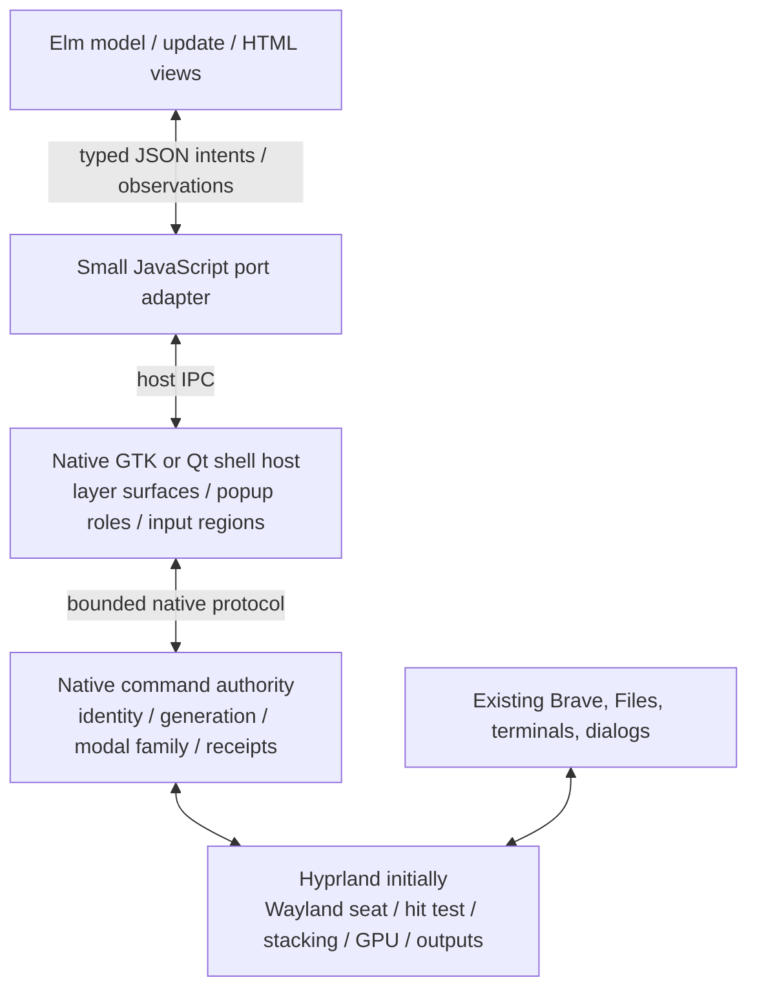

# Elm pivot: architecture feasibility — 2026-10-03

**An Elm desktop GUI is feasible. A production window system can use Elm for policy and presentation, but it still needs a native compositor, a native surface host and native lifetime/input authority.** The supported Elm toolchain does not supply a Wayland server, DRM/KMS backend, native GPU-buffer ownership or arbitrary native FFI. Calling a webview a window system would leave the hardest existing bugs unresolved.

Research only: no desktop configuration, implementation or deployment changed. The current maximized stacking correction remains staged, not activated by this research.

## Evidence and acquisition

Scrapling `Fetcher.get` retrieved 37 primary/documentation URLs into `/home/hoskinson/.cache/windows-parity-research/elm-pivot/architecture/`. `manifest.json` records requested/final URLs, HTTP status, retrieval time and SHA-256 hashes. HTML and extracted text are saved; API JSON, versioned kernel sources and protocol XML are saved as `.raw` files. This is the architecture subset, **not a claim that all Elm documentation has been collected**.

Four HTTP-200 Elm pages returned JavaScript shells: package Platform/Browser reference pages and two news articles. Their small extracted texts are retained as acquisition evidence, not counted as documentation. The substantive replacements are official `elm/core` 1.0.5 and `elm/browser` 1.0.2 `docs.json`, tagged implementation sources, and the Elm website's article sources. Generic Qt URLs included 6.12 snapshot redirects; the report instead uses retrieved **Qt 6.11** documentation for host behavior.

The Elm Guide describes model/update/view and JavaScript compilation; interop uses flags, ports and custom elements, with no arbitrary synchronous JavaScript FFI. `Platform.worker` supports state/update/subscriptions without HTML, making it a possible policy runtime in a JavaScript host. These are useful boundaries, not native operating-system APIs. [Architecture](https://guide.elm-lang.org/architecture/), [Interop limits](https://guide.elm-lang.org/interop/limits), [Platform source](https://github.com/elm/core/blob/1.0.5/src/Platform.elm).

Modern Elm uses commands and subscriptions; the historical signal-based FRP API was removed in 2016. Proposals should use today's Elm Architecture rather than assume old signal tutorials describe current APIs. [Farewell to FRP](https://elm-lang.org/news/farewell-to-frp), [retrieved article source](https://github.com/elm/elm-lang.org/blob/master/pages/news/farewell-to-frp.elm).

## Recommended target boundary

Elm owns taskbar presentation, switcher selection, Task View, launcher/jump-list state, snap chooser UI, settings and declarative accessibility markup. The native host owns the Wayland surfaces containing those views. The native authority validates and commits effects on third-party application windows.

Wayland clients cannot access other clients' surfaces or their global positions. Buffers pass through explicit commit/release ownership, and each surface has a native protocol role. Elm-created DOM elements are not independent native application windows. A native bridge is required for window observation, previews, focus, snapping and global input. [Wayland protocol](https://wayland.freedesktop.org/docs/book/Protocol.html), [surface specification](https://wayland.freedesktop.org/docs/html/apa.html).

Preserve the compositor's event-loop hot path for pointer hit testing, focus, stacking, modal redirection, capture retirement and GPU composition. Elm can propose operations and decide ordinary policy; it should not delay an input event waiting for webview IPC, a DOM repaint or a JavaScript garbage collection.

## Host choices

| Host | Useful properties | Implementation constraint | Recommendation |
| --- | --- | --- | --- |
| Custom GTK host + WebKitGTK + gtk-layer-shell | Native Linux webview and layer-surface controls | Must implement popup/input-region/focus handling, bridge and renderer lifecycle | First prototype candidate: installed packages include WebKitGTK 2.52.6 and gtk-layer-shell 0.10.1 |
| Dedicated Qt Quick host + WebEngineView + WebChannel | Fits existing Qt ecosystem; QObject-to-JS transport | Additional WebEngine dependencies; application initialization and Chromium renderer processes | Good comparative prototype; do not assume a late Quickshell plugin import is sufficient |
| Tauri/WRY | Rust host and webview IPC with Elm compiled assets | Ordinary app windows do not establish Omarchy layer-shell/popup capabilities; custom GTK integration needed | Useful toolkit, subject to native surface proof |
| Ordinary browser tab | Fast development of HTML and pure reducers | Cannot be the desktop's native compositor or implement global seat authority | UI development and replay only |

GTK layer surfaces must be initialized before window realization; keyboard interactivity is a native compositor-facing setting. WRY's own README recommends its GTK construction path for Wayland, while generic examples/child webviews have X11-only limitations. [gtk-layer-shell API](https://wmww.github.io/gtk-layer-shell/), [WRY source README](https://github.com/tauri-apps/wry).

Qt WebChannel is asynchronous and exposes JSON-convertible QObject data. Qt 6.11 WebEngine initialization must happen before `QGuiApplication` and native GL contexts. No installed `qt6-webengine` or `qt6-webchannel` package was reported by the read-only package query; dependencies and current Quickshell initialization require a separate evaluation. [WebChannel 6.11](https://doc.qt.io/qt-6.11/qtwebchannel-javascript.html), [WebEngine initialization 6.11](https://doc.qt.io/qt-6.11/qtwebenginequick.html). Tauri documents a Rust core and webview message passing; that architecture still requires the native host described above. [Tauri architecture](https://v2.tauri.app/concept/architecture/).

Installed GTK dependencies make that prototype cheaper to start; they do **not** establish lower memory use, smoother animation, accessibility parity or complete compatibility.

## Bridge contract and state ownership

Use one outgoing intent port and one incoming event port. Do not make one port per native function. Elm's own ports guidance recommends coarse state ownership boundaries. [Ports](https://guide.elm-lang.org/interop/ports).

An intent should include protocol version, request ID, compositor lifetime, frontend epoch, operation generation, captured window identity and expected native revision. Window identity should contain the existing stable ID/PID/native incarnation; a reusable address is transport metadata, not authority. Represent outcomes as typed `Pending`, `Committed`, `Refused`, `Cancelled` or `Unknown`, including the observed native revision. A sent command is not an accepted effect, and an accepted effect is not proof of displayed pixels.

On shell/webview restart: invalidate UI epochs, discard unclaimed old work and obtain a coherent fresh native snapshot. After an uncertain effect, reconcile instead of blindly replaying it. Native cancellation must be checked at the actual effect boundary; cancelling an Elm `Cmd` or abandoning a response cannot recall work already accepted by another process. These are design inferences from the asynchronous interop boundary and the repository's existing lifetime counterexamples.

Capture Alt press, repeats, release and Escape in native compositor order before UI readiness. Elm can hold the chord's generation/ordinal reducer, but browser key listeners cannot reconstruct a release that occurred before the view gained keyboard focus. Preserve the original native motion helper's identity/family authority while porting the switcher reducer.

For multiple displays, use one canonical policy owner and explicit per-display projections. A headless Elm worker plus Elm view instances is possible; it adds serialization and scheduling costs. Alternatively start with per-display presentation models and keep all cross-display decisions in native authority. Avoid independent Elm instances each owning the same snap group, pin intent or chord transaction.

## Mapping the existing design

| Existing component | Elm replacement | Native work retained |
| --- | --- | --- |
| Windows taskbar QML, Task View, menu shell | Elm HTML views and typed update functions | Layer surfaces, focus/input masks, publication stream, IPC transport |
| Switcher JavaScript reducer/Lua launch path | Elm chord state and selection; native-origin ordered events | Key-event capture, atomic final cancellation and owning-window restore |
| Snapshot/catalog services | Elm decoders and normalized view model | Event subscriptions, bounded filesystem observation, desktop catalog acquisition |
| Snap chooser and group policy | Pure geometry/group functions and views, if profiled adequately | Native configure/move/resize commits and rollback/current-owner checks |
| Pin/maximize/focus/modal bridge | Typed intents and observed state | Hit testing, stacking, family relation, native focus and input blockers |
| Thumbnail/minimize animation service | Asset handles and animation controls | Native buffer acquisition, composition, source lifetime, retirement and deadlines |
| Files app | A separate possible Elm app migration | File operations/spec, clipboard/DND integration and existing draft/edit state |

A draft in Brave belongs to Brave. Do not read, recreate or close it merely to switch windows. Modal relations and disabled-parent policy come from native toolkit/protocol state, not Elm's opinion about a dialog-looking DOM node. xdg-shell defines parent stacking, while xdg-dialog describes modality as a hint and leaves event-delivery policy to the compositor. Preserve the existing tested GTK/Qt/XWayland family handling. [xdg-shell protocol source](https://github.com/wayland-mirror/wayland-protocols/blob/main/stable/xdg-shell/xdg-shell.xml), [xdg-dialog protocol source](https://github.com/wayland-mirror/wayland-protocols/blob/main/staging/xdg-dialog/xdg-dialog-v1.xml).

## Efficiency and acceptance

Typed pure update functions can reduce accidental inconsistent GUI state and make replay/model tests simpler. They do not automatically fix native ordering, compositor bugs, buffer ownership or slow capture. Elm's browser runtime uses `requestAnimationFrame`; its port runtime schedules outgoing effects. Do not replace the native 240 Hz animation hot path with per-frame JSON and DOM updates without measurements. Historical Elm HTML benchmarks compare web UI frameworks, not this desktop. [Tagged Browser kernel](https://github.com/elm/browser/blob/1.0.2/src/Elm/Kernel/Browser.js), [tagged Platform kernel](https://github.com/elm/core/blob/1.0.5/src/Elm/Kernel/Platform.js).

Keep pixels out of Elm port JSON. Send immutable preview IDs/revisions and bounded metadata; the host supplies images or native textures. Coalesce ordinary observations, preserve ordered action outcomes, and prioritize control/retirement traffic over preview work. Measure input-to-native-effect and input-to-visible-frame separately, plus p50/p95/p99 latency, frame gaps, RSS/PSS, renderer count, idle wakeups and hotplug recovery against the current taskbar-v3 baseline.

Actual WebKit/Chromium host acceptance must cover IME/preedit, keyboard navigation, Orca/braille, clipboard/file DND, fractional scale, negative output coordinates, pointer capture, layer dismissal and crash/restart. Browser automation and pure Elm tests are useful but do not replace native acceptance. Retain the original 38/34 restore, 52 drag/resize and exact popup/lifetime campaigns and their deadlines.

## A full pivot that is honest about scope

1. Port one complete switcher/taskbar vertical slice to Elm against a fake replay backend; check pure reducers and decoders against existing scenarios.
2. Prove the GTK/WebKit host and Qt/WebEngine alternative in isolated native sessions. Require proper layer role, input mask, release-before-ready and unchanged draft/modal behavior before choosing the host.
3. Switch the **entire shell GUI** to Elm surface by surface, keeping one native authority and Hyprland. Retire duplicate QML state only after equivalent live acceptance. This is a credible complete GUI pivot.
4. If replacing **Hyprland itself** remains a requirement, build a separate native compositor and embed/use Elm as its policy frontend. Smithay supplies Rust building blocks and Anvil demonstrates a compositor; neither is evidence of Windows parity or a ready replacement for this desktop. [Smithay](https://github.com/Smithay/smithay), [Anvil](https://github.com/Smithay/smithay/tree/master/anvil).
5. Validate that compositor in nested sessions, then hardware sessions with sacrificial applications. A main Wayland compositor replacement normally changes the connection hosting existing application surfaces; preserve drafts and avoid treating compositor restart as routine shell reload.

The feasible end state is **Elm GUI and much of desktop policy, with native window-system execution**. A claim that standard Elm alone can own every layer would require a new runtime/compiler/backend project and a much broader compatibility effort. The available evidence supports the GUI pivot and prototype plan; it does not establish that such a rewrite is faster or cheaper than finishing the staged native fixes.
