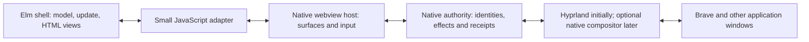

# Elm GUI and window-system pivot

Research decision, 2026-10-03. **Explore a complete Elm shell with a native Wayland host and native window authority. Retain Hyprland initially.** A complete shell rewrite is plausible; a complete compositor rewrite is a separate, substantially larger project. No evidence collected here establishes that Elm/webview rendering is faster or cheaper than the existing Qt Quick implementation.

Scrapling downloaded the reachable official English guide and every indexed version of the official-author packages, with primary FRP papers and host/compiler references. Start at the [local corpus index](CORPUS_INDEX.md). The [architecture](ARCHITECTURE.md), [implementation](IMPLEMENTATION.md) and [FRP](FRP.md) reports provide supporting sources and caveats.

## What “complete pivot” would mean

| Scope | Elm owns | Native components required | Assessment |
| --- | --- | --- | --- |
| Policy migration | Switcher/taskbar state, selection, intent and receipt handling | Existing Quickshell UI and native window actions | Smallest experiment; evaluates Elm semantics but does not evaluate a complete GUI pivot |
| Complete desktop shell | Taskbar, launcher, switcher, Task View, snap chooser, menus, settings and ordinary UI policy | Webview host, layer/popup surfaces, global input, application-window authority, captures and compositor | Recommended target to evaluate; replaces the shell's QML presentation |
| Complete compositor replacement | Above plus high-level placement/focus/workspace policy | New native Wayland compositor, Xwayland integration, rendering, seat/output/backend management and protocol implementations | Possible hybrid system, but not an all-Elm implementation; defer until the shell experiment has evidence |

Modern Elm compiles to JavaScript and uses Model/update/view, commands and subscriptions. The historical Signals API was removed; old signal-based FRP examples are not current Elm APIs. [Elm Architecture](https://guide.elm-lang.org/architecture/), [interop limits](https://guide.elm-lang.org/interop/limits), [Farewell to FRP](https://elm-lang.org/news/farewell-to-frp).

Elm owns the desired state and ordinary policy. Native components own real surface lifetime, accepted window operations, hit testing, drawing order and frame presentation. A DOM node is not a Wayland application window; ports provide asynchronous communication rather than operating-system authority. [Ports](https://guide.elm-lang.org/interop/ports), [Wayland protocol](https://wayland.freedesktop.org/docs/book/Protocol.html).

## Why consider it

A single typed model can make selection, cancellation, snap intent, pin state and popup transitions easier to inspect and replay. Exhaustive cases and decoded messages can prevent ambiguous intermediate UI states. The benefits depend on preserving event identity and causality across the native boundary; the language cannot recover missing events or make external effects atomic.

Elm HTML and elm-ui offer a coherent layout approach for the entire shell. That could reduce hand-maintained QML/JavaScript presentation logic. It also introduces webview integration, renderer processes, CSS/DOM behavior, focus routing and native popup hosting. This is an implementation tradeoff to measure, not a demonstrated efficiency improvement. [elm-ui reference](https://package.elm-lang.org/packages/mdgriffith/elm-ui/1.1.8/), [Tauri process architecture](https://v2.tauri.app/concept/architecture/).

## First full-GUI experiment

Build one isolated native layer-surface host containing an Elm taskbar and switcher, using recorded observations first. This directly tests the proposed GUI replacement. A separate headless Elm worker can cheaply test reducers, but passing that experiment alone must not decide the browser-hosted shell pivot.

Compare GTK/WebKitGTK with the Qt WebEngine alternative. The installed GTK-related packages make it a reasonable first candidate; verify GTK major-version compatibility and actual Wayland behavior before implementation. A dedicated Qt host remains an alternative, with its initialization and dependency requirements. Do not assume an ordinary Tauri window has the shell roles needed here. [GTK layer shell](https://wmww.github.io/gtk-layer-shell/), [Qt WebEngine initialization](https://doc.qt.io/qt-6.11/qtwebenginequick.html).

Use opaque native capture/frame keys in Elm, not pixel arrays or per-frame image serialization. Native rendering should retain and sample motion frames. Defer a full live-preview renderer decision until measured WebKit/Qt integration establishes source-stop lifetime, scaling and presentation behavior.

### Protocol and ownership

Use one incoming event stream and one outgoing intent stream, with a versioned envelope. Include request ID, compositor lifetime, frontend epoch, window incarnation, output generation and expected native revision. Decode foreign messages; reject stale or malformed work at the native effect boundary. Separate `Pending`, `Committed`, `Refused`, `Cancelled` and `Unknown` outcomes.

Publish coherent snapshots plus ordered events. On host restart, invalidate the old epoch and reconcile from native truth. Capture Alt press/repeat/release natively before the webview is ready. Preserve native cancellation checks and modal-family validation. Serialize dependent effects through acknowledgements: `Cmd.batch` does not guarantee completion order. [Cmd documentation](https://package.elm-lang.org/packages/elm/core/1.0.5/Platform-Cmd).

Keep one canonical owner of cross-display policy. Individual display views receive explicit projections and cannot independently commit conflicting snap, pin or switcher transactions. Browser animation timestamps are not native frame-presentation receipts; native motion clocks and buffer lifetimes remain authoritative. These protocol choices are engineering recommendations based on existing failure cases and asynchronous runtime semantics.

### Acceptance before committing to the pivot

Run controlled comparisons against the current shell on the same machine and compositor, with recorded workloads and separately reported native runs:

- Verify Alt release before startup, Escape cancellation, stale/duplicated receipts, modal redirects and host restart without unintended focus or minimize effects.
- Verify maximized Brave and overlapping native windows have matching visible order, hit order and focus. The staged compositor stacking correction remains an independent prerequisite; rewriting the shell does not replace it.
- Verify multi-display scale/transfer, pinned/fullscreen interactions, popups, keyboard input, reduced motion and accessibility.
- Measure input-to-visible-frame latency, idle CPU/wakeups, peak memory, startup time, capture/upload work and long-running resource growth. Choose explicit budgets from the existing baseline before implementing the experiment; compiler build speed is not desktop runtime evidence.
- Prove source-stop preview lifetime and complete retirement of owned surfaces, callbacks, buffers and helper processes. Keep original acceptance deadlines and protected native QA orchestration.

Proceed to the complete shell only if the host and protocol pass these checks and total implementation complexity is lower. Then migrate taskbar/switcher, launcher/menus, Task View/snap chooser and settings in reversible steps. Evaluate replacing Hyprland with a Rust/C++ compositor and Elm policy only as a separately scoped project, including Xwayland, IME, security, screen capture, output management and application compatibility.

## Current workspace status

This exploration changed documentation and local research artifacts. The installed taskbar v3 remains active. Capture profiling, retained-frame and switcher candidates remain staged. The native maximized stacking correction and paired compositor/plugin remain prepared but inactive; no main-compositor restart was performed.

The selected stable compiler reference is 0.19.2. The 0.19.3-beta release is a prerelease and master documentation already differs; a future experiment should pin compiler, packages, testing tools and native host versions. [Official releases](https://github.com/elm/compiler/releases).

## Corpus limitations and reuse

The corpus covers the complete reachable English Guide and all indexed versions under `elm/*` and `elm-explorations/*` at acquisition time. It additionally includes selected third-party elm-ui documentation, stable compiler documentation and a curated primary-source FRP collection. It does not claim every third-party package, translation, historical website or all FRP literature.

Raw sources remain alongside readable derivatives, URLs and hashes. Some HTTP-200 pages are JavaScript shells; reports distinguish these from substantive reference text and use underlying versioned JSON/source documents where available. Preserve upstream licenses and source attribution when redistributing; this collection is research evidence, not a relicensing of its contents.
