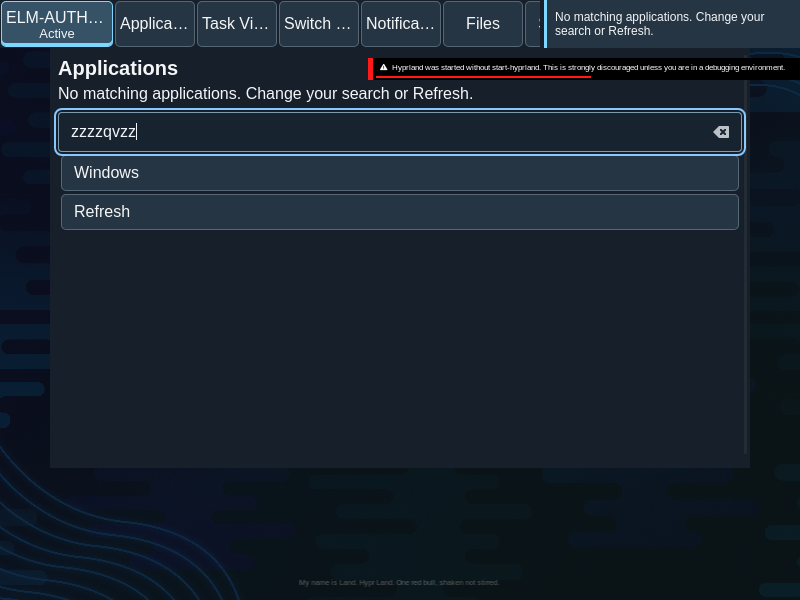

# Live output removal and keyboard recovery

Keyboard shortcuts now resolve the actual native keyboard window, mapped shell layer or live popup before choosing an output; an unrecognized focused surface is refused. The real nested output-removal journey dismisses the displaced launcher, preserves workspace identity, keeps the typed query and keyboard recovery on a declared survivor, and operates Refresh with one observed catalog read. Reconnection at identical old bounds receives a new view identity while the retired native shortcut destination stays null. No launch/window-effect replay occurs, and original drag/capture plus all-nine-surface keyboard regressions pass with normal cleanup.

The native shortcut observation now obtains its destination from the actual seat keyboard resource: the focused application window, mapped layer surface or live popup. With no keyboard resource it uses the native desktop monitor; an unmatched resource is refused. The existing live/enabled/DPMS, weak monitor incarnation, exact bounds, binding, serial, input ownership and capacity checks remain. Elm still owns current view routing; no new native window effect policy or compositor ABI is introduced.

The first probe's expected query omitted the retained text, but its real logs also exposed a layer-owned chord going to the pointer monitor after Escape. The native resource lookup repairs that routing. A later sibling QA observer request was correctly refused because the GUI already owns the shortcut journal; the final probe observes the real GUI backend frames instead of taking that ownership. These failed records are retained and are not product acceptance.

The exact native journey removes the output while its launcher search is focused. Its current issued view retires, the popup dismisses, workspace identity survives and physical chords/Tab/Enter recover on the declared remaining output. Enter issues an actual read with count 5 to 6 and no launch/effect. Recreating the output at the old 800x600 logical bounds yields view 3 rather than retired view 2; native history retains a null destination for the old weak monitor. The old popup/effect cannot replay. All helpers, clients and the matched plugin retire normally. The unchanged nine-surface keyboard journey passes on this tuple.

quint-llm-kit supplied executable initialization, five named cases, reachable witnesses and sampled safety for atomic topology retirement and issued identities. Eleven compiled production-root checks cover removal, unrelated-output survival, replacement, old renderer/dismissal callbacks, consumed shortcuts and abstract zero-output return. Those checks do not prove arbitrary native-journal/host delivery order, physical hardware, pending effects/previews or actual zero-output return.

- Physical hotplug/displays, native AT/IME consumers and independent original UI-019 scenario review remain open. Nested Wayland output evidence is separately labeled.
- All outputs disappearing/returning has compiled/model coverage only; the original outputs-return native scenario remains unadjudicated. Pending preview/capture/effect custody during removal, Unknown reconciliation, protected input and broader transform/device/resource cases remain unqualified.
- The atomic-topology model and consumed-shortcut replay checks do not establish every cross-channel delay. A fresh old native shortcut journal delayed across same-bounds replacement, topology/native generation ordering, and zero-output transport need direct implementation/qualification.
- Full original release journeys, hardware/resource budgets, reproducible packaging and reversible deployment remain open.

[manifest.json](manifest.json) retains exact original policy/scenario, source/pair identities, compressed reports/logs and the native image. The owning core/Aquamarine are unchanged; the changed C++ authority has strict symbol/dependency closure. Compiled host/Elm input snapshots remain as recorded; final runtime-only probe corrections do not change the compiled product. No full UI-019 or release acceptance is claimed.
