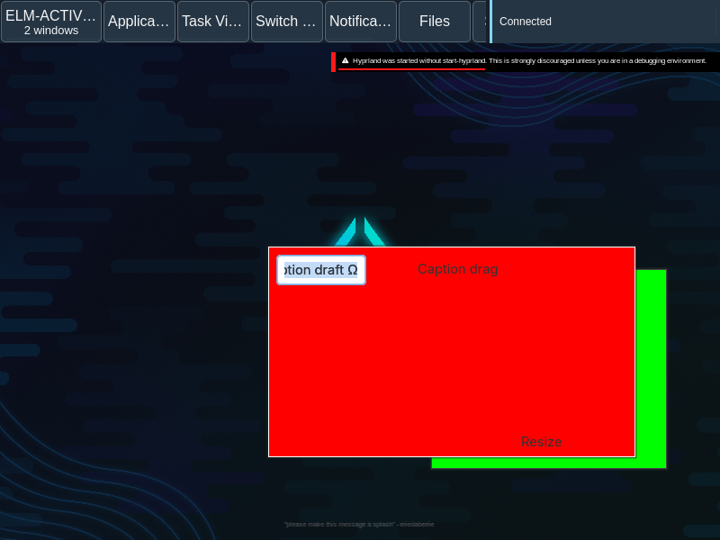

# Native caption placement restoration

Native maximized and committed left-half snapped captions now retain placement on a click without movement, restore ordinary size at the original horizontal press fraction, and restore the captured box/modes/source workspace on Escape. Actual quarter- and three-quarter-width drags, one-output pixels, committed release, unsaved drafts and captured-owner retirement/replacement pass. A released MAX caption retires its exact old ordinary placement so the next maximize/restore captures the new box. The admitted restore effect now applies its saved prospective ordinary box after validating live identity/mode/scope. The final caption/lifecycle and original modal/draft regressions pass. Original two-output input and cross-output rollback assertions pass again after separating caption phase from the shared keybind threshold flag; full combined capture still fails at the original five-second limit. UX-021 and the release remain partial.

[Manifest](manifest.json) retains exact source/pair/toolchain identities, immutable reports and failed counterexamples. Verbose reports/logs are lossless gzip; `gzip -dc FILE.json.gz` reads original bytes.

The before report shows a MAX caption press changing placement before movement. Later failures show a click overwriting ordinary size, restore returning Unknown after recentering, re-maximize refusing the obsolete placement, and shared keybind threshold state swallowing a raw cross-output motion. Final source repairs these failures. The final native caption journey passes 93 checks, including both fractions, four actual one-output restoration/cancellation pixel captures, release and re-maximize/restore, peer/draft retention and owner close/replacement. The original modal/draft journey also passes on the final pair.

These actual one-output frames qualify only their bounded observations. Original full combined-output capture still fails its unchanged five-second limit. All input assertions, including cross-output rollback, pass; requirement and release acceptance remain false.

The exact three native translation units sharing the changed private header were rebuilt; 430 of 433 archive members, public headers/object layouts, existing strong exports and owning ABI/dependencies are preserved. The authority was rebuilt against that core. Host C/Elm assets remain unchanged. The original fifteen named caption/native-drag cases retain their prior hash-identical evidence. The current Quint model has eleven named cases, eight reachable witnesses and sampled safety. Neither model nor native subset establishes wider configuration/lifecycle, AT/hardware or independent original acceptance.

- Original two-output combined capture still fails its unchanged five-second grim limit; bounded one-output images do not substitute for it.
- Native fullscreen/tiled/grouped restoration, the other snap regions/repeated snaps, nondefault thresholds/key traffic, constraints/scale/rotation and resize-mode placement transitions remain unqualified.
- Active-gesture reload/reattachment, source-space loss, hidden/disabled outputs, device/hotplug/lock/grab and wider output/lifecycle schedules, other toolkits, native AT and independent original UX-021 review remain open.
- Full original native/IME/hardware/resource/journey/package/reversible deployment/rollback release gates remain open.

Next: Implement the demonstrated original two-output presentation gap in the existing owning renderer/output path at the unchanged capture limit; preserve the actual input passes and failed recording. Keep quint-llm-kit tied to original properties. If no production fix or original verdict is obtained within the workflow limit, record the missing observation and continue another mandatory GUI slice.
