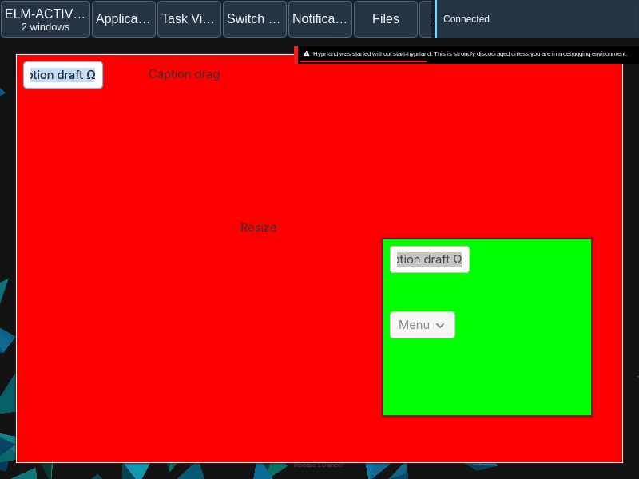

# Native gesture cancellation and retirement

Escape now restores captured floating move/resize geometry without committing a drop. Cancellation after crossing outputs also restores the live source workspace. Closing the captured owner retires the gesture before button release; a same-title replacement cannot inherit the old press. A new eligible edge press at the same pixel recovers its actual pointer recipient. The current native caption/lifecycle and modal/draft regressions pass. All original two-output input assertions and the new cross-output rollback assertion pass, but the original combined screenshot still times out at five seconds. UX-021 and the release remain partial.

This is bounded implementation evidence for ELM-UX-021 / ux-021. The original oracle is “exactly one gesture ends and no shell surface steals the drag.” Neither the requirement nor the release is accepted.

[Manifest](manifest.json) records the source hashes, matched core/plugin/Aquamarine tuple, original requirements and model hashes, actual commands, failed before observations and remaining scope. Verbose immutable native/build reports are lossless `.json.gz` files; `gzip -dc FILE.json.gz` reads the original bytes. Failed reports and helper clocks remain unchanged.

The retained counterexamples show Escape keeping moved geometry, a second edge press at the same pixel failing to reach GTK, and cross-output cancellation restoring geometry in the wrong workspace. The final core repairs all three. The actual owner-close/replacement test preserves the peer draft and cannot adopt the old press. The 53-check caption/lifecycle addition and existing modal/draft/MAX regression pass on the final pair. All original two-output input assertions pass; its full report remains failed because the unchanged final five-second combined screenshot times out.

The image is an actual one-output caption capture; it does not qualify the missing combined output recording.

Quint-llm-kit guided the incremental model and implementation. Initialization, typecheck, nine explicitly selected named cases, nine reachable witnesses and sampled safety pass. Fullscreen/tiled/MAX/snap, expired/hidden source spaces, protected input hardware, other toolkit captions, AT and original independent acceptance remain outside this result. Source/action correspondence and abstraction limits are recorded in the manifest. Original caption/native-drag models and their previously retained 15 named-case evidence remain byte-identical.

The exact four changed native translation units were rebuilt against the owning 433-member archive. The other 429 archive members, existing strong exports, public headers/object layouts and original dependency/toolchain identity are preserved. No main desktop activation occurred. The private reason/captured-origin helper adds no public controller fields.

Next: Implement original maximized/snapped caption restoration and fractional press anchoring with actual native rollback and retained drafts. Use quint-llm-kit against unchanged original caption/native-drag properties. Preserve the failed original combined capture and remaining release gates.
