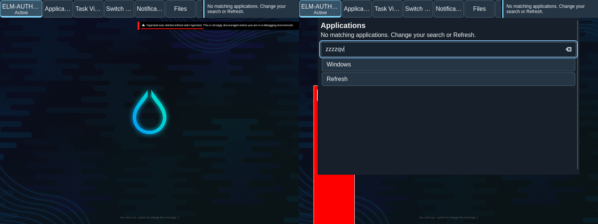

# Current-output keyboard shortcuts

Native Apps shortcuts now open on the output of the actual keyboard recipient after a cancelled cross-output drag. The shared Elm controller resolves the press-time live output against current issued view geometry; duplicate, missing, moved, retired, ambiguous and pointer-blocked destinations cannot relocate or replay. A fresh valid shortcut clears only obsolete shortcut-refusal feedback. The original two-output drag/cancel/capture journey passes, followed by actual popup bounds, painted control pixels, physical-keyboard no-match/query/focus retention and Escape without launch or window mutation. The unchanged all-nine-surface keyboard journey passes on the same core/plugin/host tuple with normal cleanup.

The native observation retains a weak monitor identity and the exact advertised integer logical bounds. At journal read, removal, replacement or changed bounds produce a null destination. The active keyboard window supplies its output when it owns the actual seat focus; otherwise the native focus monitor supplies the layer/desktop destination. GTK reports only issued view identities and current monitor bounds. The shared Elm root chooses exactly one current matching view and retains the original binding, serial, pointer ownership, counter and effect guards.

quint-llm-kit guided initialization, named cases, positive witnesses and sampled safety. The abstraction checks journal-time lifetime and current host matching; transport interleavings and hardware are separate obligations. Thirteen compiled root checks include stale/ambiguous destinations and recovery after refusal; unchanged shortcut history/pointer/search checks also pass. The exact C++ authority TU has no missing symbols and the core/Aquamarine ABI remains unchanged.

The first native counterexample selected the pointer monitor after Escape restored the keyboard window to the other output. The second recorded a real retained refusal hiding the no-match message. Both reports and logs are preserved. The corrected native journey verifies current owner/configured popup geometry, actual PNG label/control regions, physical typed query, reachable no-match/Refresh/Windows controls, no launch/window mutation, Escape and normal owned-helper/plugin cleanup. The unchanged nine-surface keyboard journey passes on the same tuple.

- Native AT/IME consumers and independent original scenario review remain open; the broad UX-023 surface requirement and UI-005 search policy are not accepted from these owner observations.
- Output removal/replacement/movement between native journal delivery and host topology delivery, mirrored/rotated/fractional-scale hardware, disabled/DPMS transitions and wider hotplug/lock schedules need direct native qualification. The model abstracts native journal admission and host matching in one receive, not every transport interleaving.
- Initial paint on an occluded output, unrelated output/caption/fullscreen/group/preview paths, resource budgets, representative journeys, reproducible packaging and reversible deployment remain separate release work.

[manifest.json](manifest.json) retains exact original EARS/scenarios, source/pair identities and compressed reports/logs. Model/compiled/native results remain separate. Neither original requirement nor the full release is accepted.
